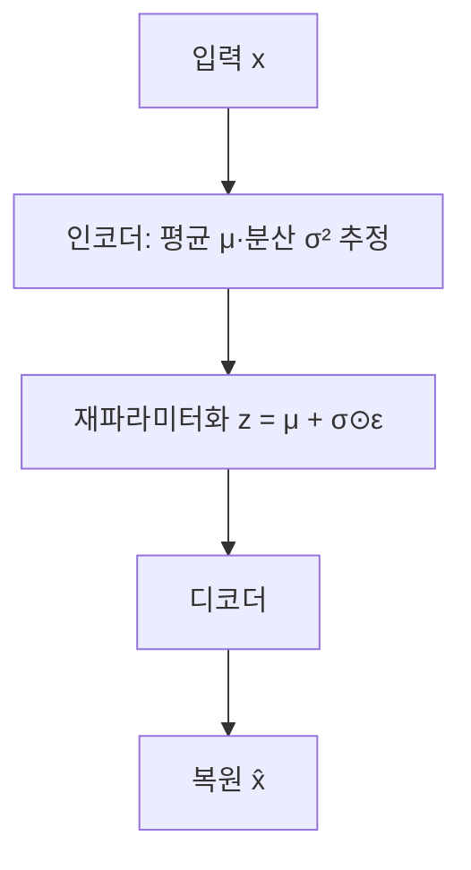

## 30초 인출

- 본질: VAE는 입력을 잠재 확률분포로 압축해 복원하고, 그 분포에서 새 데이터를 생성하는 생성 모델이다.
- 메커니즘: 인코더가 평균·분산을 추정 → 재파라미터화로 잠재변수 샘플링 → 디코더가 복원하며 ELBO를 최적화

<details>
<summary>핵심 용어</summary>

- **잠재변수(latent variable)**: 관측 데이터의 특징을 압축해 표현하는 내부 변수
- **재파라미터화 트릭**: 난수 추출을 입력과 독립된 노이즈로 분리해 평균·분산에도 기울기가 전달되게 하는 샘플링 기법
- **ELBO**: 데이터 로그우도의 하한으로, VAE가 최대화하는 목적함수
- **KL 발산**: 인코더가 추정한 잠재분포와 사전분포 사이의 차이를 재는 값
</details>

---
## 1교시 예상문제 (10점)

> 제135회 1교시 12번 기출: VAE(Variational AutoEncoder)의 개념과 구조를 설명하시오.

---
## 1교시 10점 답안

### 1. 정의·목적
- 정의: VAE는 입력을 잠재 확률분포로 표현하고 그 분포를 학습해 데이터를 복원·생성하는 신경망이다.
- 목적: 데이터의 압축 표현을 학습하고 잠재공간에서 새로운 표본을 생성한다.

### 2. 구조와 학습



인코더가 추정한 분포에서 표본을 뽑고 디코더가 입력을 복원한다. 노이즈 ε를 분리하면 샘플링을 거쳐도 학습 기울기가 평균과 분산으로 전달된다.

### 3. 목적함수
VAE는 다음 ELBO를 최대화한다. 구현에서는 음의 ELBO를 손실로 최소화한다.

| 항 | 역할 |
|---|---|
| 재구성 로그우도 | 입력을 잘 복원하도록 학습 |
| KL 발산 | 잠재분포가 사전분포에서 지나치게 벗어나지 않도록 정규화 |

### 4. 제언
재구성 품질과 잠재분포의 활용 가능성을 함께 평가한다.

---
## 2~4교시 예상문제 (25점)

> 변분 오토인코더(VAE)의 잠재변수 구조, 재파라미터화 트릭과 학습 목적함수를 설명하고, 적용 시 유의점을 제시하시오. (예상)

---
## 2~4교시 25점 답안

## Ⅰ. 개념과 오토인코더와의 차이
VAE는 입력마다 잠재변수의 분포를 추정해 잠재공간을 학습하는 확률적 생성 모델이다.

| 구분 | 일반 오토인코더 | VAE |
|---|---|---|
| 잠재 표현 | 입력별 고정 벡터 | 평균·분산으로 표현한 분포 |
| 학습 목표 | 입력 복원 | 복원과 사전분포 정합을 함께 최적화 |
| 생성 | 임의 잠재점의 의미가 보장되지 않음 | 학습한 사전분포에서 표본 생성 가능 |

## Ⅱ. 인코더·샘플링·디코더

```mermaid
flowchart TD
    X[관측 x] --> Q[인코더 qφ z|x]
    Q --> P[평균 μ·표준편차 σ]
    P --> S[z = μ + σ⊙ε, ε는 표준정규 노이즈]
    S --> G[디코더 pθ x|z]
    G --> XH[복원 또는 생성 표본]
```

인코더는 근사 사후분포의 모수를 출력한다. 재파라미터화 식에서 ε만 무작위로 추출하므로 z가 μ·σ에 대해 미분 가능하고, 디코더는 z에서 관측값의 분포를 계산한다.

## Ⅲ. ELBO와 최적화
학습은 데이터의 로그우도를 직접 다루기 어려운 경우 그 하한을 최대화한다.

```mermaid
flowchart TD
    L[ELBO 최대화] --> R[복원 로그우도 높임]
    L --> K[KL qφ z|x || p z 낮춤]
    R --> O[데이터 설명력 개선]
    K --> O
```

최소화 손실로 쓰면 재구성 오차와 KL 정규화 항이 더해진다. 두 항의 부호는 최대화하는 로그우도 기준인지 최소화하는 손실 기준인지 구분한다.

## Ⅳ. 한계와 기술적 제언

| 문제 | 해결 방안 |
|---|---|
| 픽셀 단위 복원 손실이 세밀한 특징을 흐리게 만들 수 있음 | 과업에 맞는 재구성 분포·손실을 선택하고 실제 표본 품질을 평가 |
| KL 항이 지나치게 강하면 잠재변수 정보가 약해질 수 있음 | 잠재표현 활용 여부와 재구성·KL 항의 균형을 검증 |
| 낮은 복원 오차가 이상 여부를 항상 구분하지는 않음 | 정상·이상 표본을 분리해 임계값과 오탐·미탐을 평가 |

---
## 출제 이력과 검증 출처

- 제135회 1교시 12번: VAE(Variational AutoEncoder)
- Kingma & Welling, [Auto-Encoding Variational Bayes](https://arxiv.org/abs/1312.6114): 재파라미터화, 잠재분포와 변분 하한을 확인함.
