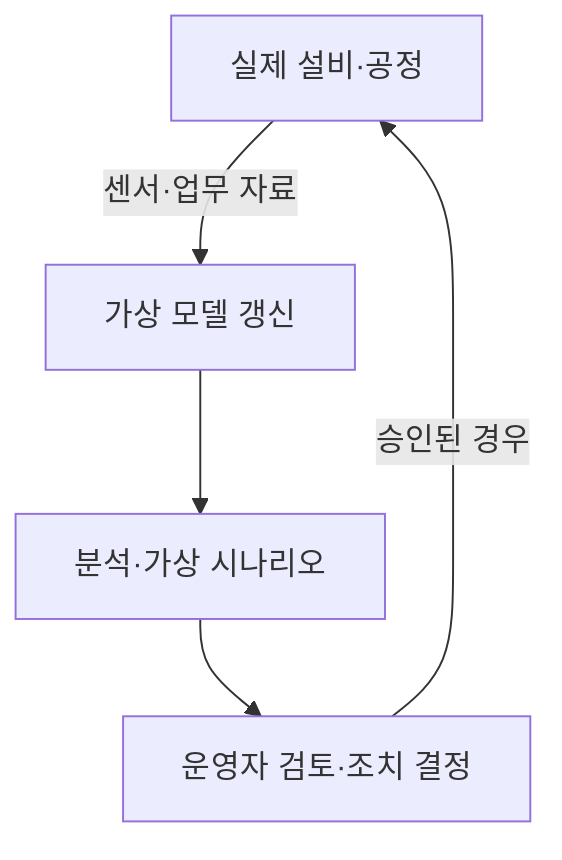
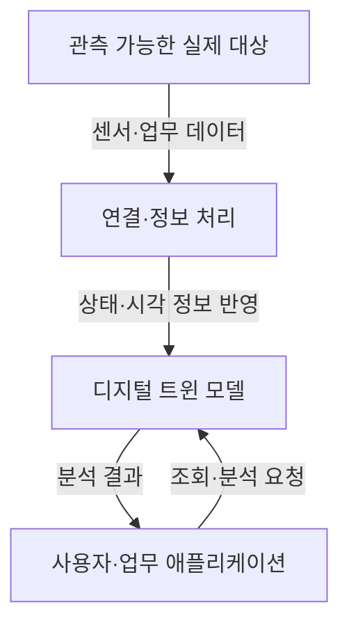

## 30초 인출

- 본질: 디지털 트윈은 실제 대상의 데이터와 모델을 연결해 상태를 분석하고 의사결정을 돕는 가상 표현이다.
- 메커니즘: 실제 대상의 관측 자료를 반영 → 가상 모델에서 분석·예측 → 필요한 경우 검토된 조치를 현실에 적용

핵심 용어

- **디지털 트윈**: 실제 대상이나 공정의 상태·특성을 데이터와 모델로 표현한 가상 체계
- **동기화**: 실제 대상에서 얻은 관측 자료를 가상 표현에 반영하는 것. 주기·방향·실시간성은 구현에 따라 다름
- **What-if 분석**: 가상 모델에서 조건을 바꿔 결과를 비교하는 분석
- **ISO 23247**: 제조 분야 디지털 트윈의 원칙·참조 아키텍처 등을 다루는 국제표준 시리즈

---
## 1교시 예상문제 (10점)

> 제127회 1교시 기출 주제: 디지털 트윈의 개념, 핵심 기술, 단계별 진화 과정 및 적용 분야를 설명하시오.

---
## 1교시 10점 답안

### 1. 정의·목적
- 정의: 디지털 트윈은 실제 대상의 상태·특성을 데이터와 모델로 표현한 가상 체계다.
- 목적: 실제 대상을 이해·분석하고 운영·설계 결정을 지원한다.

### 2. 핵심 작동 관계

이 도해는 관측 자료가 모델을 갱신하고, 분석 결과가 운영자의 결정을 돕는 구현 예다. 모든 트윈이 자동 제어하거나 실시간 양방향으로 연결되는 것은 아니다.

### 3. 적용
제조 설비의 상태 감시·예지보전, 공정 조건 검토, 제품·시설 운영 분석 등에 활용한다.

### 4. 제언
모델의 가정과 자료 갱신 주기를 현장 의사결정의 위험도에 맞춘다.

---
## 2~4교시 예상문제 (25점)

> 디지털 트윈의 개념과 구성 관계, 기존 3D 모델·시뮬레이션과의 차이, 제조 분야 적용 및 구축 시 유의사항을 설명하시오. (예상)

---
## 2~4교시 25점 답안

## Ⅰ. 개념과 유사 기술의 구분
디지털 트윈은 실제 대상과 연결된 자료를 이용해 상태·거동을 분석하는 가상 표현이다.

| 기술 | 중심 역할 | 실제 대상 자료와의 관계 |
|---|---|---|
| 3D 모델 | 형상 표현 | 형상 정보 중심 |
| 시뮬레이션 | 조건별 거동 계산 | 입력 조건으로 결과 분석 |
| 디지털 트윈 | 실제 상태를 반영해 분석·운영 지원 | 자료의 갱신 방식은 시스템별로 다름 |

## Ⅱ. 구성 요소와 정보 관계

화살표는 관측 정보의 전달, 요청 및 분석 결과의 반환을 뜻한다. 센서·통신·모델·응용 기능은 대상과 목적에 따라 구성하며, 특정 통신 프로토콜이나 3D 표현이 표준상 필수인 것은 아니다.

## Ⅲ. 적용과 활용
제조 분야의 디지털 트윈은 실제 제조 요소를 관찰하고 운영 자료를 분석해 운영 개선을 돕는다.

| 적용 | 활용 예 |
|---|---|
| 설비 운영 | 상태 추세를 분석해 점검 우선순위를 정함 |
| 공정 개선 | 조건별 시뮬레이션 결과를 비교함 |
| 품질 관리 | 공정·검사 자료를 연결해 원인 분석을 지원함 |
| 제품 수명주기 | 설계·생산·검사·정비 정보를 연계함 |

ISO 23247은 제조 분야 참조 프레임워크이며 구현 기술이나 데이터 형식을 하나로 강제하지 않는다.

## Ⅳ. 기술적 제언

| 문제 | 해결 방안 |
|---|---|
| 센서 자료와 가상 모델의 시간·단위·품질이 맞지 않으면 분석 결과를 신뢰하기 어려움 | 데이터 출처·단위·시각·갱신주기를 관리하고 모델 결과를 현장 자료와 검증 |
| 자동 제어가 모델 오류를 실제 설비에 전달할 수 있음 | 위험도에 따라 사람 승인, 안전 인터록, 복구 절차를 둔 뒤 제어 범위를 단계적으로 확대 |
| 시스템 간 정보 단절로 제품 수명주기 분석이 어려움 | 필요한 업무 자료와 식별자를 정해 설계·생산·검사·정비 기록을 연결 |

---
## 출제 이력과 검증 출처

- 제114회 1교시, 제118회 2교시, 제119회 1교시, 제127회 1교시: 디지털 트윈 관련 기출 이력(원문 노트 표기)
- ISO, [ISO 23247-2:2021 참조 아키텍처](https://www.iso.org/standard/78743.html): 제조 분야 참조 아키텍처의 범위를 확인함.
- ISO, [ISO 23247 시리즈 소개 및 적용 범위](https://www.iso.org/obp/ui?_escaped_fragment_=iso%3Astd%3Aiso%3A23247%3A-5%3Adis%3Aed-1%3Av1%3Aen): 제조 프레임워크가 특정 데이터 형식·프로토콜을 강제하지 않는다는 점을 확인함.
