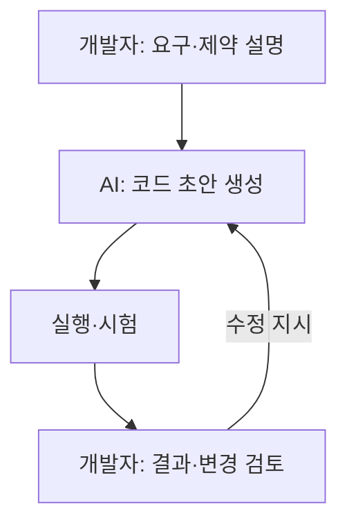
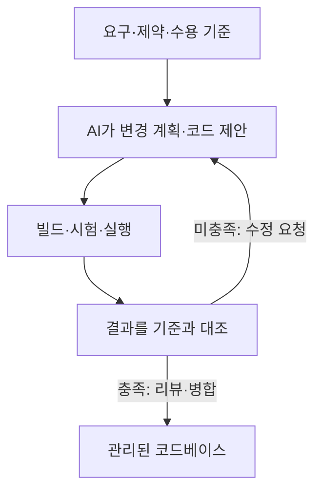

## 30초 인출

- 본질: 바이브 코딩은 자연어로 의도를 전달하고 AI가 작성한 코드를 실행·수정하며 소프트웨어를 만드는 방식이다.
- 메커니즘: 요구 설명 → 코드 생성·실행 → 결과 확인·수정. 빠른 시제품이 가능하지만 검토되지 않은 코드는 품질·보안 위험을 만든다.

핵심 용어

- **바이브 코딩**: 개발자가 코드의 세부 작성보다 자연어 의도와 실행 결과에 집중하는 AI 보조 개발 방식
- **코드 리뷰**: 코드 변경의 정확성·보안·유지보수성을 사람이 검토하는 활동
- **회귀 시험**: 변경 후 기존 기능이 계속 동작하는지 확인하는 시험

---
## 1교시 예상문제 (10점)

> 바이브 코딩의 개념과 소프트웨어 개발 시 유의사항을 설명하시오. (예상)

---
## 1교시 10점 답안

### 1. 정의·목적
- 정의: 바이브 코딩은 자연어로 의도를 지시하고 생성형 AI의 코드를 실행 결과에 따라 다듬는 개발 방식이다.
- 목적: 반복적인 코드 작성과 시제품 구현을 빠르게 진행한다.

### 2. 동작 흐름

### 3. 유의점
생성 코드를 이해하지 않고 배포하면 결함·취약점·유지보수 문제가 남을 수 있으므로 코드 리뷰와 시험이 필요하다.

### 4. 제언
작은 변경 단위로 생성하고 테스트·검토를 통과한 코드만 병합한다.

---
## 2~4교시 예상문제 (25점)

> 바이브 코딩의 개발 방식과 기대 효과를 설명하고, 기업 적용 시 품질·보안·유지보수 위험 및 통제 방안을 제시하시오. (예상)

---
## 2~4교시 25점 답안

## Ⅰ. 개념과 개발 방식의 변화
바이브 코딩은 요구를 자연어로 설명하고, AI가 제안한 코드를 실행 결과에 따라 반복 개선하는 개발 방식이다.

| 구분 | 일반적인 AI 코드 보조 | 바이브 코딩 |
|---|---|---|
| 개발자 입력 | 코드 작성 중 특정 부분의 도움 요청 | 기능·행동·제약을 자연어로 설명 |
| 작업 단위 | 코드 조각·함수 제안 | 여러 변경을 묶은 기능 시제품 가능 |
| 개발자 책임 | 제안 코드를 통합·검증 | 요구 구체화와 생성 결과의 검증 책임 유지 |

## Ⅱ. 반복 개발 메커니즘

각 화살표는 요구 전달, 생성 코드의 실행, 결과 피드백을 나타낸다. 실행 성공만으로 기능 요구나 보안이 충족됐다고 보지는 않는다.

## Ⅲ. 기대 효과와 위험 통제

| 관점 | 기대·위험 | 통제 |
|---|---|---|
| 개발 속도 | 반복 구현·시제품 작성이 빨라질 수 있음 | 변경 범위와 수용 기준을 명시 |
| 기능 품질 | 그럴듯하지만 요구와 다른 코드가 생성될 수 있음 | 단위·통합·회귀 시험과 사람 리뷰 |
| 보안 | 취약한 코드·비밀정보 노출 위험 | 의존성·정적 분석·비밀정보 검사를 배포 절차에 포함 |
| 유지보수 | 구조를 이해하지 못한 채 코드가 누적될 수 있음 | 설계 결정·변경 이유를 기록하고 모듈 경계 점검 |

## Ⅳ. 기술적 제언

| 문제 | 해결 방안 |
|---|---|
| 자연어 지시가 모호하면 구현 결과가 요구와 달라짐 | 수용 기준·금지 조건·시험 사례를 먼저 작성 |
| 자동 생성 변경이 기존 동작을 깨뜨릴 수 있음 | 격리된 브랜치에서 시험·코드 리뷰를 통과한 변경만 병합 |
| 외부 AI에 소스·비밀정보가 노출될 수 있음 | 승인된 도구·자료 범위와 비밀정보 처리 정책을 적용 |

---
## 출제 이력과 검증 출처

- 원문 출제 이력 표기: 미출제. 본 문항은 예상문제.
- Andrej Karpathy, [바이브 코딩을 설명한 원문 게시물](https://x.com/karpathy/status/1886192184808149383): 용어와 개발자 역할을 확인함.
