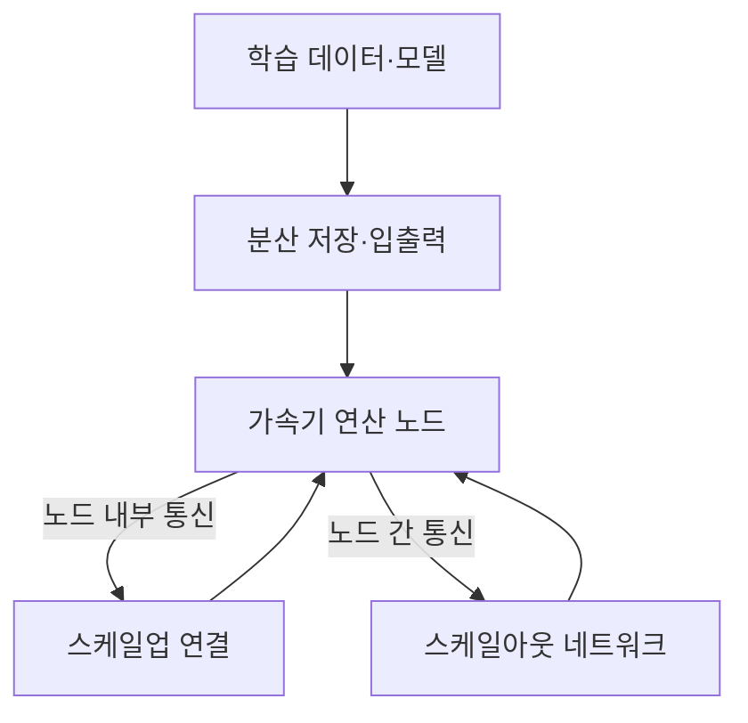
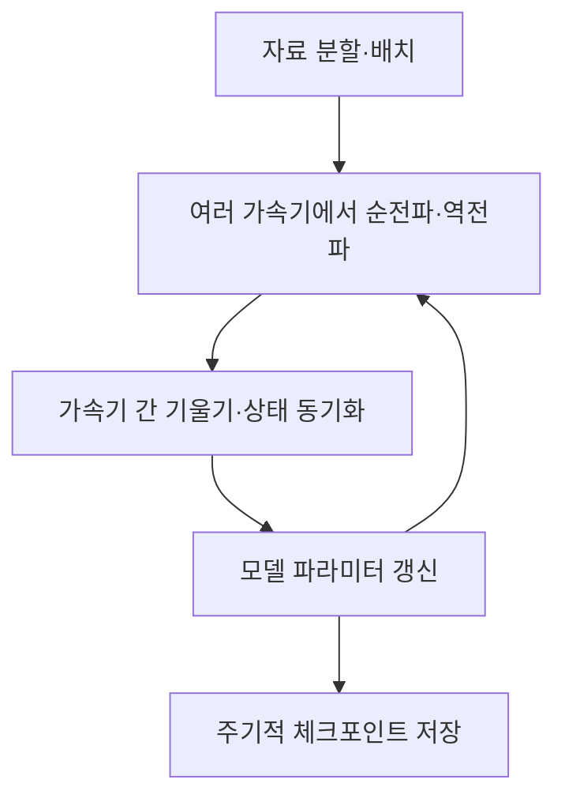

## 30초 인출

- 본질: AI 슈퍼컴퓨팅 플랫폼은 여러 가속기·서버·네트워크·저장장치를 묶어 대규모 AI 학습과 추론을 수행하는 기반이다.
- 메커니즘: 데이터를 분산 처리 → 가속기들이 계산·통신을 반복 → 모델·결과를 저장

핵심 용어

- **스케일업**: 한 서버·랙 안에서 가속기 간 연결을 확장하는 방식
- **스케일아웃**: 네트워크로 여러 서버를 연결해 처리 용량을 확장하는 방식
- **집합 통신(All-reduce)**: 분산된 각 작업자의 값을 결합해 모든 작업자에 공유하는 통신 연산
- **체크포인트**: 학습 상태를 저장해 장애 이후 이어서 실행하도록 돕는 복구 지점

---
## 1교시 예상문제 (10점)

> 대규모 AI 학습·추론을 지원하는 AI 슈퍼컴퓨팅 플랫폼의 구성과 주요 고려사항을 설명하시오. (예상)

---
## 1교시 10점 답안

### 1. 정의·목적
- 정의: AI 슈퍼컴퓨팅 플랫폼은 다수의 가속기와 서버를 고속 통신·저장 기반으로 연결한 대규모 연산 환경이다.
- 목적: 단일 장비의 연산·메모리 한계를 넘어 대규모 모델 학습과 추론을 지원한다.

### 2. 구성과 역할

가속기는 모델 연산을 수행하고, 스케일업·스케일아웃 연결은 각기 노드 내부와 서버 간 통신을 맡는다. 데이터 경로와 집합 통신 성능도 전체 작업 시간에 영향을 준다.

### 3. 주요 고려사항
네트워크 병목, 전력·냉각, 장애 복구, 작업 관리와 데이터 입출력 성능을 함께 설계한다.

### 4. 제언
목표 작업으로 연산·통신·저장·전력 병목을 측정한 뒤 규모를 확장한다.

---
## 2~4교시 예상문제 (25점)

> 제140회 2교시 4번 기출: “최근 LLM 등 초거대 AI 서비스의 급격한 확산과 텍스트·이미지·음성·영상 등 멀티모달 데이터 처리 수요의 증가에 따라, 대규모 AI 학습 및 추론을 지원하는 고성능 컴퓨팅 인프라의 중요성을 설명하시오.”

---
## 2~4교시 25점 답안

## Ⅰ. 필요성과 플랫폼 구성
대규모 모델은 연산량뿐 아니라 가속기 메모리·데이터 공급·분산 통신 요구 때문에 여러 자원을 함께 설계해야 한다.

| 구성 | 역할 |
|---|---|
| CPU·GPU 등 연산 노드 | 모델 계산과 데이터 전처리 |
| 스케일업 패브릭 | 한 서버·랙 안에서 가속기 통신 |
| 스케일아웃 네트워크 | 서버 간 분산 작업·집합 통신 |
| 병렬 저장·입출력 | 학습 데이터와 체크포인트 공급·보존 |
| 작업 관리·관측 | 자원 할당, 상태 확인, 장애 대응 |

## Ⅱ. 분산 학습의 계산·통신 흐름

각 가속기는 자료 일부로 계산하고, 병렬화 방식에 따라 필요한 값을 통신으로 동기화한다. 갱신된 모델은 다음 계산에 쓰이며 저장된 체크포인트는 복구에 이용된다.

## Ⅲ. 설계 선택과 운영 지표

| 설계 영역 | 검토 사항 |
|---|---|
| 스케일업·스케일아웃 | 통신량·지연·확장 방식에 맞는 패브릭 선택 |
| 데이터 경로 | 저장장치가 가속기에 데이터를 지속 공급할 수 있는지 측정 |
| 신뢰성 | 장애 감지, 체크포인트, 작업 재시작 경로 마련 |
| 전력·냉각 | 실제 랙 밀도와 설비 한도에 맞춰 전력·열 설계 |
| 자원 활용 | 가속기 사용률, 통신 대기, 입출력 대기, 작업 완료시간 관측 |

스케일업·스케일아웃은 상호 대체재가 아니라 서로 다른 범위의 통신을 맡는다. 장비별 속도·전력 수치는 세대와 구성에 따라 달라지므로 실제 배치 환경에서 확인한다.

## Ⅳ. 기술적 제언

| 문제 | 해결 방안 |
|---|---|
| 가속기 수를 늘려도 통신·자료 대기 때문에 처리량이 늘지 않을 수 있음 | 목표 모델로 분산 통신과 입력 경로를 측정하고 병목이 확인된 계층부터 확장 |
| 학습 중 장비 장애로 긴 작업이 중단될 수 있음 | 체크포인트 주기와 재시작 절차를 정하고 장애 복구를 실제로 시험 |
| 전력·냉각 한계를 넘으면 성능 저하·가동 중단이 발생할 수 있음 | IT 부하뿐 아니라 전력·냉각 용량과 운영 여유를 함께 산정 |

---
## 출제 이력과 검증 출처

- 제140회 2교시 4번: 대규모 AI 학습·추론을 지원하는 고성능 컴퓨팅 인프라의 중요성
- NVIDIA, [DGX GB 계열 네트워킹 안내](https://docs.nvidia.com/dgx/dgxgb200-user-guide/networking.html): NVLink의 가속기 간 연결과 InfiniBand의 노드 간 패브릭 역할을 확인함.
