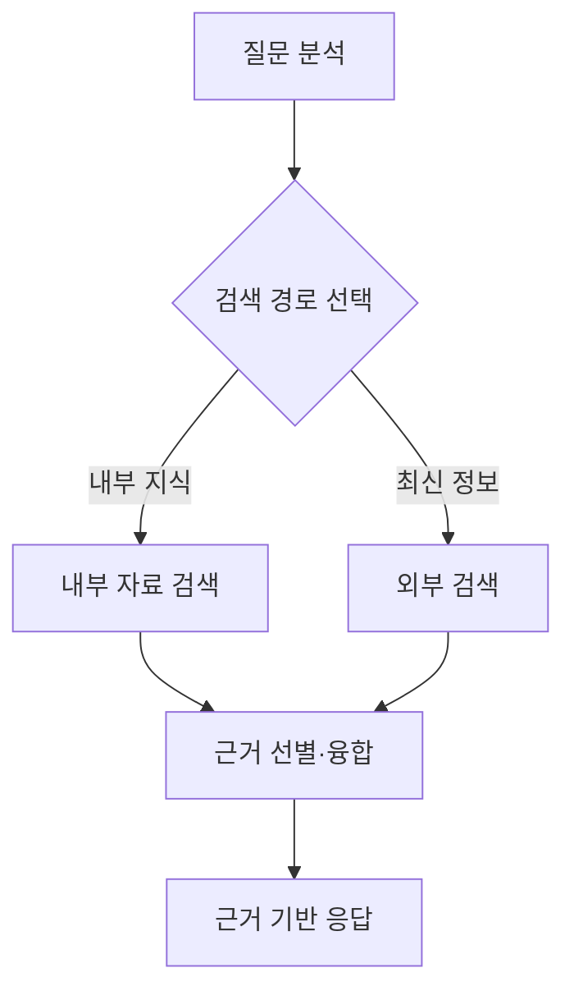
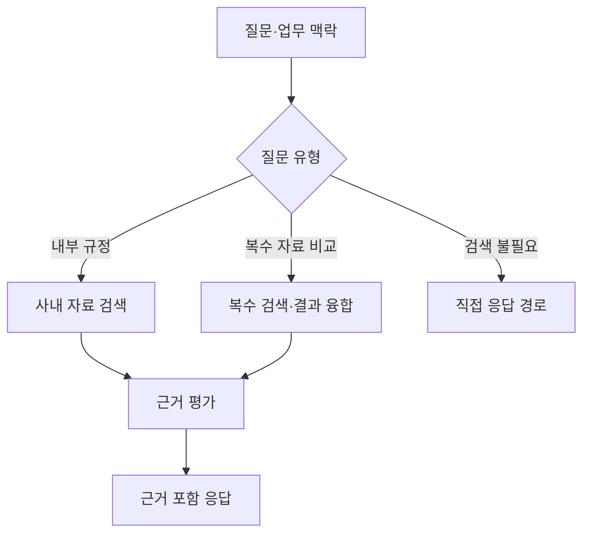

## 30초 인출

- 본질: Modular RAG는 검색·라우팅·융합 같은 기능을 모듈로 나눠 과업에 맞게 조합하는 RAG 설계 방식이다.
- 메커니즘: 질문 분석 → 필요한 모듈 선택·연결 → 검색 근거로 생성 → 결과 평가

핵심 용어

- **RAG**: 외부 자료를 검색해 언어 모델의 응답 생성에 근거로 제공하는 방식
- **라우팅**: 질문이나 조건에 따라 사용할 검색·처리 경로를 선택하는 기능
- **융합**: 여러 검색 결과를 하나의 후보 목록이나 문맥으로 결합하는 기능
- **모듈성**: 기능 단위를 교체·조합할 수 있도록 인터페이스와 역할을 나누는 설계 성질

---
## 1교시 예상문제 (10점)

> 제139회 1교시 3번 기출: “Advanced RAG(Retrieval-Augmented Generation)와 Modular RAG(Retrieval-Augmented Generation)를 비교하시오.”

---
## 1교시 10점 답안

### 1. 정의·목적
- 정의: Modular RAG는 RAG 기능을 모듈로 나눠 질문과 업무에 맞게 경로를 구성하는 설계 방식이다.
- 목적: 검색·처리 단계를 과업에 맞춰 조합하고 변경을 쉽게 한다.

### 2. 비교

| 구분 | Advanced RAG | Modular RAG |
|---|---|---|
| 관점 | 검색 전·중·후 처리를 보강 | 기능 모듈과 연결 방식을 설계 |
| 구성 | 질의 변환, 검색, 재정렬 등 다양한 보강 | 검색·라우팅·융합·생성 등 독립 기능 조합 |
| 흐름 | 특정 단계 구분을 활용할 수 있음 | 선형·조건부·분기·반복 경로 가능 |

### 3. 모듈 조합 예

검색 경로는 과업에 따라 달라지고, 검색 결과는 생성 전에 근거 문맥으로 결합한다.

### 4. 제언
모듈 경계·입출력 형식·평가 기준을 먼저 정한다.

---
## 2~4교시 예상문제 (25점)

> Modular RAG의 개념과 모듈 구성 방식을 설명하고, Advanced RAG와 비교하여 적용 시 고려사항을 제시하시오. (예상)

---
## 2~4교시 25점 답안

## Ⅰ. Advanced RAG와 Modular RAG
Advanced RAG는 검색 품질을 높이기 위한 보강 기법을, Modular RAG는 RAG 기능을 모듈화하고 경로를 구성하는 관점을 강조한다. 두 방식은 배타적이지 않다.

| 구분 | Advanced RAG | Modular RAG |
|---|---|---|
| 핵심 질문 | 검색 전후를 어떻게 개선하는가 | 필요한 기능을 어떻게 나누고 연결하는가 |
| 대표 기능 | 질의 재작성, 재정렬, 문맥 압축 등 | 검색, 라우팅, 융합, 생성, 평가 등 |
| 관계 | 기법을 모듈로 구현할 수 있음 | Advanced RAG 기법을 포함할 수 있음 |

## Ⅱ. 질의별 실행 경로

라우터는 업무 맥락에 따라 모듈 경로를 고르고, 검색을 거친 경로는 근거 평가 뒤 생성한다. 모든 요청이 동일한 모듈을 통과할 필요는 없다.

## Ⅲ. 설계·평가 기준

| 영역 | 확인할 사항 |
|---|---|
| 인터페이스 | 모듈 간 질의·문서·출처 메타데이터 형식 |
| 검색 품질 | 검색 재현율, 근거 관련성, 최신성 |
| 응답 품질 | 근거 충실성, 과업 적합성, 인용 정확성 |
| 운영 | 지연시간, 비용, 실패 경로와 관측 가능성 |

## Ⅳ. 기술적 제언

| 문제 | 해결 방안 |
|---|---|
| 모듈을 추가할수록 운영 경로가 복잡해져 전체 RAG 품질 개선이 불분명해짐 | 기본 경로를 작게 유지하고, 새 모듈은 대표 질의에서 개선 효과가 확인된 경우에만 연결한다. |

---
## 출제 이력과 검증 출처

- 제139회 1교시 3번: Advanced RAG와 Modular RAG 비교
- Gao et al., [Modular RAG: Transforming RAG Systems into LEGO-like Reconfigurable Frameworks](https://arxiv.org/abs/2407.21059): 모듈형 설계와 선형·조건부·분기·반복 패턴을 확인함.
