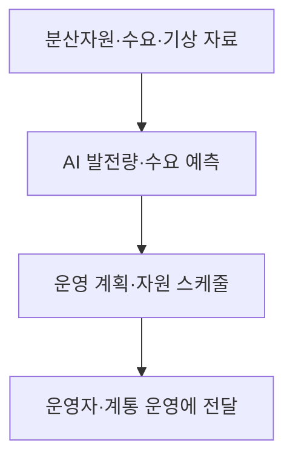
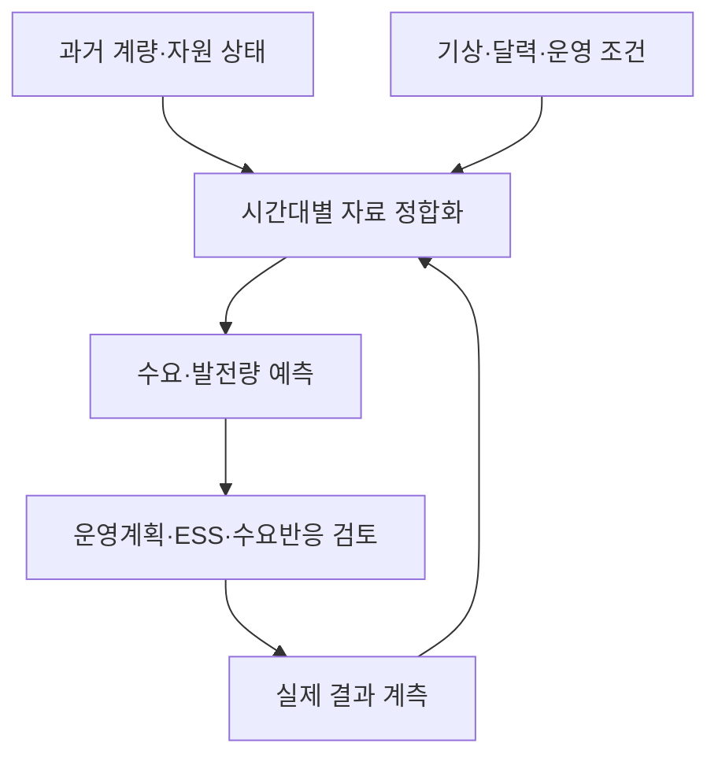

## 30초 인출

- 본질: VPP는 분산 에너지 자원을 묶어 전력 수급 조정과 계통 서비스를 제공하는 운영 방식이다.
- 메커니즘: 자원·수요 자료 수집 → 발전량·수요 예측 → 운영자·제어시스템이 자원 운용 계획에 활용

핵심 용어

- **VPP(가상발전소)**: 여러 분산 에너지 자원을 통신·제어 체계로 집합해 운영하는 방식
- **DER(분산 에너지 자원)**: 소비지 인근에 있는 분산 발전·저장·유연 부하 자원
- **수요예측**: 과거 사용량, 기상, 달력 등 자료로 미래 전력 수요를 추정하는 작업
- **예측오차**: 실제값과 예측값의 차이. 운영 목적에 맞는 지표와 시간 범위로 평가

---
## 1교시 예상문제 (10점)

> VPP의 개념과 AI 기반 전력 수요예측이 운영에 활용되는 방식을 설명하시오. (예상)

---
## 1교시 10점 답안

### 1. 정의·목적
- 정의: VPP는 분산 발전·저장·유연 수요 자원을 정보통신·제어 체계로 묶어 운영하는 방식이다.
- 목적: 분산 자원의 상태와 예측 정보를 활용해 전력 수급 조정과 계통 운영을 돕는다.

### 2. 예측과 운용

예측은 ESS 운용, 수요반응, 자원 일정 수립을 지원한다. 실제 제어·시장 참여는 자원 계약과 계통·시장 규칙에 따라 정한다.

### 3. 제언
예측값을 실제 계량 자료와 비교해 오차와 운영 영향을 함께 관리한다.

---
## 2~4교시 예상문제 (25점)

> 제139회 4교시 5번 기출 주제: “VPP(Virtual Power Plant) 가상발전소에서는 전력수요 예측을 위해 AI 기술을 사용하고 있다.” VPP 구성과 수요예측 활용, 도입 시 고려사항을 설명하시오. (예상형 확장)

---
## 2~4교시 25점 답안

## Ⅰ. VPP의 개념과 목적
VPP는 분산된 발전·저장·소비 자원을 통신과 운영 체계로 모아 하나의 집합 자원처럼 관리한다.

| 자원 | 예 | 운영상 역할 |
|---|---|---|
| 분산 발전 | 태양광 등 | 발전량·출력 변동 정보를 제공 |
| 저장 | 배터리 저장장치 | 충전·방전 일정에 유연성 제공 |
| 유연 수요 | 건물·산업 부하, 충전 설비 | 계약·제어 범위 안에서 사용 시점을 조정 |

DOE 자료는 VPP를 분산 에너지 자원의 집합으로 설명하며, 수요 유연성과 분산 발전·저장 자원의 조정이 전력망 서비스를 지원할 수 있다고 본다.

## Ⅱ. 수요예측 자료 흐름과 활용

화살표는 자료 결합, 예측, 계획 수립, 결과 환류 순서를 나타낸다. 예측 결과는 계획의 입력이며, 운용 결정은 운영 조건과 권한에 따라 이뤄진다.

## Ⅲ. 모델·운영 평가

| 단계 | 점검 내용 |
|---|---|
| 자료 준비 | 결측·이상 계량값, 시각대, 자원별 측정 품질 |
| 모델링 | 계절성·기상·휴일 등 과업에 필요한 입력과 기준모델 비교 |
| 평가 | 예측 시간 범위별 오차와 피크·급변 구간의 운영 영향 |
| 운영 | 실제 오차 감시, 자료·모델 변경 기록, 재평가 절차 |

## Ⅳ. 기술적 제언

| 문제 | 해결 방안 |
|---|---|
| 단일 예측값만으로 계획하면 변동성이 큰 시간대의 공급 부족을 놓칠 수 있음 | 예측 불확실성을 함께 산출해 운영 여유를 정하는 방안을 시험하고, 실제 계획 성과로 보정한다. |

---
## 출제 이력과 검증 출처

- 제139회 4교시 5번: VPP의 전력 수요예측과 AI 활용 주제. 원문에 기재된 범위를 유지하고 세부 문항은 예상형으로 확장함.
- 미국 에너지부, [Virtual Power Plants](https://www.energy.gov/edf/virtual-power-plants): VPP와 분산 자원 집합의 개념을 확인함.
- 미국 에너지부, [Virtual Power Plants: Demand Flexibility & Distributed Generation and Storage](https://www.energy.gov/sites/default/files/2024-04/2024%20The%20Future%20of%20Resource%20Adequacy%20Report.pdf): 수요 유연성·분산 발전·저장 자원의 운영 역할을 확인함.
