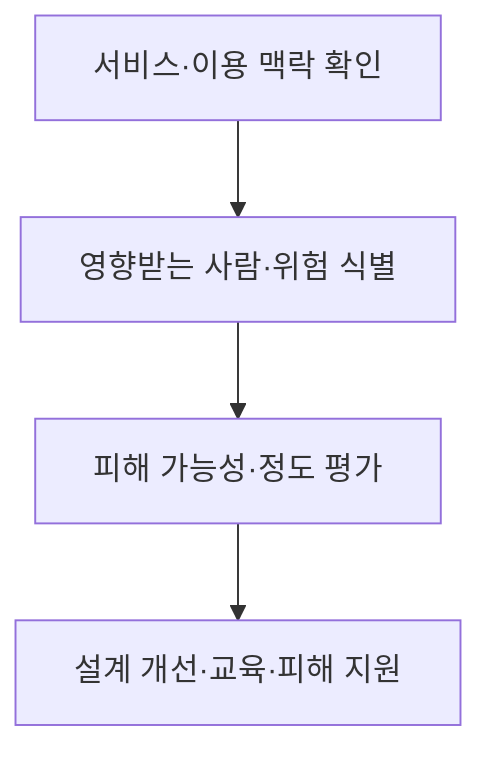
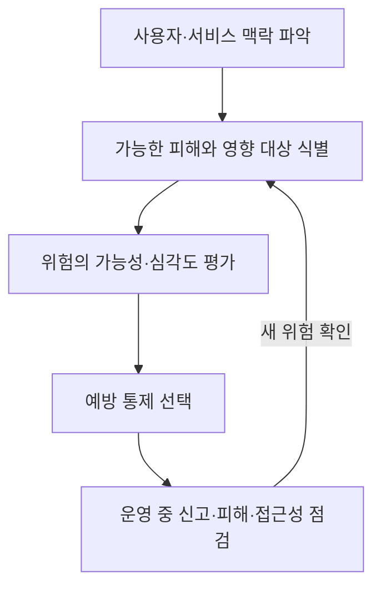

## 30초 인출

- 본질: 디지털 역기능은 디지털 기술의 설계·접근·이용에서 생기는 개인·사회 차원의 피해와 불이익이다.
- 메커니즘: 위험이 생기는 이용 맥락 파악 → 영향받는 사람과 피해 평가 → 설계·교육·지원으로 예방·완화

핵심 용어

- **디지털 역기능**: 디지털 기술의 이용 과정에서 발생하는 접근·안전·권리·사회적 문제를 아우르는 표현
- **디지털 접근성**: 장애 여부와 관계없이 사람이 디지털 서비스의 정보와 기능을 이용할 수 있도록 하는 성질
- **디지털 포용**: 이용자의 조건과 역량 차이를 고려해 디지털 서비스 참여 기회를 넓히는 접근
- **다크 패턴**: 사용자의 선택을 왜곡하거나 방해하도록 설계한 인터페이스 패턴

---
## 1교시 예상문제 (10점)

> 제130회 1교시 기출: “디지털 역기능”

---
## 1교시 10점 답안

### 1. 정의·목적
- 정의: 디지털 역기능은 디지털 기술의 이용으로 개인·사회에 생기는 피해와 불이익을 말한다.
- 목적: 기술 활용의 편익을 살리면서 접근·안전·권리 침해를 줄인다.

### 2. 주요 유형

| 유형 | 예 |
|---|---|
| 접근·역량 격차 | 서비스 이용에 필요한 기기·접근성·디지털 역량 차이 |
| 과의존·건강 | 이용 조절 곤란, 수면·일상생활 방해 |
| 정보·권리 피해 | 허위 정보, 사칭·사기, 개인정보 침해 |
| 서비스 설계 문제 | 기만적 선택 유도, 불투명한 추천·자동화 결정 |

### 3. 대응 흐름

### 4. 제언
서비스 설계 초기부터 접근성·안전·이의제기 경로를 함께 마련한다.

---
## 2~4교시 예상문제 (25점)

> 디지털 역기능의 주요 유형과 사회적 영향을 설명하고, 개인·서비스 제공자·공공 부문의 대응 방안을 제시하시오. (예상)

---
## 2~4교시 25점 답안

## Ⅰ. 개념과 주요 유형
디지털 역기능은 기술 자체의 속성만이 아니라 서비스 설계, 이용 맥락, 이용자 조건이 맞물려 생기는 피해다.

| 영역 | 문제 예 | 영향 |
|---|---|---|
| 접근·역량 격차 | 접근성 장벽, 디지털 역량 차이 | 서비스·정보 이용 기회 차이 |
| 심리·생활 | 이용 조절의 어려움, 과도한 알림·피드 | 수면·학습·일상에 부정적 영향 가능 |
| 정보·안전 | 사칭, 사기, 개인정보 침해, 허위 정보 | 경제적 손실·신뢰 저하 |
| 설계·알고리즘 | 기만적 선택 유도, 불투명한 자동화 | 자율성·공정성·설명 가능성 훼손 우려 |

## Ⅱ. 피해 파악과 대응 절차

이 도해는 위험을 한 번 점검하고 끝내지 않고, 운영 중 새 피해가 확인되면 다시 평가하는 순환을 나타낸다.

## Ⅲ. 주체별 대응

| 주체 | 대응 |
|---|---|
| 개인·가정·교육기관 | 정보 출처 확인, 계정·개인정보 보호, 이용 조절과 도움 요청 교육 |
| 서비스 제공자 | 접근성 시험, 안전한 기본 설정, 선택의 명확성, 신고·이의제기·수정 절차 |
| 공공 부문 | 취약 이용자 지원, 피해 구제·예방 교육, 위험 기반 감독·평가 |

디지털 접근성은 설계와 시험 과정에서 구체적인 이용자 요구를 확인해야 한다. W3C WAI는 웹 접근성 표준과 지원 자료를 제공한다.

## Ⅳ. 기술적 제언

| 문제 | 해결 방안 |
|---|---|
| 이용 취약성 점검이 개발 후반에 이뤄져 서비스 구조를 바꾸기 어려움 | 기획 단계에서 취약 이용자와 핵심 이용 경로를 먼저 정하고, 시제품 검토에 당사자 사용성 시험을 반영한다. |

---
## 출제 이력과 검증 출처

- 제123회 4교시, 제130회 1교시: 디지털 역기능 관련 기출 이력(원문 노트 표기)
- W3C WAI, [접근성·사용성·포용](https://www.w3.org/WAI/fundamentals/accessibility-usability-inclusion/): 접근성과 포용적 설계의 관계를 확인함.
- W3C WAI, [웹 접근성 소개](https://www.w3.org/WAI/fundamentals/accessibility-intro/): 접근성 설계의 목적을 확인함.
