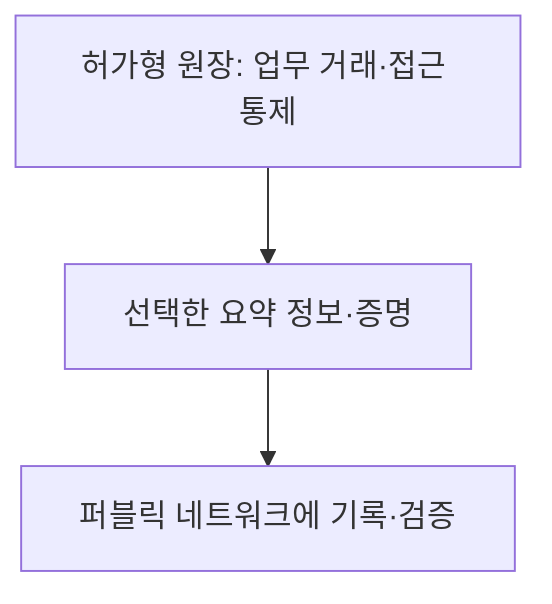
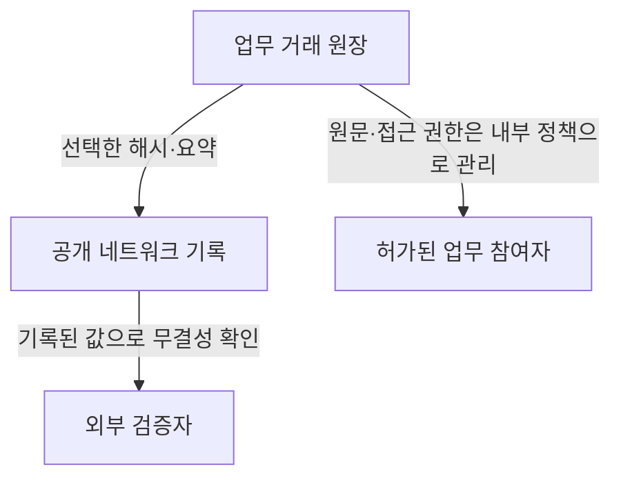

## 30초 인출

- 본질: 블록체인 유형은 주로 참여 허가, 검증 권한, 데이터 공개와 거버넌스 방식으로 구분한다.
- 메커니즘: 공개 참여·검증 중심의 퍼블릭과 신원·정책으로 통제하는 허가형을 요구에 맞춰 선택하며, 하이브리드는 두 환경을 연계하는 설계다.

핵심 용어

- **퍼블릭(permissionless) 네트워크**: 누구나 참여할 수 있는 공개 네트워크. 실제 읽기·쓰기·검증 권한은 프로토콜 규칙에 따름
- **허가형(permissioned) 네트워크**: 알려진 신원과 정책에 따라 참여·행위를 관리하는 네트워크
- **프라이빗 블록체인**: 한 조직이 운영을 주도하는 허가형 네트워크의 한 형태
- **컨소시엄 블록체인**: 복수 조직이 참여·거버넌스를 나누는 허가형 네트워크의 한 형태
- **하이브리드 블록체인**: 공개 네트워크와 허가형 시스템을 목적에 맞춰 연계하는 설계. 공개 원장 앵커링은 가능한 한 패턴이지 필수 정의가 아님

---
## 1교시 예상문제 (10점)

> 제126회 1교시 기출: “하이브리드 블록체인”

---
## 1교시 10점 답안

### 1. 정의·목적
- 정의: 하이브리드 블록체인은 공개 네트워크와 허가형 네트워크의 기능을 목적에 따라 함께 쓰는 설계다.
- 목적: 공개 검증과 참여 통제·정보 보호 사이의 요구를 조정한다.

### 2. 구성 예

화살표는 하나의 가능한 앵커링 패턴이다. 모든 하이브리드 체인이 이 구조를 따르거나 민감한 원자료를 공개 원장에 올리는 것은 아니다.

### 3. 제언
공개할 정보와 검증 주체, 키 관리 책임을 먼저 정한다.

---
## 2~4교시 예상문제 (25점)

> 제124회 4교시 5번 기출: “퍼블릭(Public) 블록체인과 프라이빗(Private) 블록체인의 차이점을 비교하여 설명하시오.”

---
## 2~4교시 25점 답안

## Ⅰ. 유형 구분 기준
네트워크의 이름만으로 권한을 단정하기보다 참여 허가와 거버넌스를 확인해야 한다.

| 유형 | 참여·검증 | 운영·거버넌스 |
|---|---|---|
| 퍼블릭 | 누구나 접근할 수 있는 공개형이 일반적이며 검증은 프로토콜 조건에 따름 | 공개 프로토콜과 네트워크 합의에 따름 |
| 프라이빗 | 참여를 한 조직의 정책으로 제한 | 단일 조직이 운영을 주도 |
| 컨소시엄 | 참여를 복수 기관의 정책으로 제한 | 참여 기관이 규칙·운영을 공동 관리 |
| 하이브리드 | 공개·허가형 요소를 함께 사용 | 연계 범위·권한·데이터 공개를 설계로 결정 |

퍼블릭/허가형은 접근·참여 방식, 프라이빗/컨소시엄은 거버넌스 주체를 설명하는 축이다.

## Ⅱ. 퍼블릭과 프라이빗 비교

| 비교 항목 | 퍼블릭 | 프라이빗 |
|---|---|---|
| 참여 | 공개 네트워크 규칙에 따라 폭넓게 참여 | 조직이 신원·권한을 관리 |
| 검증 | 합의 프로토콜에 따라 검증자 참여 | 허가된 노드와 정책으로 거래 검증 |
| 데이터 | 원장 데이터가 공개될 수 있어 민감정보 처리 주의 | 접근을 제한할 수 있으나 권한 설정·운영자 신뢰가 필요 |
| 적용 검토 | 공개 검증·개방성이 중요한 경우 | 참여자 식별·업무 통제가 중요한 경우 |

## Ⅲ. 하이브리드 연계 패턴

이 예에서는 내부 원문과 외부 공개 증거를 분리한다. 실제 구성에서는 공개 대상 데이터, 검증 방식, 거래 비용·지연, 키와 권한 관리 책임을 따져야 한다.

## Ⅳ. 기술적 제언

| 문제 | 해결 방안 |
|---|---|
| 퍼블릭 원장에 민감한 거래 자료를 직접 기록하면 공개 범위가 과도해질 수 있음 | 필요한 검증 자료만 선별하고 개인정보·영업정보는 원장 밖에서 보호 |
| 프라이빗 체인은 운영 주체와 권한 설정에 신뢰가 집중될 수 있음 | 참여기관·관리자·검증자 역할을 분리하고 변경·감사 절차를 마련 |
| 서로 다른 네트워크 사이 검증·연계가 복잡함 | 연계 목적과 신뢰 가정을 문서화하고 실패·키 손상 시 대응을 시험 |

---
## 출제 이력과 검증 출처

- 제124회 4교시 5번: 퍼블릭·프라이빗 블록체인 비교
- 제126회 1교시: 하이브리드 블록체인
- Ethereum, [네트워크 개요](https://ethereum.org/developers/docs/networks/): 공개 네트워크 참여와 검증 설명을 확인함.
- Hyperledger Fabric, [허가형 네트워크 개요](https://hyperledger-fabric.readthedocs.io/en/latest/whatis.html): 식별된 참여자, 정책과 허가형 네트워크의 차이를 확인함.
