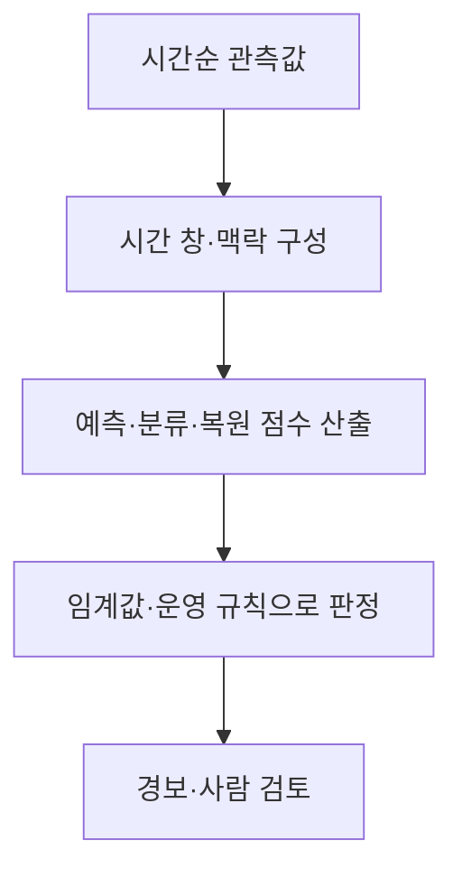
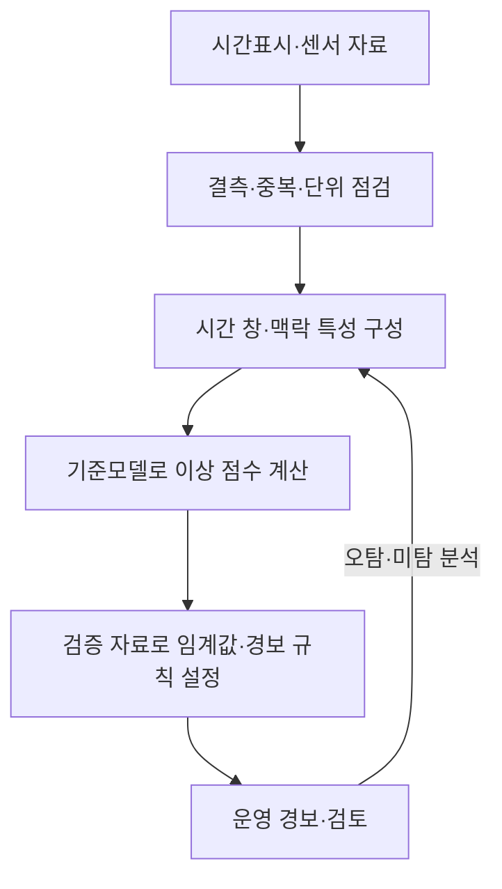

## 30초 인출

- 본질: 시계열 이상치 탐지는 시간 순서와 상황을 고려해 정상 패턴과 다른 관측·구간을 찾는 작업이다.
- 메커니즘: 시간 창 구성 → 기준모델로 점수 산출 → 상황에 맞는 임계값으로 판정 → 운영 결과를 점검

핵심 용어

- **점 이상**: 특정 시점의 값이 주변 패턴에서 벗어나는 이상
- **문맥 이상**: 값 자체보다 시간·상황 맥락에서 비정상인 관측
- **집단 이상**: 개별 값은 정상 범위여도 연속된 구간의 조합이 비정상인 경우
- **재구성 오차**: 입력 구간과 모델이 복원한 구간 사이의 차이. 이상 점수로 쓸 수 있으나 단독 확정 기준은 아님
- **SPOT**: 극단값 이론 기반 임계값 설정을 스트림에 적용하는 방법. 데이터·분포 가정과 매개변수 점검이 필요

---
## 1교시 예상문제 (10점)

> 제140회 4교시 4번 기출 주제: “시계열 데이터에서 실시간 이상치 탐지는 여러 산업 분야에서 중요성이 증가하고 있다. 다음을 설명하시오.”

---
## 1교시 10점 답안

### 1. 정의·목적
- 정의: 시계열 이상치 탐지는 시간 순서와 상황을 반영해 정상 패턴에서 벗어난 관측이나 구간을 찾는 작업이다.
- 목적: 장애·위험 징후를 조기에 찾아 운영자의 확인과 대응을 돕는다.

### 2. 유형과 탐지

| 유형 | 예 |
|---|---|
| 점 이상 | 한 시점의 비정상 급등 |
| 문맥 이상 | 계절·시간대에 비춰 비정상인 값 |
| 집단 이상 | 값 하나는 정상이어도 순서·조합이 비정상인 구간 |

### 3. 제언
경보 임계값은 시간대별 정상 변동과 오탐 비용을 고려해 검증한다.

---
## 2~4교시 예상문제 (25점)

> 시계열 이상치의 유형과 통계·기계학습 기반 탐지 절차를 설명하고, 실시간 적용 시 고려사항을 제시하시오. (예상)

---
## 2~4교시 25점 답안

## Ⅰ. 이상치의 유형과 판정 관점
이상 여부는 값의 크기뿐 아니라 시간·조건·연속 구간과 비교해 판단한다.

| 유형 | 판정 관점 | 예시 |
|---|---|---|
| 점 이상 | 한 관측이 주변 분포에서 이탈 | 압력의 순간 급등 |
| 문맥 이상 | 정상 범위 안의 값이 특정 맥락에서 이탈 | 계절·시간에 맞지 않는 부하 |
| 집단 이상 | 여러 관측의 순서·조합이 비정상 | 정상 폭의 값이 비정상 순서로 반복 |

## Ⅱ. 탐지 절차

모델은 통계 기준, 예측 오차, 분류기, 밀도·격리 기반 방법 등에서 과업에 맞게 고른다. 재구성 오차도 한 가지 점수 방식이며 정상 자료만으로 충분히 분리된다는 보장은 없다.

## Ⅲ. 접근 방법과 평가

| 접근 | 장점·용도 | 주의점 |
|---|---|---|
| 통계·예측 잔차 | 기준선이 명확하고 계산이 단순 | 계절성·추세 변화에 민감할 수 있음 |
| 트리·밀도 기반 모델 | 복합 특성·비선형 경계를 다룰 수 있음 | 시계열 순서·맥락을 별도 표현해야 할 수 있음 |
| 시계열 신경망 | 긴 문맥·다변량 패턴을 학습 가능 | 라벨·계산량·드리프트와 설명 가능성을 점검 |
| 임계값 보정 | 경보 빈도·위험 수준을 조정 | 분포·매개변수 변화와 실제 오탐을 확인 |

평가에는 적중률뿐 아니라 오탐·미탐, 탐지 지연, 경보 수와 운영자가 처리할 수 있는지를 포함한다.

## Ⅳ. 기술적 제언

| 문제 | 해결 방안 |
|---|---|
| 계절·운전 조건 변화로 오탐이 누적될 수 있음 | 운전 상태별 기준선과 임계값을 검증하고 분포 변화 감시 |
| 희귀한 이상 사례가 적어 모델 평가가 불안정함 | 장애 이력·모의 사례를 구분해 검증하고 운영자 판정으로 갱신 |
| 경보가 많아도 원인 확인으로 이어지지 않을 수 있음 | 중요도·관련 시점·기여 변수를 함께 제공하고 경보 처리 절차를 연결 |

---
## 출제 이력과 검증 출처

- 제140회 4교시 4번: 실시간 시계열 이상치 탐지 주제
- Siffer et al., [Anomaly Detection in Streams with Extreme Value Theory](https://dl.acm.org/doi/10.1145/3097983.3098144): 스트리밍 임계값 접근의 범위를 확인함.
- Tuli et al., [TranAD: Deep Transformer Networks for Anomaly Detection in Multivariate Time Series Data](https://arxiv.org/abs/2201.07284): 시계열 이상 탐지 연구 사례를 확인함.
