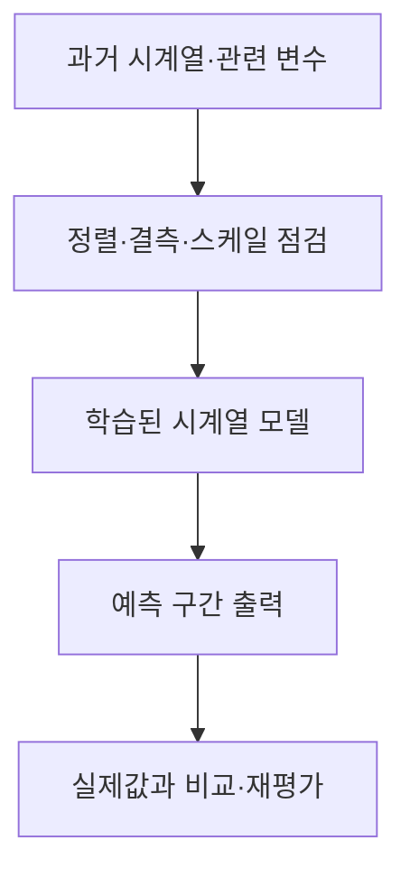
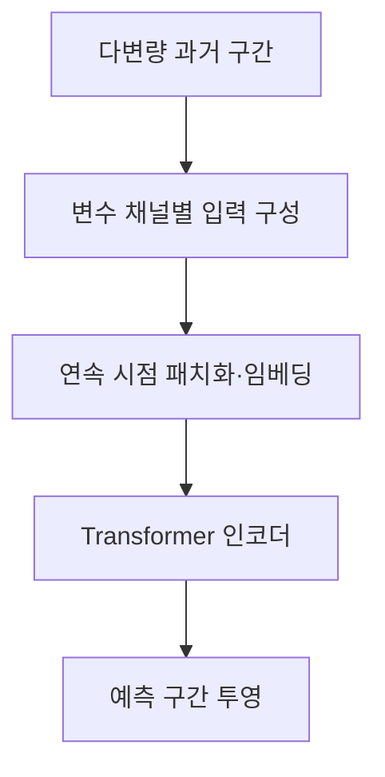

## 30초 인출

- 본질: 시계열 딥러닝은 시간 순서가 있는 자료에서 예측·분류에 유용한 패턴을 신경망으로 학습하는 방법이다.
- 메커니즘: 과거 구간과 관련 변수를 입력 → 시간 특징 학습 → 미래 구간을 예측하고 기준모델과 비교

핵심 용어

- **시계열**: 시간 순서에 따라 측정·기록된 자료
- **LSTM**: 장·단기 상태를 게이트로 조절하는 순환 신경망 구조
- **TCN**: 시간 방향 합성곱으로 과거 구간의 특징을 계산하는 신경망 구조
- **패칭(Patching)**: 연속한 여러 시점을 한 구간 단위 표현으로 묶는 방법
- **채널 독립 처리**: 다변량 시계열의 각 변수를 별도 채널로 입력해 모델링하는 설계 선택

---
## 1교시 예상문제 (10점)

> 시계열 딥러닝의 개념과 예측 과정, 대표 알고리즘을 설명하시오. (예상)

---
## 1교시 10점 답안

### 1. 정의·목적
- 정의: 시계열 딥러닝은 시간순 자료의 추세·계절·변수 관계를 신경망으로 학습하는 방법이다.
- 목적: 과거 관측과 보조 정보를 이용해 미래값이나 상태를 추정한다.

### 2. 예측 과정

### 3. 대표 구조

| 계열 | 핵심 계산 |
|---|---|
| RNN·LSTM | 시점별 상태를 갱신하며 순서 정보를 이용 |
| TCN | 합성곱으로 시간 구간의 특징을 계산 |
| Transformer | 어텐션으로 입력 구간의 관계를 계산 |

### 4. 제언
복잡한 모델을 적용하기 전에 단순 기준모델과 동일한 자료·평가 조건에서 비교한다.

---
## 2~4교시 예상문제 (25점)

> 시계열 딥러닝의 예측 구조와 대표 모델을 설명하고, 모델 선정·평가 시 고려사항을 제시하시오. (예상)

---
## 2~4교시 25점 답안

## Ⅰ. 시계열 예측의 특성
시계열 예측은 시간 순서와 예측 시점에서 알 수 있는 정보를 지켜 미래 구간을 추정한다.

| 특성 | 설계·평가상 의미 |
|---|---|
| 추세·계절성 | 시간대·주기별 패턴과 변화 여부를 확인 |
| 자기상관 | 최근 과거의 값·상태가 이후 값과 연결될 수 있음 |
| 외생 변수 | 기상·달력·가격 등 예측 시점에 이용 가능한 자료를 구분 |
| 시간 누수 | 미래 자료가 학습·전처리·검증에 섞이지 않도록 분할 |

## Ⅱ. PatchTST 계열 처리 예

PatchTST는 입력 시점을 패치로 묶고 채널 독립 방식으로 처리하는 구조를 제안했다. 이는 설계 사례이지 모든 시계열 자료에서 최선이라는 뜻은 아니다.

## Ⅲ. 모델 선택과 검증

| 계열 | 적합성 검토 | 확인할 한계 |
|---|---|---|
| 통계·선형 기준모델 | 단순 추세·계절 패턴의 기준선 | 비선형·외생 상호작용 표현이 제한될 수 있음 |
| RNN·LSTM | 시간 순서의 상태 갱신이 필요한 문제 | 긴 순차 계산과 학습 안정성 |
| TCN | 구간 특징과 병렬 계산 활용 | 입력 길이·수용 구간 설계 |
| Transformer 계열 | 긴 문맥·변수 관계를 반영할 수 있음 | 자료량·연산비용, 기준모델 대비 실제 이득 |

시간순 학습·검증 분할을 사용하고, 여러 예측 구간에서 MAE·RMSE 등 과업에 맞는 오차와 운영 비용을 비교한다. 복잡도가 높은 모델이 단순 모델보다 항상 우수한 것은 아니다.

## Ⅳ. 기술적 제언

| 문제 | 해결 방안 |
|---|---|
| Transformer 계열 도입이 단순 기준모델보다 실제 예측을 개선하는지 불분명함 | 예측 시점별 시간순 검증에서 계절 기준선과 비교해 개선이 확인된 구간·과업에만 적용한다. |

---
## 출제 이력과 검증 출처

- 제139회 4교시 5번: VPP 전력수요 예측에 AI를 활용하는 기출 주제(원문 노트 표기). 이 노트의 포괄 문항은 예상.
- Nie et al., [A Time Series is Worth 64 Words: Long-term Forecasting with Transformers](https://arxiv.org/abs/2211.14730): PatchTST의 패치·채널 독립 설계를 확인함.
- Zeng et al., [Are Transformers Effective for Time Series Forecasting?](https://arxiv.org/abs/2205.13504): 기준선과 모델별 성능을 자료셋·조건별로 비교해야 하는 근거로 활용함.
