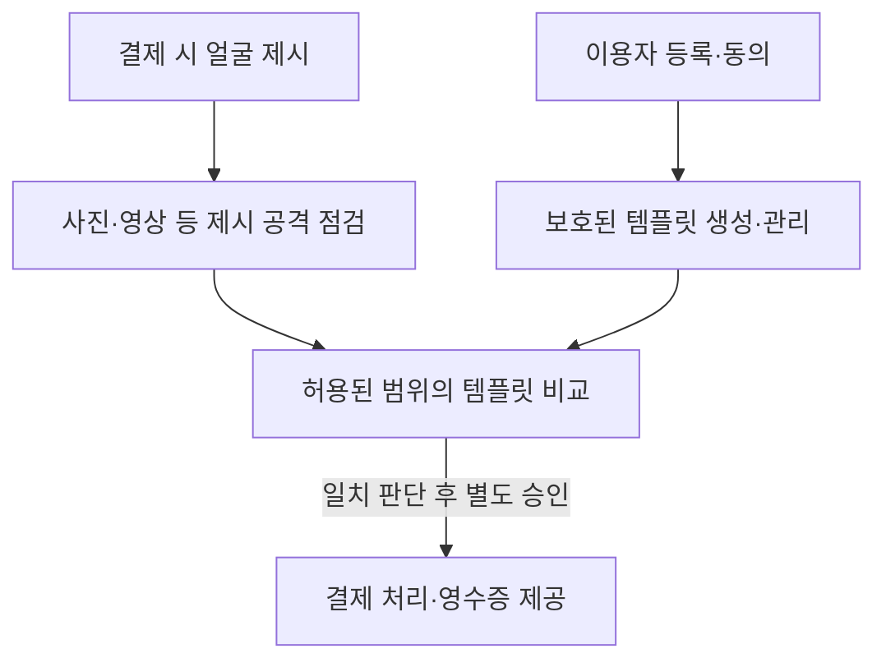
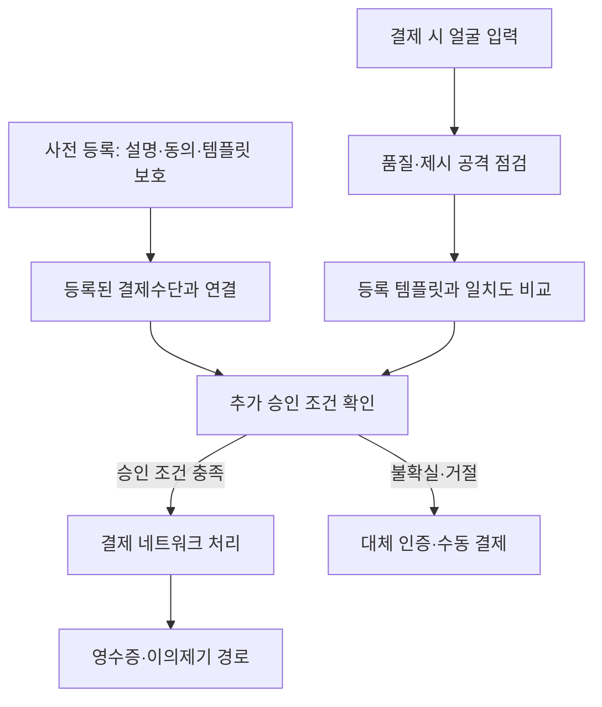

## 30초 인출

- 본질: 안면인식 결제는 얼굴 특징을 이용해 사용자를 확인하고, 별도 결제 시스템이 승인한 거래를 처리하는 서비스다.
- 메커니즘: 등록·동의 → 얼굴 제시와 위조 탐지 → 허용된 템플릿 비교 → 별도 결제 승인·영수증 제공

핵심 용어

- **생체인식**: 얼굴 등 개인의 신체·행동 특징을 이용해 동일인 여부를 추정하는 기술
- **등록 템플릿**: 원본 영상과 구별되는 생체 비교용 표현. 안전성은 생성·보호 방식에 달림
- **PAD(Presentation Attack Detection)**: 사진·영상 등 제시 공격을 탐지하는 생체인식 기술
- **1:1 인증 / 1:N 식별**: 사용자가 제시한 신원과 비교하거나, 여러 등록 대상 가운데 일치 후보를 찾는 방식
- **결제 토큰**: 결제 처리에서 실제 계정정보 대신 제한된 대체 식별자를 쓰는 설계 기법

---
## 1교시 예상문제 (10점)

> 제138회 1교시 5번 기출: “안면인식 결제 서비스”

---
## 1교시 10점 답안

### 1. 정의·목적
- 정의: 안면인식 결제는 얼굴 특징으로 이용자를 확인하고 결제 승인 절차와 연계하는 서비스다.
- 목적: 결제 편의성을 높이면서 본인 확인과 거래 보안을 제공한다.

### 2. 처리 흐름

생체 일치 판단은 결제 승인을 대신하지 않는다. 실제 인증 방식과 결제수단 연동은 사업 설계에 따라 다르다.

### 3. 보안 고려
동의·목적 제한, 템플릿 보호, 위조 탐지, 오인식 시 대체 인증과 분쟁 처리가 필요하다.

### 4. 제언
편의성보다 생체정보 보호와 오인식 대응을 먼저 설계한다.

---
## 2~4교시 예상문제 (25점)

> 안면인식 결제 서비스의 처리 구조와 생체인식 방식을 설명하고, 보안·개인정보·오인식 대응 방안을 제시하시오. (예상)

---
## 2~4교시 25점 답안

## Ⅰ. 개념과 인증 방식
안면인식 결제는 얼굴 비교를 본인 확인 단계로 쓰고, 승인·정산은 결제 시스템이 처리한다.

| 방식 | 비교 | 고려사항 |
|---|---|---|
| 1:1 인증 | 제시된 신원과 등록 템플릿을 비교 | 신원 제시·계정 연결 절차 필요 |
| 1:N 식별 | 여러 등록 템플릿에서 후보를 검색 | 검색 규모·오인식·임계값 관리가 중요 |

서비스는 결제수단 연결, 얼굴 처리 위치, 동의와 대체 수단을 명확히 해야 한다.

## Ⅱ. 서비스 처리 구조

이 도해는 한 가지 참조 흐름이다. PAD는 제시 공격 대응의 한 요소이며 모든 공격을 막는 보장은 아니다. ISO/IEC 30107-3은 생체인식 제시 공격 탐지의 시험·보고를 다룬다.

## Ⅲ. 위험과 통제

| 위험 | 통제 |
|---|---|
| 사진·화면 등으로 타인 행세 | PAD 시험, 위험 기반 추가 인증, 실패 시 대체 결제 |
| 템플릿·영상 유출 | 원본·템플릿 최소 수집, 암호화·접근 통제·보유기간 관리 |
| 오인식·거부 및 집단별 성능 차이 | 대표 이용자·환경에서 성능 시험, 오류 신고·이의제기 절차 |
| 결제 승인 오류·분쟁 | 얼굴 일치와 결제 승인을 분리하고 거래 확인·취소·환불 절차 제공 |

## Ⅳ. 기술적 제언

| 문제 | 해결 방안 |
|---|---|
| 생체정보는 비밀번호처럼 간단히 바꾸기 어려워 유출 영향이 큼 | 수집 최소화, 분리 보관, 접근 통제와 사고 대응을 설계하고 보유 필요성을 재검토 |
| 얼굴 비교 결과가 결제 성공으로 오인될 수 있음 | 생체 인증·거래 위험 확인·결제 승인을 별도 단계로 관리 |
| 이용자가 오인식에 대응할 경로가 불명확할 수 있음 | 대체 결제, 거래 확인, 이의제기와 정정 절차를 항상 제공 |

---
## 출제 이력과 검증 출처

- 제138회 1교시 5번: 안면인식 결제 서비스
- ISO, [ISO/IEC 30107-3:2023](https://www.iso.org/standard/79520.html): 생체인식 제시 공격 탐지의 시험·보고 범위를 확인함.
