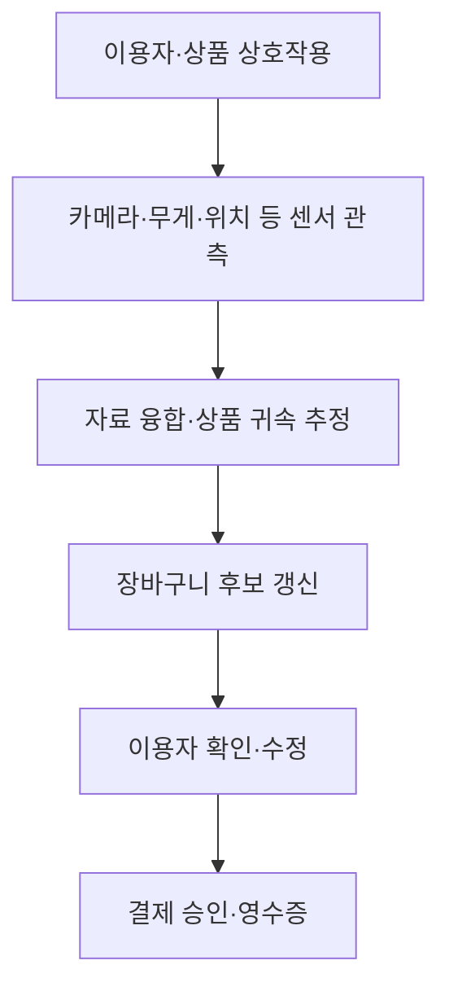
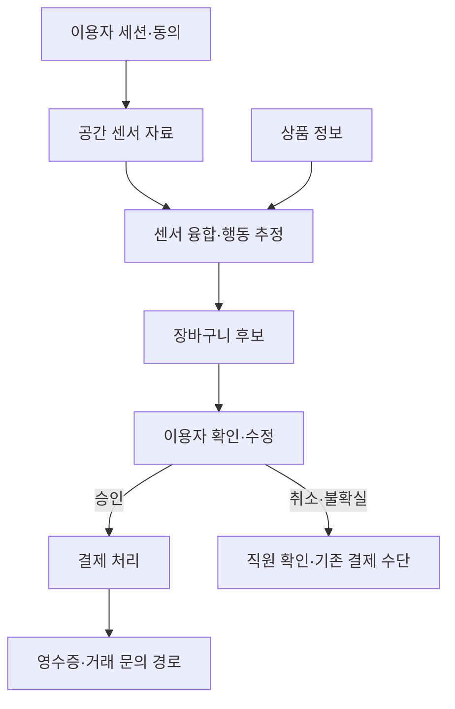

## 30초 인출

- 본질: 앰비언트 커머스는 공간·기기가 이용 맥락을 감지해 상품 탐색과 구매 절차를 주변 환경에 통합하는 상거래 방식이다.
- 메커니즘: 이용자 의도 확인 → 상품·행동 인식 → 장바구니 갱신 → 이용자에게 거래 확인·취소 기회 제공

핵심 용어

- **앰비언트 커머스**: 네트워크 연결 기기와 상황 인식으로 상거래 기능을 일상 환경에 통합하는 개념
- **센서 융합**: 여러 센서의 자료를 결합해 개별 센서의 불확실성을 줄이는 처리
- **가상 장바구니**: 이용자와 상품 상호작용을 연결해 구매 후보를 관리하는 소프트웨어 표현
- **제로 UI**: 화면·버튼 조작을 줄이고 음성·행동·환경 맥락으로 상호작용하는 설계 방향. 사용자의 확인 권리를 없앤다는 뜻은 아님

---
## 1교시 예상문제 (10점)

> 제120회 1교시 기출: “앰비언트 커머스(Ambient Commerce)의 개념과 주요 기술 요소를 설명하시오.”

---
## 1교시 10점 답안

### 1. 정의·목적
- 정의: 앰비언트 커머스는 연결된 기기와 공간이 이용 맥락을 파악해 상거래 기능을 자연스럽게 제공하는 방식이다.
- 목적: 탐색·주문·결제 과정의 불필요한 조작을 줄이되 이용자의 선택과 통제를 보장한다.

### 2. 기술 흐름

센서 관측만으로 구매 의도를 확정하지 않고, 추정 오류를 고치거나 거래를 확인할 경로를 둔다.

### 3. 제언
자동화로 조작을 줄여도 거래 확인·취소·대체 결제는 쉽게 제공한다.

---
## 2~4교시 예상문제 (25점)

> 제121회 2교시 기출: “IoT와 인공지능 기반의 앰비언트 커머스 아키텍처와 구현 시 고려해야 할 기술적·보안적 과제를 설명하시오.”

---
## 2~4교시 25점 답안

## Ⅰ. 개념과 기존 상거래 방식의 차이
앰비언트 커머스는 이용자·상품·공간의 맥락을 감지해 상거래 기능을 제공하며, 구매 절차를 무인·무확인으로 만들어야 한다는 뜻은 아니다.

| 방식 | 상호작용 중심 | 이용자 통제 |
|---|---|---|
| 웹·앱 상거래 | 검색·선택·주문 조작 | 화면에서 상품과 주문 확인 |
| 음성 상거래 | 음성 명령·대화 | 음성 응답과 승인 방식 |
| 앰비언트 상거래 | 주변 센서·기기의 맥락 인식 | 명시적 확인·수정·취소를 설계에 포함 |

## Ⅱ. 참조 아키텍처와 구매 처리

각 연결은 세션·관측·상품 자료의 결합, 이용자 승인 후 결제, 불확실할 때의 대체 경로를 나타낸다. 실제 센서 조합과 결제 방식은 서비스 구현에 따라 다르다.

## Ⅲ. 구현상 위험과 대응

| 위험 | 대응 |
|---|---|
| 여러 이용자의 동선이 겹쳐 상품을 잘못 귀속 | 센서별 불확실성을 결합하고 모호한 경우 자동 확정 대신 확인 요청 |
| 센서·모델 오류로 장바구니가 달라짐 | 상품별 근거·변경 내역 제공, 쉬운 수정·취소와 이의제기 절차 |
| 영상·위치 자료의 과도한 수집 | 목적에 필요한 최소 자료만 처리하고 보유·접근·삭제 기준 설정 |
| 장애·통신 중단 시 결제 흐름이 멈춤 | 수동 계산대 등 대체 경로와 안전한 장애 복구 절차 마련 |

## Ⅳ. 기술적 제언

| 문제 | 해결 방안 |
|---|---|
| 센서 조합이 매장마다 달라 인식·결제 품질을 사전에 예측하기 어려움 | 제한된 구역에서 상품 귀속과 장바구니 수정 흐름을 먼저 시험하고, 현장 측정 결과에 따라 확대 여부를 결정한다. |

---
## 출제 이력과 검증 출처

- 제120회 1교시: 앰비언트 커머스의 개념과 주요 기술 요소
- 제121회 2교시: IoT·AI 기반 아키텍처와 기술·보안 과제
- 원문 노트의 출제 이력과 문항 표기를 유지함. 업체별 무인 매장 구현을 보편 표준으로 취급하지 않음.
