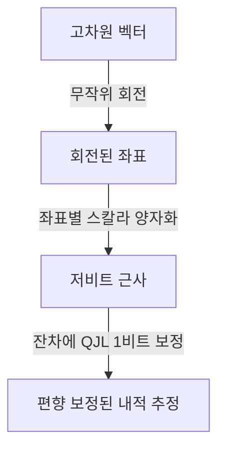
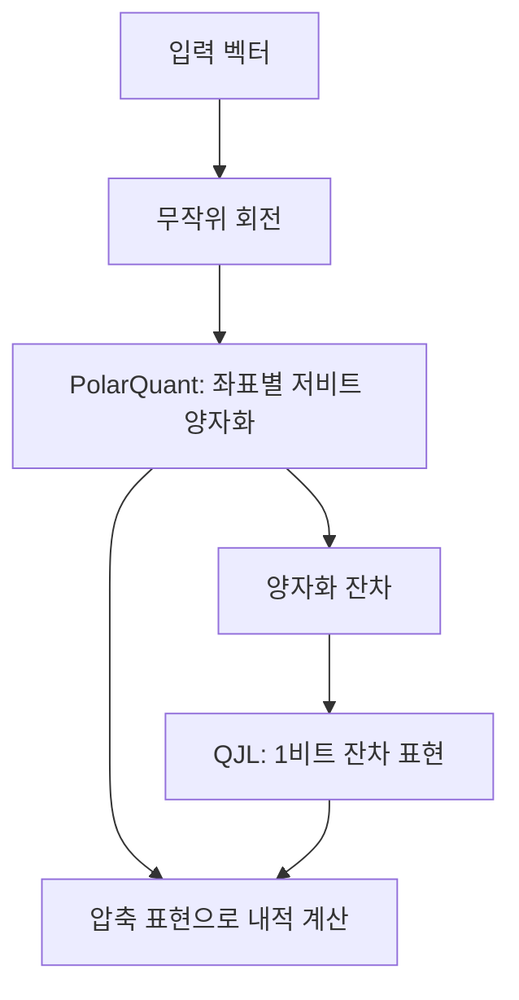

## 30초 인출

- 본질: TurboQuant는 고차원 벡터를 적은 비트로 표현하기 위한 온라인 벡터 양자화 방법이다.
- 메커니즘: 무작위 회전으로 좌표 분포를 다루기 쉽게 바꿈 → 좌표별 양자화 → 1비트 QJL 잔차로 내적 추정 편향 보정

핵심 용어

- **벡터 양자화**: 실수 벡터를 적은 비트의 표현으로 바꿔 저장량을 줄이는 방법
- **PolarQuant**: 무작위 회전된 좌표에 스칼라 양자화를 적용하는 TurboQuant의 주요 압축 단계
- **QJL(Quantized Johnson–Lindenstrauss)**: 잔차에 1비트 표현을 적용해 내적 추정의 편향을 보정하는 방법
- **KV 캐시**: 생성 중 재사용하는 어텐션의 Key·Value 벡터를 저장하는 메모리

---
## 1교시 예상문제 (10점)

> TurboQuant의 개념과 벡터 압축 원리를 설명하시오. (예상)

---
## 1교시 10점 답안

### 1. 정의·목적
- 정의: TurboQuant는 고차원 벡터의 저장 표현을 줄이면서 벡터 관계의 추정을 지원하는 양자화 방법이다.
- 목적: 벡터 검색이나 LLM KV 캐시처럼 벡터 저장량이 큰 작업의 메모리 부담을 줄인다.

### 2. 핵심 처리

PolarQuant가 압축 표현을 만들고 QJL이 남은 오차 성분의 내적 추정을 보정한다. 이는 가중치 이상치를 FP16으로 분리하는 방식과 다르다.

### 3. 제언
실제 모델·벡터 검색 작업에서 압축률과 품질 변화를 함께 측정한다.

---
## 2~4교시 예상문제 (25점)

> 제139회 2교시 4번 기출: “TurboQuant의 개념, 특징, 성능, 기존 양자화 기술과의 차이점, 기대 효과에 대하여 설명하시오.”

---
## 2~4교시 25점 답안

## Ⅰ. 해결 대상과 적용 범위
TurboQuant는 벡터 표현을 압축하는 방법으로, 연구에서 LLM KV 캐시와 벡터 검색 적용을 다룬다.

| 대상 | 저장 내용 | 구분 |
|---|---|---|
| KV 캐시 | 토큰별 Key·Value 벡터 | 문맥 처리 중 재사용하는 상태 |
| 벡터 검색 | 문서·항목 임베딩 | 유사 벡터 탐색용 표현 |
| 모델 가중치 | 학습된 파라미터 | GPTQ·AWQ 등은 주로 이 대상의 양자화를 다룸 |

KV 캐시 압축을 모델 가중치 압축과 같은 문제로 보아서는 안 된다.

## Ⅱ. 알고리즘 구성

무작위 회전은 좌표 분포를 단순화해 스칼라 양자화를 활용하며, QJL은 잔차에 대한 보정 정보를 추가한다. 논문은 양자화 벡터의 내적 추정과 왜곡률을 분석한다.

## Ⅲ. 기존 양자화와 비교

| 기법 | 주 대상·접근 | 구분점 |
|---|---|---|
| TurboQuant | 고차원 벡터·KV 표현 | 회전, 좌표 양자화, QJL 잔차 보정 |
| 가중치 양자화 | 모델 파라미터 | 가중치 표현 비트 수를 줄이는 데 초점 |
| KV 캐시 양자화 일반 | 추론 중 Key·Value 상태 | 다양한 스케일·압축 기법이 있으며 정확도·속도는 구현별 평가 필요 |

Google Research는 자사 실험 결과를 공개했으나, 특정 압축률·속도·정확도 수치를 모든 모델·하드웨어의 보장으로 일반화할 수 없다.

## Ⅳ. 기술적 제언

| 문제 | 해결 방안 |
|---|---|
| 벡터 압축 오차가 검색 순위나 어텐션 결과를 바꿀 수 있음 | 대상 모델·데이터의 검색 품질과 생성 품질을 기준 조건과 비교 |
| 특정 벤치마크의 속도 결과가 실제 서비스와 다를 수 있음 | 대상 하드웨어·배치·문맥 길이에서 메모리와 지연을 직접 측정 |
| KV 캐시용 기법을 가중치 압축에도 그대로 적용할 수 있다고 오해 | 최적화 대상 텐서와 연산 커널 지원 여부를 각각 확인 |

---
## 출제 이력과 검증 출처

- 제139회 2교시 4번: TurboQuant의 개념·특징·성능·기존 양자화와 비교·기대 효과
- Google Research, [TurboQuant 소개](https://research.google/blog/turboquant-redefining-ai-efficiency-with-extreme-compression/): KV 캐시·벡터 검색 적용과 논문 실험의 범위를 확인함.
- Zandieh et al., [TurboQuant: Online Vector Quantization with Near-optimal Distortion Rate](https://arxiv.org/abs/2504.19874): 무작위 회전, 좌표별 스칼라 양자화, QJL 잔차 보정을 확인함.
