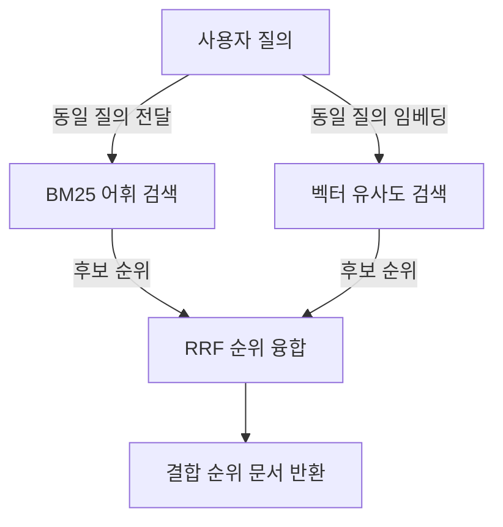
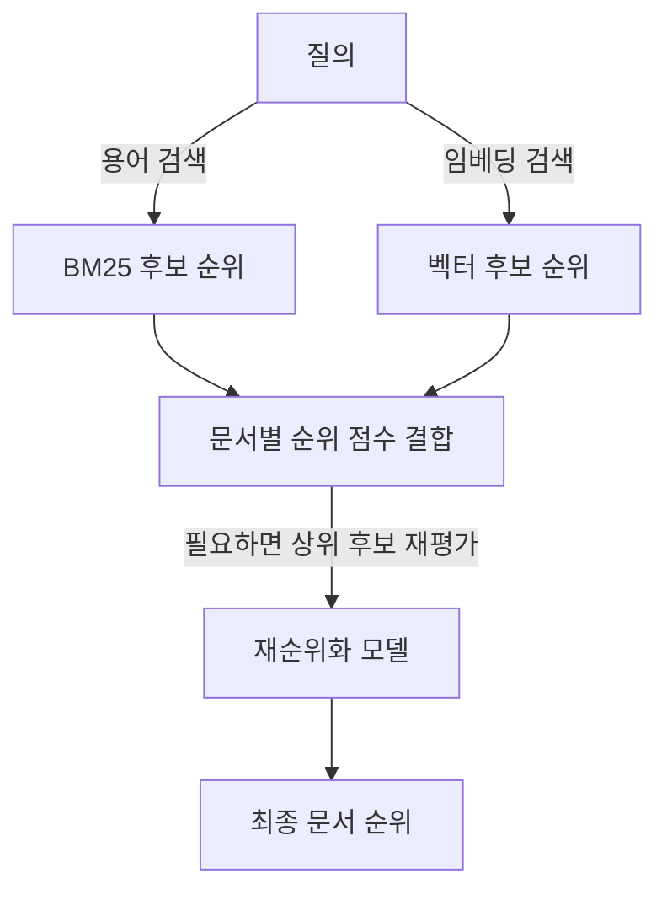

## 30초 인출

- 본질: 하이브리드 검색은 어휘 일치 검색과 벡터 유사도 검색을 결합해 서로 다른 검색 단서를 활용하는 방식이다.
- 메커니즘: 한 질의를 두 검색기에 전달 → 각각 후보 순위 산출 → 순위 융합 → 필요하면 재순위화

핵심 용어

- **BM25**: 용어 빈도·문서 빈도와 길이를 고려하는 어휘 검색 순위 함수
- **밀집 벡터 검색**: 질의·문서를 벡터로 표현해 의미적 유사성을 기준으로 후보를 찾는 방식
- **RRF(Reciprocal Rank Fusion)**: 각 검색기의 순위 역수를 합산해 후보 순위를 결합하는 방법
- **재순위화(reranking)**: 후보를 더 정밀한 관련성 모델로 다시 점수화하는 후처리

---
## 1교시 예상문제 (10점)

> 제140회 1교시 6번 기출 주제: “어휘검색(Lexical Search)과 의미검색(Vector Search)을 결합한 하이브리드 검색(Hybrid Search)”

---
## 1교시 10점 답안

### 1. 정의·목적
- 정의: 하이브리드 검색은 어휘 일치와 의미 유사도를 이용하는 검색 결과를 결합하는 방법이다.
- 목적: 정확한 용어와 의미적으로 가까운 문서를 함께 찾아 검색 누락을 줄인다.

### 2. 동작 흐름

BM25는 용어 일치 단서를, 벡터 검색은 임베딩 공간의 유사성 단서를 제공한다. RRF는 원점수 대신 후보 순위를 결합한다.

### 3. 제언
검색 로그와 정답 질의로 두 검색기의 기여와 최종 품질을 평가한다.

---
## 2~4교시 예상문제 (25점)

> 하이브리드 검색의 필요성, 어휘·벡터 검색의 결합 구조와 결과 평가 방법을 설명하시오. (예상)

---
## 2~4교시 25점 답안

## Ⅰ. 결합이 필요한 이유
어휘 검색과 벡터 검색은 서로 다른 관련성 단서를 사용한다.

| 방식 | 강점 | 주의점 |
|---|---|---|
| BM25 어휘 검색 | 제품 코드·고유명사·정확한 용어 일치 | 동의어·문맥 유사 표현을 놓칠 수 있음 |
| 벡터 검색 | 표현이 다른 의미상 유사한 문서 탐색 | 숫자·식별자 등 정확 일치가 약할 수 있음 |
| 하이브리드 | 양쪽 후보를 결합해 상보 단서 사용 | 색인·검색·평가 비용과 조정 필요 |

## Ⅱ. 검색 결과 융합

순위 융합은 각 검색기의 순위를 모아 통합한다. 대표식은 `RRF(d) = Σᵢ 1 / (k + rankᵢ(d))`이며, k와 후보 수는 검증으로 정한다. 재순위화는 선택 사항이고 후보의 질의-문서 관련성을 추가로 평가한다.

## Ⅲ. 구성·평가 기준

| 구분 | 평가 방법 |
|---|---|
| 검색 후보 | Recall@k, 정확 코드·용어 질의의 적중 |
| 최종 순위 | nDCG·MRR 등 관련 문서 순위 평가 |
| 사용자 응답 | 근거 문서 적합성, 응답 충실성 |
| 운영 비용 | 지연시간, 색인 갱신, 저장공간·연산 자원 |

## Ⅳ. 기술적 제언

| 문제 | 해결 방안 |
|---|---|
| 두 점수의 척도가 달라 단순 합산 시 한 검색기에 치우칠 수 있음 | 순위 융합 또는 검증된 점수 정규화를 사용하고 평가 질의로 비교 |
| 정확 코드 질의가 벡터 유사 문서에 밀릴 수 있음 | 식별자·숫자 질의를 별도 평가하고 필요 시 어휘 검색 후보를 보존 |
| 리랭커가 지연·비용을 늘릴 수 있음 | 상위 후보 수를 제한하고 리랭커 추가 전후의 품질·지연을 측정 |

---
## 출제 이력과 검증 출처

- 제140회 1교시 6번: 어휘 검색과 의미 검색을 결합한 하이브리드 검색
- Cormack, Clarke & Buettcher, [Reciprocal Rank Fusion](https://doi.org/10.1145/1571941.1572114): 순위 기반 결과 융합을 확인함.
- Robertson & Zaragoza, [The Probabilistic Relevance Framework: BM25 and Beyond](https://doi.org/10.1561/1500000019): BM25 어휘 검색의 범위를 확인함.
