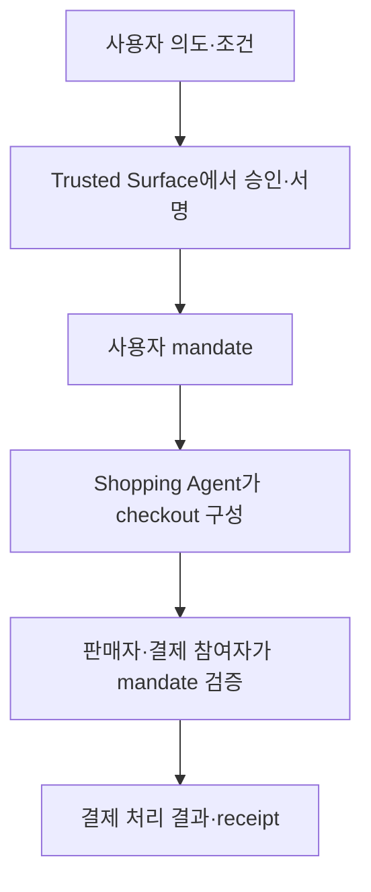
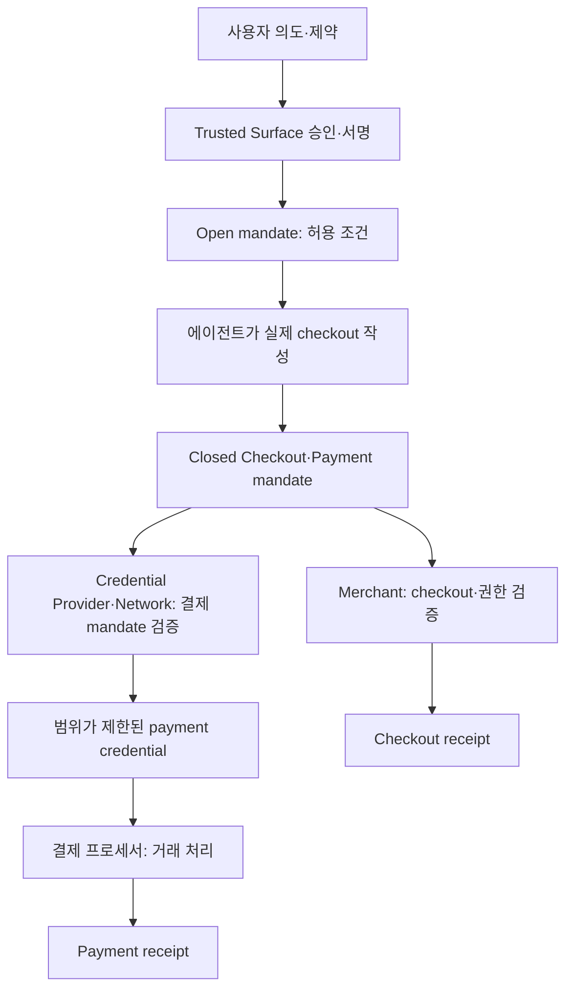

## 30초 인출

- 본질: AP2는 AI 에이전트 결제에서 사용자 의도와 위임 권한을 검증 가능한 기록으로 전달하는 개방형 프로토콜이다.
- 메커니즘: 사용자가 Trusted Surface에서 mandate 승인 → 에이전트가 장바구니에 맞는 mandate 구성 → 판매자·결제 참여자가 각각 검증·처리

핵심 용어

- **Mandate**: 사용자가 승인한 구매 의도·조건을 담고 전자서명으로 검증하는 AP2 권한 표현
- **Trusted Surface**: 사용자의 동의와 승인을 확인하는 신뢰된 인터페이스
- **Checkout Mandate**: 에이전트가 구성한 특정 장바구니가 승인 범위에 맞는지 판매자가 확인하도록 하는 정보
- **Payment Mandate**: 결제 자격 증명이 특정 결제에 쓰이도록 권한을 확인하는 정보
- **Payment Receipt**: 결제 처리의 승인·거절 결과를 기록해 돌려주는 영수증 정보

---
## 1교시 예상문제 (10점)

> AP2의 목적과 mandate 기반 결제 권한 확인 절차를 설명하시오. (예상)

---
## 1교시 10점 답안

### 1. 정의·목적
- 정의: AP2는 에이전트가 사용자를 대신해 결제할 때 사용자 의도와 권한을 검증하는 프로토콜이다.
- 목적: 에이전트의 구매 요청이 사용자 승인 범위에 맞는지 판매자·결제 참여자가 확인하게 한다.

### 2. 권한 확인 흐름

Mandate는 사용자 승인 근거이고, 실제 결제는 기존 결제 제공자·네트워크가 처리한다. AP2 자체가 블록체인 에스크로를 제공하는 프로토콜은 아니다.

### 3. 제언
승인 범위·만료·결제 증빙과 실패 처리 책임을 구현 전에 정한다.

---
## 2~4교시 예상문제 (25점)

> 에이전트 결제의 위험과 AP2의 역할·구성요소·mandate 검증 흐름을 설명하고, 적용 시 유의사항을 제시하시오. (예상)

---
## 2~4교시 25점 답안

## Ⅰ. 필요성과 참여 역할
AP2는 에이전트 요청의 사용자 권한·장바구니 무결성·결제 승인 여부를 참여자별로 검증하도록 돕는다.

| 역할 | 주요 책임 |
|---|---|
| Shopping Agent | 상품 탐색·checkout 구성·구매 요청 |
| Trusted Surface | 사용자 의도와 mandate 승인 확인 |
| Merchant | 상품·가격·checkout 구성 및 Checkout Mandate 검증 |
| Credential Provider·Network | 결제 권한 확인과 적절히 범위가 정해진 결제 자격 증명 제공 |
| Merchant Payment Processor | 자격 증명과 checkout 범위를 확인해 결제 처리 |

한 기관이 여러 역할을 수행할 수 있지만 각 책임과 검증은 분명해야 한다.

## Ⅱ. Mandate 기반 검증 흐름

Autonomous 흐름에서는 사용자가 미리 허용 조건을 승인하고 에이전트가 실제 checkout을 그 조건에 맞춰 닫는다. Human-present 흐름은 사용자가 구체 checkout과 결제를 직접 승인한다. 판매자와 결제 참여자는 각자 맡은 조건을 검증하고 receipt를 돌려준다.

## Ⅲ. 승인 모드와 범위

| 모드 | 사용자 개입 | 검증 대상 |
|---|---|---|
| Human-present | 구체 장바구니·결제를 직접 확인·승인 | 해당 거래에 대한 닫힌 mandate |
| Human-not-present | 사전에 승인한 제약을 바탕으로 에이전트가 거래 구성 | 닫힌 거래가 열린 mandate의 제약에 맞는지 |

AP2는 결제 수단에 종속되지 않으며, 상품 탐색·카탈로그 API와 일반적인 checkout 통신 전체를 정의하는 상거래 프로토콜과도 구분된다.

## Ⅳ. 기술적 제언

| 문제 | 해결 방안 |
|---|---|
| 에이전트가 사용자의 의도보다 넓은 구매를 시도할 수 있음 | 신뢰된 표면에서 구체 조건을 승인하고 검증자가 각 제약을 확인 |
| 승인된 mandate를 다른 checkout에 재사용하려 할 수 있음 | mandate를 거래 식별 정보에 묶고 서명·제약·만료를 검증 |
| mandate 검증 실패 시 일반 결제가 우회될 수 있음 | 오류 receipt와 안전한 거절·사람 확인 경로를 구현 |

---
## 출제 이력과 검증 출처

- 원문 출제 이력 표기: 미출제. 두 문항은 예상.
- Google Agentic Commerce, [AP2 Protocol Specification](https://github.com/google-agentic-commerce/AP2/blob/main/docs/ap2/specification.md): 역할, mandate 유형, 결제 흐름과 범위를 확인함.
- AP2, [Agent Authorization Framework](https://ap2-protocol.org/ap2/agent_authorization/): mandate 승인·위임과 제약 검증 방식을 확인함.
