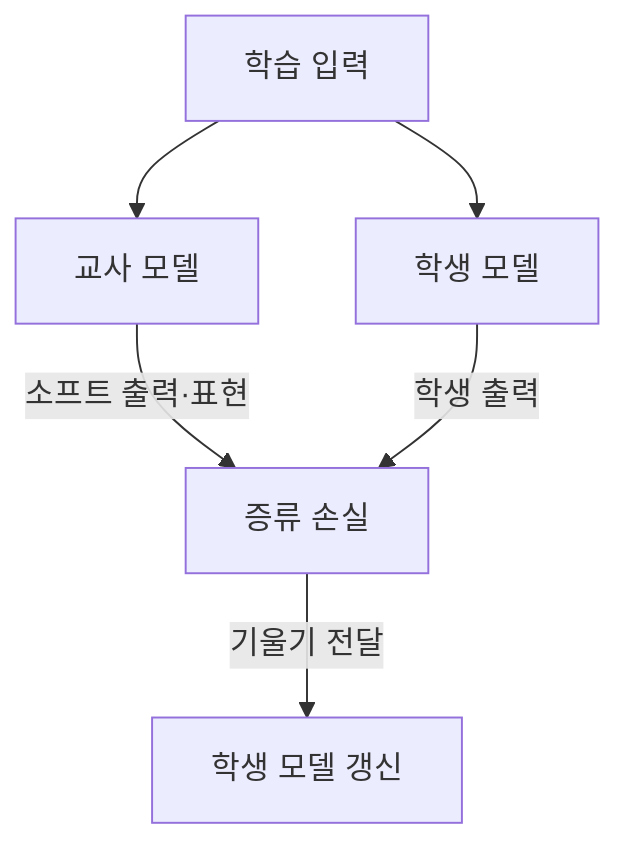
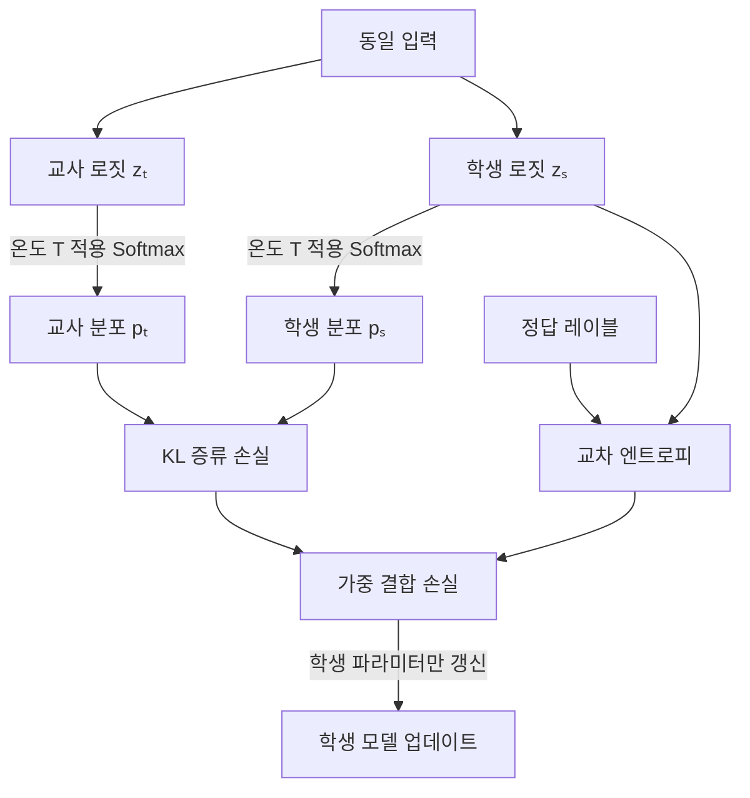

## 30초 인출

- 본질: 지식 증류는 한 모델의 예측·표현을 학습 신호로 사용해 다른 모델을 훈련하는 방법이다.
- 메커니즘: 교사 출력 생성 → 학생 출력과 비교 → 증류 손실을 계산해 학생 모델 갱신

핵심 용어

- **교사 모델(Teacher)**: 학생 학습에 출력·표현 신호를 제공하는 모델
- **학생 모델(Student)**: 교사 신호를 이용해 학습되는 모델
- **소프트 타깃(Soft Target)**: 확률분포 형태의 교사 출력으로, 여러 후보 간 상대 점수 정보를 담음
- **온도(Temperature)**: Softmax 분포를 평탄하게 하거나 뾰족하게 조절하는 값
- **증류 손실**: 교사와 학생의 출력·표현 차이를 줄이도록 계산하는 학습 손실

---
## 1교시 예상문제 (10점)

> 지식 증류의 개념과 교사·학생 모델의 학습 관계를 설명하시오. (예상)

---
## 1교시 10점 답안

### 1. 정의·목적
- 정의: 지식 증류는 교사 모델의 출력이나 내부 표현을 학생 모델의 학습 신호로 사용하는 방법이다.
- 목적: 작은 모델의 학습이나 다른 모델로의 지식 이전을 지원한다.

### 2. 기본 구조

### 3. 제언
증류 뒤에는 목표 과업 자료로 학생 모델의 품질과 자원 사용을 다시 평가한다.

---
## 2~4교시 예상문제 (25점)

> 지식 증류의 교사·학생 구조, 소프트 타깃과 손실함수, 주요 증류 유형 및 적용 시 유의점을 설명하시오. (예상)

---
## 2~4교시 25점 답안

## Ⅰ. 개념과 목적
지식 증류는 한 모델의 계산 결과를 다른 모델의 학습 감독 신호로 활용하는 학습 기법이다.

| 학습 신호 | 학생에게 전달되는 정보 |
|---|---|
| 정답 레이블 | 정답 클래스·목표 값 |
| 교사 출력 | 클래스 간 상대 확률·점수 관계 |
| 중간 표현 | 특징·관계 구조의 일부 |

학생이 더 작을 수 있지만, 같은 구조·크기·과업 사이에서도 증류를 적용할 수 있다.

## Ⅱ. 소프트 타깃과 손실

대표식은 `L = ατ² KL(p_{teacher,τ} || p_{student,τ}) + (1−α) CE(y, p_{student,1})`처럼 쓸 수 있다. τ는 Softmax 온도이며 분포를 평탄화한다. τ²는 온도에 따른 기울기 크기 차이를 보정하는 관례적 항이다. 손실 구성은 과업과 구현에 따라 달라진다.

## Ⅲ. 증류 유형

| 유형 | 전달하는 신호 | 예 |
|---|---|---|
| 응답 기반 | 최종 출력·확률분포 | 로짓·소프트 타깃 맞추기 |
| 특징 기반 | 중간 층의 표현 | 특징 벡터·활성값 정렬 |
| 관계 기반 | 표본·토큰·특징 사이 관계 | 거리·유사도·어텐션 관계 정렬 |

이는 흔히 쓰는 분류이며 과업에 따라 여러 신호를 함께 사용할 수 있다.

## Ⅳ. 기술적 제언

| 문제 | 해결 방안 |
|---|---|
| 학생 모델의 목표 장치와 과업 조건이 정해지지 않아 증류 신호를 선택하기 어려움 | 먼저 배포 제약과 필수 품질을 정하고, 출력 기반 증류를 기준으로 삼아 추가 신호의 필요성을 시험한다. |

---
## 출제 이력과 검증 출처

- 원문 출제 이력 표기: 미출제. 두 문항은 예상.
- Hinton, Vinyals & Dean, [Distilling the Knowledge in a Neural Network](https://arxiv.org/abs/1503.02531): 소프트 타깃·온도 기반 지식 증류를 확인함.
