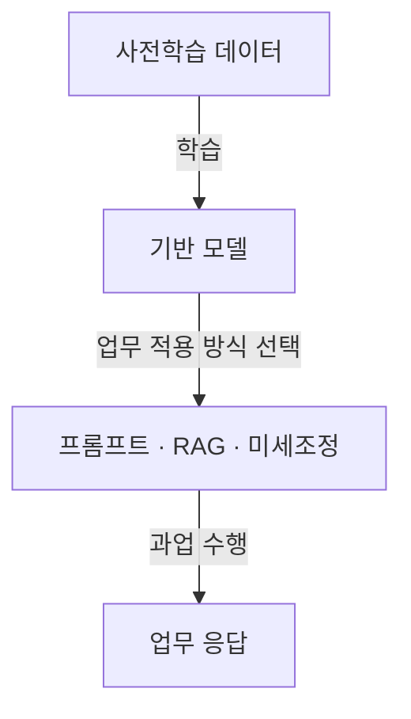
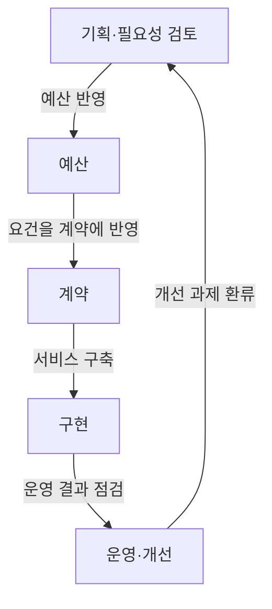
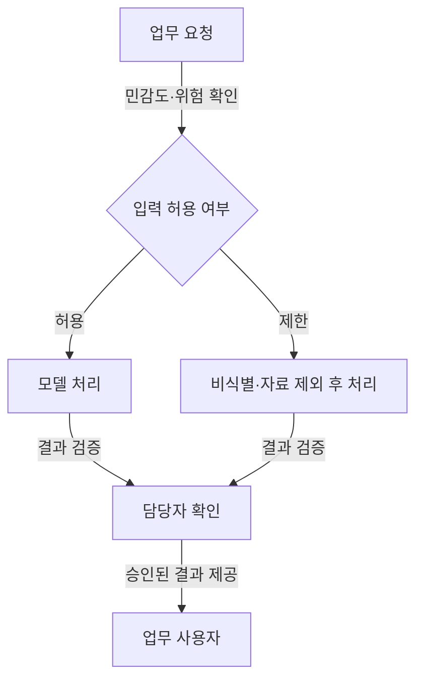

## 지식 로드맵 내 현재 위치
IT 인공지능 → 기반 모델 → 초거대 인공지능

## 30초 인출
- **본질:** 초거대 AI는 대규모 데이터와 연산으로 학습한 기반 모델을 여러 과업에 활용하는 AI 접근이다.
- **메커니즘:** 사전학습 모델을 프롬프트·검색 결합·미세조정 등 과업에 맞는 방식으로 적용한다.

핵심 용어

- **기반 모델(Foundation Model):** 폭넓은 데이터로 사전학습해 여러 하위 과업의 출발점으로 쓰는 모델이다.
- **스케일링 법칙(Scaling Laws):** 모델·데이터·연산 규모와 학습 성능의 경험적 관계를 나타내며 조건에 따라 달라진다.
- **검색 증강 생성(RAG):** 관련 자료를 찾아 생성 모델의 입력에 제공해 답변 근거를 보완하는 방식이다.

---

## 1교시 예상문제 (10점)
> 초거대 AI의 개념과 활용 구조, 공공부문 도입 시 고려사항을 설명하시오. (예상)

---

## 1교시 10점 답안
### 1. 정의·목적
정의: 초거대 AI는 대규모 데이터와 연산으로 학습한 기반 모델을 여러 과업에 활용하는 인공지능이다.
목적: 공통 모델을 활용해 다양한 업무의 AI 적용 비용과 시간을 줄인다.

### 2. 활용 구조
사전학습 모델을 업무에 적용할 때는 데이터 민감도와 품질 요구에 따라 프롬프트, RAG, 미세조정을 선택한다.

### 3. 도입 시 고려사항
| 판단 항목 | 확인 내용 |
|---|---|
| 정확성 | 업무 자료의 최신성, 인용 근거, 오류 영향 |
| 보안·개인정보 | 입력자료의 민감도, 보관·재사용 조건 |
| 운영성 | 비용, 지연시간, 공급자 종속과 장애 대응 |

**제언:** 위험도와 자료 민감도를 기준으로 적용 범위를 정하고, 담당자의 검토 절차를 둔다.

---

## 2~4교시 예상문제 (25점)
> 공공부문 초거대 AI 서비스의 도입·운영 구조와 주요 위험 및 통제 방안을 설명하시오. (예상)

---

## 2~4교시 25점 답안
## Ⅰ. 개요
초거대 AI 기반 서비스는 기반 모델을 업무 데이터·사용자 절차와 결합해 제공한다. 공공 적용에서는 성능뿐 아니라 자료 보호, 설명·검증, 운영 책임을 함께 설계한다.

| 구성 | 역할 |
|---|---|
| 기반 모델 | 입력을 해석하고 생성·분류 등 과업 수행 |
| 업무 연결 | 검색자료·도구·화면을 모델과 연결 |
| 통제·운영 | 접근권한, 검토, 기록, 장애·품질관리 |

## Ⅱ. 도입·운영 생명주기
NIA의 2026년 가이드(’26.5월 기준)는 공공 AI 도입을 기획, 예산, 계약, 구축, 운영·개선으로 다룬다.

이 순서는 해당 가이드의 도입 절차를 요약한 것이다. 서비스 범위·위험과 기관 여건에 따라 세부 수행은 구체화한다.

## Ⅲ. 위험과 통제
| 위험 | 통제 방안 | 확인 방법 |
|---|---|---|
| 부정확하거나 근거 없는 생성 | 근거자료 연결, 출처 표시, 중요 결과의 담당자 검토 | 대표 질문 시험, 근거 일치 점검 |
| 민감정보 노출 | 입력 최소화, 접근 제한, 저장·재사용 조건 확인 | 권한·로그 및 계약 조건 점검 |
| 비용·품질 변동 | 사용량 한도, 품질·지연 모니터링, 대체 절차 마련 | 운영 지표와 장애 대응 점검 |

## Ⅳ. 기술사적 제언
| 문제 | 해결 방안 |
|---|---|
| 공공기관 업무마다 허용할 모델 사용 범위와 사람의 책임 수준이 달라 일괄 적용하기 어려움 | 업무를 영향도별로 나누고, 공개 안내·내부 보조 등 제한된 용도부터 입력 허용 범위와 담당자 확인 기준을 정한다. |

## 출제 이력과 검증 출처
- 기출 주제: 제137회 2교시 4번, 「공공부문 초거대 AI 도입·활용 가이드라인 2.0」의 도입 절차·보안성 검토·기대효과 및 유의사항.
- 한국지능정보사회진흥원, [공공부문 초거대 AI 도입·활용 가이드라인 2.0](https://www.nia.or.kr/site/nia_kor/ex/bbs/View.do?bcIdx=27985&cbIdx=99953) (2025).
- 한국지능정보사회진흥원, [공공부문 AI 도입·활용 가이드(’26.5월 기준)](https://www.nia.or.kr/site/nia_kor/ex/bbs/View.do?bcIdx=29526&cbIdx=37989) (2026).

## 연결 토픽
- 기반 모델 활용: [생성형 AI](./009_generative_ai.md)
- 검색 결합: [검색 증강 생성(RAG)](./005_rag.md)
