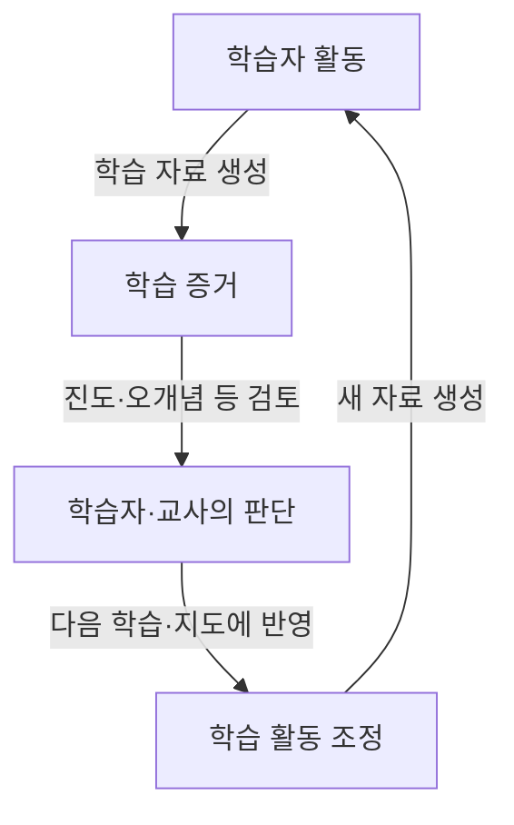
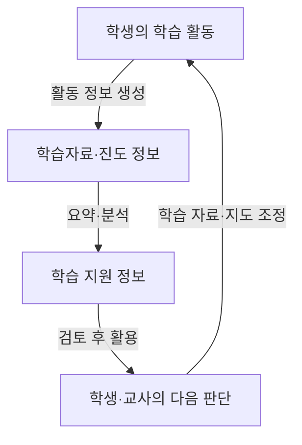

## 지식 로드맵 내 현재 위치
IT 교육·에듀테크 → 학습 지원 소프트웨어 → AI 디지털교과서와 AI 교육자료

## 30초 인출
- **본질:** AI 디지털교과서는 AI를 활용해 학습 활동과 교사의 수업 판단을 지원하려는 디지털 학습자료다.
- **현재 구분:** 2026년 교육부 계획은 AI 디지털교과서를 포함한 여러 도구를 ‘AI 교육자료’로 다루며, 학교의 자율적 선택·활용을 전제로 한다.
- **메커니즘:** 학습 활동에서 생긴 자료를 학습자와 교사가 검토해 다음 학습·지도에 반영한다.

핵심 용어

- **AI 교육자료:** 교육부의 현행 계획에서 AI 디지털교과서 등을 포함해 학교가 선택·활용하는 AI 기반 학습자료를 가리킨다.
- **학습지원 소프트웨어:** 학습활동을 돕는 소프트웨어로, 현행 초·중등교육법은 이를 교과용 도서와 구분해 교육자료로 규정한다.
- **학습 분석:** 학습 활동 자료를 살펴 학습자·교사의 다음 판단을 돕는 과정이다.

---

## 1교시 예상문제 (10점)
> AI 디지털교과서의 개념과 학습 지원 구조, 학교 현장 적용 시 고려사항을 설명하시오. (예상)

---

## 1교시 10점 답안
### 1. 정의·목적
정의: AI 디지털교과서는 학습자료와 AI 기능을 결합해 학습과 교사의 수업 판단을 지원하려는 디지털 도구다.
목적: 학습자의 필요에 맞는 자료와 교사의 지도 정보를 제공한다.

### 2. 학습 지원 구조

도구가 제시하는 분석은 판단 근거 중 하나이며, 교사의 전문적 판단을 대체하지 않는다.

### 3. 현장 적용 시 고려사항
| 항목 | 점검 내용 |
|---|---|
| 교육적 적합성 | 교육과정·수업 목적과 자료의 부합 여부 |
| 개인정보 | 수집 항목, 이용 목적, 접근·보유 관리 |
| 접근성·운영 | 기기·네트워크 여건, 장애·대체 수업 절차 |

**제언:** 학교가 교육적 적합성·개인정보·운영 여건을 함께 확인해 자료를 선택하도록 지원한다.

---

## 2~4교시 예상문제 (25점)
> AI 디지털교과서 정책의 학습 지원 구조와 현행 제도상 위치를 설명하고, 학교 적용 시의 기술적·교육적 고려사항을 제시하시오. (예상)

---

## 2~4교시 25점 답안
## Ⅰ. 개요와 제도상 위치
AI 디지털교과서는 AI 기능을 활용하는 디지털 학습자료를 도입하려는 정책 개념으로 출발했다. 2026년 교육부 계획은 이를 포함한 다양한 자료를 ‘AI 교육자료’로 넓게 다루고, 학교가 자율적으로 선택·활용하도록 설명한다. 현행 초·중등교육법은 학습지원 소프트웨어를 교과용 도서로 인정하지 않고 교육자료로 구분한다.

| 구분 | 설명 |
|---|---|
| 과거 정책 용어 | AI 디지털교과서(AIDT) |
| 2026 교육부 계획 | AI 디지털교과서 등을 포함하는 AI 교육자료, 학교 자율 선택·활용 |
| 법률상 구분 | 학습지원 소프트웨어는 교과용 도서가 아닌 교육자료 |

## Ⅱ. 학습·수업 지원 구조
학생의 활동 자료를 분석해 학습자와 교사가 살펴볼 정보를 제공하는 구조다. 실제 기능과 데이터는 제품·정책에 따라 다르므로 특정 API나 저장소가 필수라고 단정하지 않는다.

## Ⅲ. 도입 고려사항
| 관점 | 확인할 사항 | 이유 |
|---|---|---|
| 교육적 효과 | 학습목표 연계, 교사 피드백 활용성 | 화면 사용이 학습 효과를 대신하지 않도록 함 |
| 개인정보·보안 | 수집 최소화, 접근 통제, 보유·삭제, 위탁 조건 | 학생 정보의 오용·노출 방지 |
| 형평성·접근성 | 장애·기기·네트워크 여건과 대체 수단 | 학습 참여 격차 완화 |
| 품질·운영 | 콘텐츠 정확성, 장애 대응, 학교 지원 | 수업 중단과 부정확한 안내 예방 |

## Ⅳ. 기술사적 제언
| 문제 | 해결 방안 |
|---|---|
| 디지털 기능 도입이 학습 효과와 개인정보 보호를 자동으로 보장하지 않음 | 학교가 교육적 효과·정보 처리·접근성을 사전 점검하고, 수업 결과와 이용자 의견을 반영해 지속적으로 개선한다. |

## 출제 이력과 검증 출처
- 기출: 제135회 2교시 6번, AI 디지털교과서의 도입 배경·필요성, 구성요소·기능, 현장 안착을 위한 기술·제도 고려사항.
- 교육부, [2026년 주요업무 추진계획](https://www.moe.go.kr/upload/filedown/2026_business_plan_data.pdf).
- 「초·중등교육법」 제29조·제29조의2, [국가법령정보센터](https://www.law.go.kr/LSW/lsInfoP.do?ancNo=21049&ancYd=20250916&ancYnChk=0&chrClsCd=010202&efGubun=Y&efYd=20260301&lsiSeq=273677&nwJoYnInfo=N), 2026년 3월 1일 시행.

## 연결 토픽
- 교육 데이터·분석: 관련 토픽은 교육부·교육기관의 현행 지침과 함께 확인한다.
