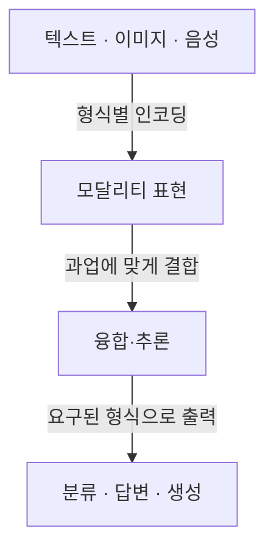
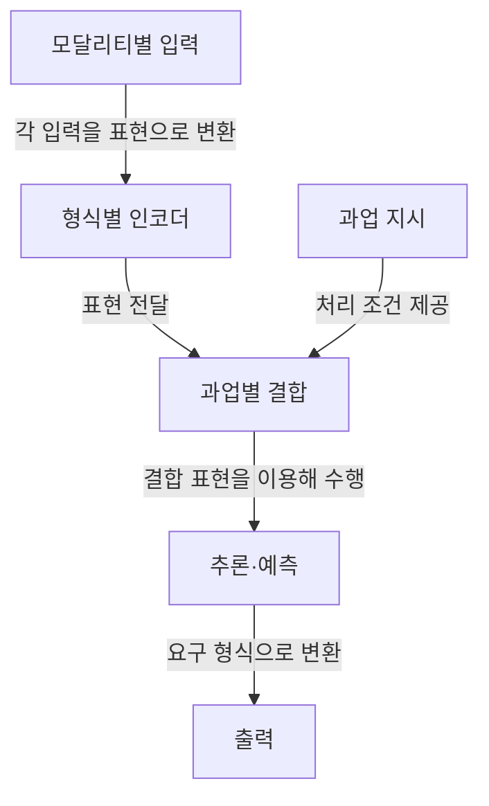

## 지식 로드맵 내 현재 위치
IT 인공지능 → 표현·생성 모델 → 멀티모달 인공지능

## 30초 인출
- **본질:** 멀티모달 AI는 텍스트·이미지·음성처럼 형식이 다른 정보를 함께 처리하는 인공지능이다.
- **메커니즘:** 각 입력을 표현으로 바꾼 뒤, 과업에 맞는 위치에서 결합해 추론하거나 출력한다.
- **추가 단서:** 결합 방식은 모델마다 다르며, 모든 모달리티가 하나의 공통 잠재 공간을 쓰는 것은 아니다.

핵심 용어

- **모달리티(Modality):** 정보가 표현되고 입력되는 형식으로, 텍스트·이미지·음성 등이 해당한다.
- **융합(Fusion):** 서로 다른 모달리티의 표현이나 판단을 과업 수행 과정에서 결합하는 방법이다.
- **교차 모달 정렬(Cross-modal Alignment):** 서로 다른 모달리티의 대응 정보가 관련성을 갖도록 학습하는 것으로, CLIP의 이미지·텍스트 쌍 학습이 한 사례다.

---

## 1교시 예상문제 (10점)
> 멀티모달 AI의 개념과 일반적인 처리 구조, 융합 방식의 차이를 설명하시오. (예상)

---

## 1교시 10점 답안
### 1. 정의·목적
정의: 멀티모달 AI는 둘 이상의 정보 형식을 함께 처리해 과업을 수행하는 인공지능이다.
목적: 단일 형식만으로 부족한 단서를 결합해 인식·추론·생성을 지원한다.

### 2. 처리 구조

구체적인 인코더와 결합 지점은 모델 구조에 따라 달라진다.

### 3. 융합 방식
| 유형 | 결합 위치 | 특징 |
|---|---|---|
| 초기 융합 | 입력 또는 초기 표현 | 이른 단계에서 정보를 함께 처리 |
| 중간 융합 | 내부 표현 단계 | 처리 중 모달리티 간 상호작용 |
| 후기 융합 | 개별 분석 뒤 | 모달리티별 결과를 결합 |

**제언:** 과업의 입력 품질과 필요한 상호작용 수준에 맞춰 융합 위치를 선택한다.

---

## 2~4교시 예상문제 (25점)
> 멀티모달 AI의 구성과 정보 융합 방식을 설명하고, 적용 시 발생할 수 있는 품질·운영 문제와 대응 방안을 제시하시오. (예상)

---

## 2~4교시 25점 답안
## Ⅰ. 개요와 적용 범위
멀티모달 AI는 여러 정보 형식의 단서를 함께 활용한다. 입력 인코더, 결합 방식, 출력 형식은 이미지 질의응답·음성 대화·문서 이해 등 과업에 따라 달라진다.

| 입력 형식 | 예시 표현 | 함께 활용할 단서 |
|---|---|---|
| 텍스트 | 토큰·문장 표현 | 의미·질문 |
| 이미지 | 패치·영역 특징 | 객체·배치·문서 시각정보 |
| 오디오 | 파형·음향 특징·전사문 | 음성 내용·화자·음향 단서 |

## Ⅱ. 일반 처리 구조

그림은 일반적인 데이터 경로다. 일부 모델은 입력부터 함께 인코딩하거나 모달리티별 결과를 늦게 결합하며, 모든 모델이 같은 공간·구조를 공유하지 않는다.

## Ⅲ. 융합 방식과 적용 판단
| 융합 방식 | 동작 위치 | 적합한 상황·주의점 |
|---|---|---|
| 초기 | 입력 또는 초기 표현 | 입력 간 초기 상호작용이 중요할 때; 형식 차이를 처리해야 함 |
| 중간 | 내부 표현 | 세부 단서 교환이 필요할 때; 결합 구조 설계가 복잡해질 수 있음 |
| 후기 | 개별 처리 이후 | 모달리티별 처리기를 재사용하기 쉬움; 초기 상호작용은 제한됨 |

CLIP은 이미지와 문장 쌍의 관련성을 대조학습하는 대표 사례지만, 이를 모든 멀티모달 시스템의 필수 구조로 일반화하면 안 된다.

## Ⅳ. 기술사적 제언
| 문제 | 해결 방안 |
|---|---|
| 한 모달리티의 오류·편향이 결합 결과에 섞이고 출력 근거가 불명확할 수 있음 | 모달리티별 입력 품질과 결합 결과를 따로 평가하고, 중요 과업은 출력이 참조한 입력 근거를 사용자에게 확인 가능하게 제공한다. |

## 출제 이력과 검증 출처
- 현재 확인된 기출 없음. 문항은 출제 범위를 바탕으로 한 예상문제.
- Radford et al., [Learning Transferable Visual Models From Natural Language Supervision (CLIP)](https://arxiv.org/abs/2103.00020), 2021.

## 연결 토픽
- 이미지·텍스트 기반 검색: [검색 증강 생성(RAG)](./005_rag.md)
- 언어 인코더: [BERT](./074_bert.md)
