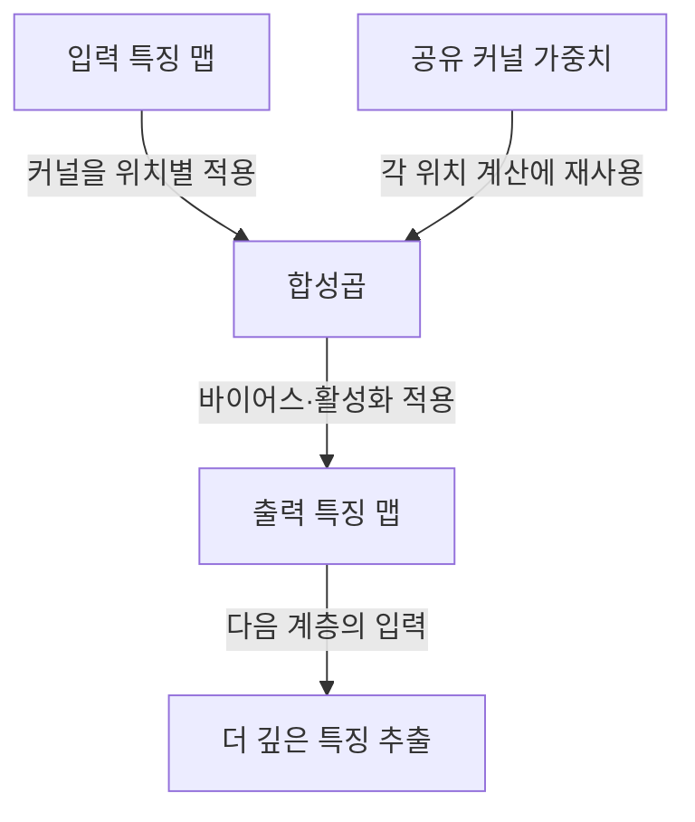

## 지식 로드맵 내 현재 위치
IT 인공지능 → 딥러닝 → 합성곱 신경망

## 30초 인출
- **본질:** CNN은 합성곱을 이용해 입력의 국소 패턴을 추출하는 신경망이다.
- **메커니즘:** 같은 필터를 위치별로 적용해 특징 맵을 만들고, 층을 쌓아 더 넓은 문맥의 특징을 학습한다.
- **추가 단서:** 합성곱은 이동에 등변적이며, 풀링·스트라이드 등 다운샘플링은 작은 위치 변화에 대한 불변성을 일부 높일 수 있다.

핵심 용어

- **합성곱(Convolution):** 학습한 필터를 입력의 국소 영역에 적용해 특징 맵을 계산하는 연산이다.
- **가중치 공유(Weight Sharing):** 한 필터의 가중치를 여러 공간 위치에 재사용하는 구조다.
- **이동 등변성(Translation Equivariance):** 입력이 이동하면 합성곱 출력의 특징 위치도 대응해 이동하는 성질이다.

---

## 1교시 예상문제 (10점)
> CNN의 개념을 설명하고, 합성곱 계층·풀링 계층의 역할과 가중치 공유의 이점을 설명하시오. (제123회 1교시 기출 주제)

---

## 1교시 10점 답안
### 1. 정의·목적
정의: CNN은 합성곱 계층으로 입력의 국소 특징을 학습하는 신경망이다.
목적: 이미지 등 격자형 자료에서 공간적 패턴을 효율적으로 추출한다.

### 2. 핵심 연산

풀링은 CNN의 필수 구성요소가 아니며, 위치 정보를 줄이는 대신 작은 이동 변화에 강한 표현을 만들 수 있다.

### 3. 계층별 역할
| 구성 | 역할 |
|---|---|
| 합성곱 | 국소 패턴 계산, 위치별 필터 가중치 공유 |
| 활성화 함수 | 비선형 표현 학습 |
| 풀링·스트라이드 | 선택적으로 공간 해상도 축소 |

**제언:** 검출·분할처럼 위치가 중요한 과업은 다운샘플링이 세부 위치를 지우지 않는지 확인한다.

---

## 2~4교시 예상문제 (25점)
> CNN의 기본 구조와 합성곱의 특성을 설명하고, 공간 정보·연산량을 고려한 설계 방안을 제시하시오. (예상)

---

## 2~4교시 25점 답안
## Ⅰ. 개요
CNN은 국소 수용영역과 필터 가중치 공유를 이용해 격자형 입력의 패턴을 학습한다. 공유는 완전연결층보다 파라미터를 줄이지만, 합성곱만으로 모든 위치 변화에 대한 완전한 불변성이 생기는 것은 아니다.

| 구조 특성 | 효과 |
|---|---|
| 국소 수용영역 | 인접 입력 간 관계를 반영 |
| 가중치 공유 | 위치마다 별도 필터를 두지 않아 파라미터 감소 |
| 합성곱의 이동 등변성 | 입력 특징 이동에 대응해 출력 특징 위치도 이동 |

## Ⅱ. 합성곱 계층의 처리

출력의 공간 크기는 각 축에서 `floor((W − K + 2P) / S) + 1`로 계산할 수 있다. 여기서 `W`는 입력 크기, `K` 커널 크기, `P` 패딩, `S` 스트라이드다.

## Ⅲ. 다운샘플링과 과업별 선택
| 방법 | 공간 정보 | 계산량 | 유의점 |
|---|---|---|---|
| 스트라이드 합성곱 | 출력 해상도를 직접 줄임 | 다음 계층 연산 감소 | 필터 학습과 축소를 함께 수행 |
| 풀링 | 국소 요약으로 축소 | 다음 계층 연산 감소 | 작은 이동 변화에 둔감해질 수 있으나 세부 위치 손실 가능 |
| 다운샘플링 없음 | 높은 공간 해상도 유지 | 상대적으로 큼 | 정밀 위치가 중요한 과업에서 유리할 수 있음 |

## Ⅳ. 기술사적 제언
| 문제 | 해결 방안 |
|---|---|
| 과도한 다운샘플링은 작은 객체·얇은 경계 정보를 지우고, 다운샘플링 억제는 연산·메모리를 늘림 | 과업별 공간 정밀도 요구를 정하고, 검증자료에서 해상도·스트라이드·풀링 조합의 정확도와 자원 사용량을 함께 비교한다. |

## 출제 이력과 검증 출처
- 기출 주제: 제123회 1교시 CNN 구성요소인 합성곱 계층·풀링 계층의 역할과 가중치 공유의 이점. 또한 제111회 1교시 `CNN` 출제 기록.
- Goodfellow, Bengio, Courville, [Deep Learning, Chapter 9: Convolutional Networks](https://www.deeplearningbook.org/contents/convnets.html).

## 연결 토픽
- 대안 이미지 구조: [멀티모달](./073_multimodal.md)
