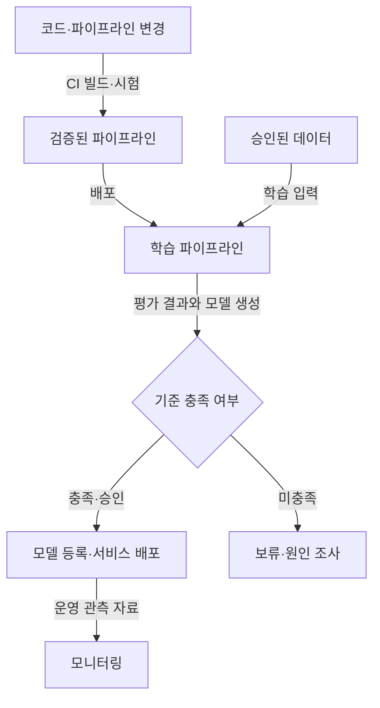

## 지식 로드맵 내 현재 위치
IT 운영·데이터 과학 → 머신러닝 시스템 개발·운영 → MLOps

## 30초 인출
- **본질:** MLOps는 머신러닝 시스템의 개발과 운영을 안정적으로 연결하는 실천·기술이다.
- **메커니즘:** 데이터·코드·모델을 버전과 검증 절차로 연결하고, 학습·배포·운영 상태를 추적한다.
- **추가 단서:** 재학습 자동화 수준은 데이터 가용성, 모델 위험, 운영 요구에 따라 정한다.

핵심 용어

- **지속적 통합(CI):** 코드 변경을 자동 빌드·시험해 통합 오류를 빠르게 찾는 과정이다.
- **지속적 배포(CD):** 검증된 변경을 배포 환경에 전달하는 자동화 과정이다.
- **지속적 훈련(CT):** 정해진 일정이나 조건에 따라 학습 파이프라인을 다시 실행하는 운영 방식이다.
- **모델 레지스트리:** 모델 버전과 평가·계보 정보를 관리하는 저장소다.

---

## 1교시 예상문제 (10점)
> MLOps의 개념과 필요성, 주요 운영 흐름을 설명하시오. (예상)

---

## 1교시 10점 답안
### 1. 정의·목적
정의: MLOps는 머신러닝 시스템의 개발·배포·운영을 반복 가능하고 관리 가능하게 만드는 실천이다.
목적: 모델 변경과 운영 변화를 추적해 신뢰할 수 있는 서비스를 제공한다.

### 2. 기본 흐름

### 3. 관리 대상
| 대상 | 관리 내용 |
|---|---|
| 데이터 | 출처·버전·검증 결과 |
| 파이프라인·코드 | 변경 이력·환경·시험 결과 |
| 모델 | 학습 실행·평가·승인·배포 버전 |
| 운영 | 입력·출력 품질, 성능, 장애·변경 |

**제언:** 자동 재학습은 성능 평가와 승인 기준을 정한 뒤 운영 위험에 맞춰 적용한다.

---

## 2~4교시 예상문제 (25점)
> MLOps의 구성과 자동화 수준을 설명하고, 모델 재현성·배포 신뢰성·운영 품질을 확보하는 방안을 제시하시오. (예상)

---

## 2~4교시 25점 답안
## Ⅰ. 개요와 관리 범위
머신러닝 서비스는 코드뿐 아니라 데이터, 학습 절차, 모델 산출물과 운영 환경에 영향을 받는다. MLOps는 이 요소들의 개발·검증·배포·관측을 연결한다.

| 관리 대상 | 추적할 정보 |
|---|---|
| 데이터 | 출처·버전·검증 결과 |
| 파이프라인·코드 | 변경 이력·환경·시험 결과 |
| 모델 | 학습 실행·평가·승인·배포 버전 |
| 운영 | 입력·출력 품질, 성능, 장애·변경 |

## Ⅱ. 자동화 파이프라인

모델 또는 파이프라인 변경은 자동화하더라도 배포 기준·승인 수준은 업무 위험에 맞춰 정한다.

## Ⅲ. 성숙도와 품질 통제
| Google Cloud의 예시 성숙도 | 특징 |
|---|---|
| Level 0 | 수동 학습·배포 중심 |
| Level 1 | 학습 파이프라인 자동화와 지속적 훈련 |
| Level 2 | 파이프라인 변경에 대한 CI/CD 자동화까지 구축 |

| 위험 | 통제 |
|---|---|
| 재현 불가 | 데이터·코드·환경·모델 계보 기록 |
| 학습·서비스 입력 차이 | 특성 정의와 시점 일치 검증 |
| 운영 성능 저하 | 입력 분포·예측 품질 관측, 필요 시 라벨 기반 평가 |

입력 분포 변화는 성능 저하의 신호가 될 수 있지만, 그것만으로 자동 재학습을 결정하지 않는다. 업무 결과와 검증 기준을 함께 본다.

## Ⅳ. 기술사적 제언
| 문제 | 해결 방안 |
|---|---|
| 자동화 수준을 먼저 높이면 조직이 모델 변경을 검토할 역량과 책임 범위를 놓칠 수 있음 | 대표 모델 하나에 버전·검증·승인·복구 절차를 적용해 운영팀이 수행 가능한지 확인한 후 자동화 수준을 높인다. |

## 출제 이력과 검증 출처
- 기출 주제: 제130회 2교시 MLOps 개념·필요성·구성요소와 Google MLOps 성숙도 Level 0~2.
- Google Cloud, [MLOps: Continuous delivery and automation pipelines in machine learning](https://docs.cloud.google.com/architecture/mlops-continuous-delivery-and-automation-pipelines-in-machine-learning).

## 연결 토픽
- 모델 관리: [모델옵스(ModelOps)](./020_modelops.md)
- 모델 운용 단계: [LLMOps](./053_llmops.md)
