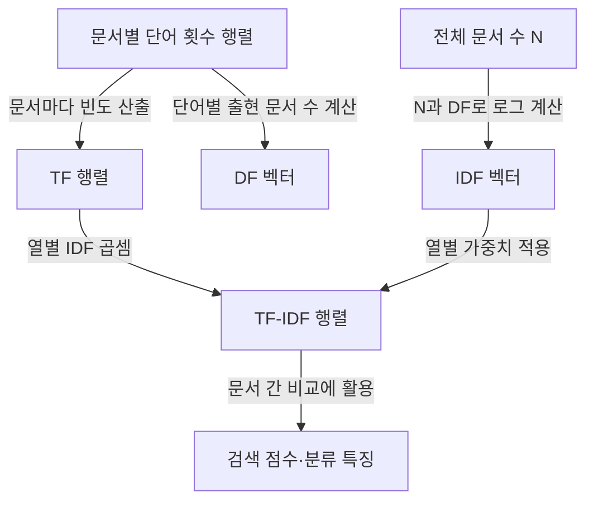

## 지식 로드맵 내 현재 위치
IT 인공지능 → 정보검색·텍스트 표현 → 문서-단어 통계 가중치 → TF-IDF

## 30초 인출
- **본질:** TF-IDF는 한 문서에서 자주 나오고 전체 문서에서는 드문 단어에 상대적으로 큰 가중치를 주는 통계량이다.
- **메커니즘:** 문서 내 단어 빈도(TF)에 말뭉치 내 문서 빈도의 역수 로그(IDF)를 곱한다.
- **추가 단서:** 단어 순서와 의미 유사성을 직접 표현하지 않는다.

<details><summary>핵심 용어</summary>

- **단어 빈도(Term Frequency, TF):** 특정 문서 안에서 단어가 나타난 횟수 또는 그 정규화 값이다.
- **문서 빈도(Document Frequency, DF):** 말뭉치에서 해당 단어를 포함한 문서의 수다.
- **역문서 빈도(Inverse Document Frequency, IDF):** 전체 문서 수와 DF의 비율에 로그를 취해 단어의 문서 간 희소성을 나타낸 값이다.
</details>

---

## 1교시 예상문제 (10점)
> 제시된 문서별 단어 빈도로 TF-IDF를 계산하는 절차와 결과를 설명하고, IDF 계산식을 제시하시오. (제132회 2교시 3번 기출 주제의 10점 예상 변형)

---

## 1교시 10점 답안
### 1. 정의·목적
정의: TF-IDF는 문서 내 단어 빈도와 말뭉치 내 문서 희소성을 결합한 단어 가중치다.
목적: 문서별 특징 단어를 수치화해 검색·분류에 활용한다.

### 2. 계산식·절차
고전적 식은 `tfidf(t,d) = tf(t,d) × log(N / df(t))`이다. `N`은 문서 수, `df(t)`는 단어 `t`가 등장한 문서 수다. TF 정규화와 IDF 스무딩 식은 구현에 따라 달라질 수 있다.

```mermaid
flowchart TD
    F[문서별 단어 횟수] -->|TF 산출| T[TF(t,d)]
    D[단어별 문서 수 df] -->|log(N / df)| I[IDF(t)]
    T -->|원소별 곱셈| W[TF-IDF 가중치]
    I -->|원소별 곱셈| W
```

### 3. 결과 해석
| 조건 | 가중치 경향 |
|---|---|
| 문서 안에서 자주 나오고 다른 문서에는 드묾 | 큼 |
| 여러 문서에 널리 나타남 | 작음 |

**제언:** 말뭉치와 정규화 방식을 고정해 결과를 재현할 수 있도록 기록한다.

---

## 2~4교시 예상문제 (25점)
> 문서별 TF-IDF 행렬을 계산하는 과정을 수식과 예시로 설명하고, 검색·분류에 적용할 때의 장단점과 보완 방안을 제시하시오. (예상)

---

## 2~4교시 25점 답안
## Ⅰ. 개요와 표현 구조
TF-IDF는 문서 집합을 문서-단어 행렬로 나타낼 때 각 문서의 단어 빈도를 전체 말뭉치의 문서 빈도로 조정한다.

| 행렬 축 | 의미 |
|---|---|
| 행 | 문서 |
| 열 | 말뭉치 어휘의 단어 |
| 원소 | 해당 문서·단어 쌍의 TF-IDF 가중치 |

## Ⅱ. 계산식
| 항목 | 고전적 계산 | 의미 |
|---|---|---|
| TF | `tf(t,d)` 또는 문서 내 빈도 정규화 | 문서 `d`에서의 단어 출현 정도 |
| IDF | `idf(t)=log(N/df(t))` | 많은 문서에 등장할수록 낮아지는 전역 가중치 |
| 결합 | `tfidf(t,d)=tf(t,d)×idf(t)` | 문서 내 중요도와 말뭉치 희소성 결합 |

실무 라이브러리는 분모 0 방지, 평활화, TF 정규화, 벡터 정규화 방식이 다를 수 있다. 사용한 설정을 답안·실험 기록에 명시한다.

## Ⅲ. 계산 과정과 해석


| 계산 단계 | 수행 내용 |
|---|---|
| 1 | 입력 문서에서 토큰을 정하고 문서별 `tf(t,d)`를 계산 |
| 2 | 각 단어가 포함된 문서 수 `df(t)`와 전체 문서 수 `N`을 계산 |
| 3 | 단어별 `idf(t)=log(N/df(t))` 계산 |
| 4 | 같은 단어 열의 TF와 IDF를 곱해 행렬 원소를 산출 |
| 5 | 필요하면 문서 벡터를 정규화하고 유사도·분류기에 사용 |

문서 전체에 있는 단어는 고전식에서 `idf=0`이 되며, 스무딩식을 쓰면 값이 달라진다. 같은 문서에서 반복되는 단어는 TF 정의에 따라 가중치가 커질 수 있어 정규화 설정이 중요하다.

## Ⅳ. 기술사적 제언
| 문제 | 해결 방안 |
|---|---|
| TF-IDF는 어휘 일치에 의존해 동의어·문맥·어순을 직접 반영하지 못하고, 설정 차이로 점수가 달라질 수 있음 | 형태소·토큰화와 TF/IDF·정규화 설정을 명시하고, 의미 기반 검색이 필요한 과업은 임베딩 검색과 결합해 검증한다. |

## 출제 이력과 검증 출처
- 기출: 제132회 2교시 3번, 주어진 문서별 단어 횟수로 TF-IDF를 계산하는 과정·결과와 IDF 계산식.
- Salton et al., [A Theory of Term Importance in Automatic Text Analysis](https://asistdl.onlinelibrary.wiley.com/doi/pdfdirect/10.1002/asi.4630260106), 1975.
- scikit-learn, [TfidfVectorizer](https://scikit-learn.org/stable/modules/generated/sklearn.feature_extraction.text.TfidfVectorizer.html) — 실무 설정에서 평활화·정규화 방식이 달라지는 사례.

## 연결 토픽
- 어휘 기반 검색 확장: [검색 증강 생성(RAG)](./005_rag.md)
