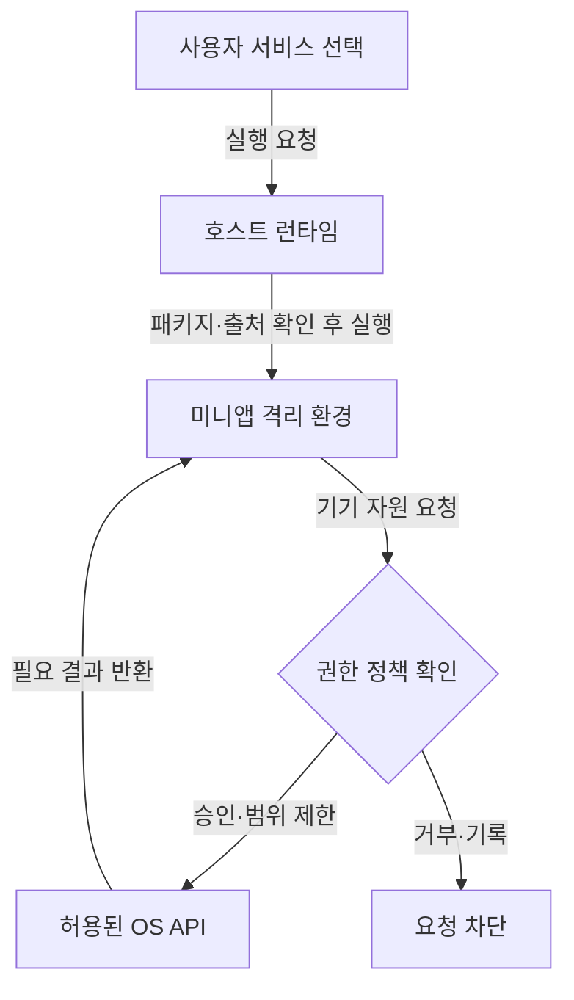

## 지식 로드맵 내 현재 위치
IT 서비스 플랫폼 → 모바일 서비스 통합 → 슈퍼앱·미니앱 생태계

## 30초 인출
- **본질:** 슈퍼앱은 하나의 모바일 플랫폼 안에서 여러 서비스를 이용하게 하는 앱 생태계다.
- **메커니즘:** 호스트 앱이 서비스 진입·공통 기능과 실행 환경을 제공하고, 미니앱이 그 환경 안에서 개별 기능을 수행한다.
- **추가 단서:** 인증·결제 통합과 미니앱 실행 방식은 플랫폼별로 다르다.

핵심 용어

- **미니앱(MiniApp):** 호스트 플랫폼 안에서 실행되는 소규모 서비스 앱이다.
- **호스트 앱(Host App):** 사용자 진입점과 미니앱 실행에 필요한 공통 기능을 제공하는 앱이다.
- **네이티브 브리지(Native Bridge):** 웹 기반 화면과 모바일 운영체제 기능 사이의 요청을 중개하는 인터페이스다.

---

## 1교시 예상문제 (10점)
> 슈퍼앱의 개념과 미니앱 구동 구조, 보안상 고려사항을 설명하시오. (예상)

---

## 1교시 10점 답안
### 1. 정의·목적
정의: 슈퍼앱은 하나의 앱 플랫폼에서 여러 서비스를 연결해 제공하는 모바일 서비스 구조다.
목적: 사용자가 여러 서비스에 접근하는 절차를 줄이고 플랫폼 내 이용 경험을 연결한다.

### 2. 구동 구조

모든 슈퍼앱이 동일한 웹뷰·브리지 구조를 쓰는 것은 아니다.

### 3. 보안 고려사항
| 위험 | 통제 |
|---|---|
| 과도한 기기 정보 접근 | 권한 최소 부여, 사용자 동의, 요청 검증 |
| 미니앱 코드·데이터 간 간섭 | 실행·저장 영역 격리, 출처·버전 관리 |

**제언:** 미니앱 권한을 기능별로 제한하고 업데이트 후에도 재검증한다.

---

## 2~4교시 예상문제 (25점)
> 슈퍼앱의 개념과 등장 배경, 미니앱 아키텍처·구동 방식, 보안 위협 및 플랫폼 운영 고려사항을 설명하시오. (제133회 3교시 3번 기출 주제)

---

## 2~4교시 25점 답안
## Ⅰ. 개요
슈퍼앱은 단일 모바일 진입점에서 여러 서비스에 접근하게 하는 플랫폼이다. 이용 편의와 서비스 연계가 장점이지만 공통 플랫폼에 장애·보안 문제가 생기면 여러 서비스에 영향을 줄 수 있다.

| 구성 요소 | 역할 |
|---|---|
| 호스트 앱 | 사용자 진입, 탐색, 공통 정책 적용 |
| 미니앱 | 개별 서비스 기능·화면 제공 |
| 플랫폼 서비스 | 플랫폼에 따라 인증·결제·메시지 등 공통 기능 제공 |

## Ⅱ. 미니앱 실행과 권한 경계

이 구조는 개념도다. 플랫폼마다 실행 환경, 권한 모델, 결제·인증 연계 방식이 다르므로 구현 사양을 확인해야 한다.

## Ⅲ. 위협과 운영 통제
| 위협 | 대응 방안 |
|---|---|
| 미니앱의 과도한 정보·기기 접근 | 최소 권한, 목적 고지·동의, 민감 API 호출 검증 |
| 악성·취약 코드 유통 | 개발자·패키지 검증, 취약점 점검, 신속한 차단·업데이트 |
| 공통 플랫폼 장애·침해 | 중요 기능 분리, 용량·복구 계획, 사고 통지·대응 절차 |
| 플랫폼 종속·상호운용성 부족 | 공개 인터페이스와 데이터 이전·종료 정책 검토 |

W3C MiniApps 작업은 상호운용성을 위한 명세를 개발해 왔지만, 이를 모든 플랫폼이 반드시 구현하는 단일 강제 표준으로 간주하지 않는다.

## Ⅳ. 기술사적 제언
| 문제 | 해결 방안 |
|---|---|
| 서비스 편의를 위해 통합한 권한·데이터·운영 기반이 침해되면 여러 입점 서비스로 피해가 확산될 수 있음 | 미니앱별 권한·데이터 경계를 강제하고, 이상 행위 차단·철회와 플랫폼 장애 대응을 정기적으로 검증한다. |

## 출제 이력과 검증 출처
- 원노트에 기록된 기출: 제133회 3교시 3번, 슈퍼앱 개념·등장 배경, 주요 아키텍처·미니앱 구동, 보안 위협·운영 고려사항.
- W3C, [MiniApps Working Group](https://www.w3.org/groups/wg/miniapps/) — 상호운용성 관련 명세 개발 임무.
- W3C, [MiniApp Manifest](https://www.w3.org/TR/miniapp-manifest/) 및 [MiniApp Packaging](https://www.w3.org/TR/miniapp-packaging/) — 현재 문서 상태와 적용 범위 확인 필요.

## 연결 토픽
- 플랫폼 기반 모델 운영: [MLOps](./077_mlops.md)
