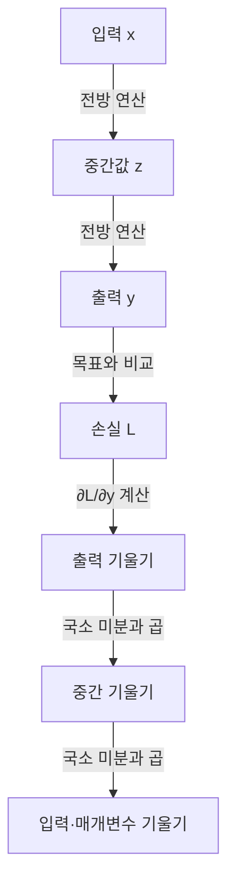

## 지식 로드맵 내 현재 위치
IT 인공지능 → 신경망 학습 → 미분·최적화 → 역전파

## 30초 인출
- **본질:** 역전파는 손실의 매개변수별 기울기를 계산 그래프를 따라 효율적으로 구하는 방법이다.
- **메커니즘:** 순전파 중간값을 이용해 연쇄 법칙을 출력에서 입력 방향으로 적용한다.
- **구분:** 역전파는 기울기를 계산하고, 경사하강법 계열 최적화기는 그 기울기로 매개변수를 갱신한다.

핵심 용어

- **계산 그래프(Computational Graph):** 연산과 그 입력·출력 관계를 노드와 연결로 나타낸 그래프다.
- **연쇄 법칙(Chain Rule):** 합성함수의 미분을 각 단계의 미분 곱으로 계산하는 미분 법칙이다.
- **기울기(Gradient):** 스칼라 손실이 각 매개변수 변화에 얼마나 민감한지 나타내는 편미분 값들의 모음이다.

---

## 1교시 예상문제 (10점)
> 인공신경망의 구조와 역전파의 동작 원리, 연쇄 법칙에 따른 기울기 계산을 설명하시오. (예상)

---

## 1교시 10점 답안
### 1. 정의·목적
정의: 역전파는 손실함수의 기울기를 출력에서 입력 방향으로 계산하는 방법이다.
목적: 신경망 매개변수를 학습하는 데 필요한 미분값을 효율적으로 구한다.

### 2. 계산 흐름

### 3. 단일 연산의 미분
| 계산 대상 | 연쇄 법칙 |
|---|---|
| 합성 연산 `x→z→y→L` | `∂L/∂x = (∂L/∂y)(∂y/∂z)(∂z/∂x)` |

**제언:** 구현 시 손실 정의·미분 경로·갱신 규칙을 분리해 검증한다.

---

## 2~4교시 예상문제 (25점)
> 인공신경망의 기본 구조와 다층 퍼셉트론에서 역전파가 연쇄 법칙으로 기울기를 계산하는 원리, 기울기 소실의 원인과 대응 방안을 설명하시오. (제133회 3교시 6번 기출 주제)

---

## 2~4교시 25점 답안
## Ⅰ. 개요
신경망은 층별 연산을 연결해 예측값을 계산한다. 학습은 손실의 기울기를 구하는 역전파와 매개변수를 바꾸는 최적화 단계를 결합한다.

| 단계 | 역할 |
|---|---|
| 순전파 | 입력에서 예측값과 손실 계산 |
| 역전파 | 손실의 매개변수별 편미분 계산 |
| 최적화 | 학습률 등 규칙에 따라 매개변수 갱신 |

## Ⅱ. 역전파 처리 원리

순전파에서 계산한 중간값을 저장해 두면, 역방향으로 국소 미분을 곱해 앞선 연산의 기울기를 재사용할 수 있다.

## Ⅲ. 연쇄 법칙과 기울기 소실
| 개념 | 설명 |
|---|---|
| 연쇄 법칙 | `L=f(y), y=g(z), z=h(w)`이면 `∂L/∂w=(∂L/∂y)(∂y/∂z)(∂z/∂w)` |
| 기울기 소실 | 깊은 경로에서 크기가 작은 도함수들이 연속 곱해져 앞쪽 층 기울기가 매우 작아지는 현상 |
| 가능한 대응 | ReLU 계열, 적절한 초기화, 잔차 연결 등 구조·학습 설계; 적용 효과는 검증 필요 |

역전파 자체의 수학적 연산과 데이터·활성화·구조로 인한 기울기 전달 문제를 구분해 설명한다.

## Ⅳ. 기술사적 제언
| 문제 | 해결 방안 |
|---|---|
| 깊거나 긴 계산 경로에서 불안정한 기울기가 학습을 지연·발산시킬 수 있음 | 학습 곡선과 층별 기울기를 관측하고, 초기화·활성화·잔차 구조·기울기 클리핑을 과업에 맞게 검증한다. |

## 출제 이력과 검증 출처
- 원노트에 기록된 기출: 제133회 3교시 6번, 인공신경망 구조·다층 퍼셉트론의 역전파·연쇄 법칙·기울기 소실.
- Goodfellow, Bengio, Courville, [Deep Learning, Chapter 6: Deep Feedforward Networks](https://www.deeplearningbook.org/contents/mlp.html).

## 연결 토픽
- 적용 대상: [딥러닝](./079_deep_learning.md)
