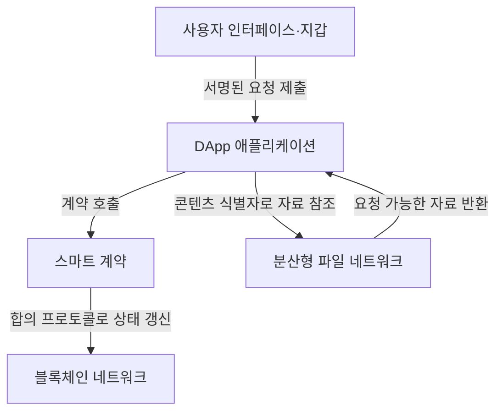

## 지식 로드맵 내 현재 위치
IT 인터넷 서비스 → 웹 플랫폼 변화 → Web 3.0 개념과 분산형 서비스

## 30초 인출
- **본질:** Web 3.0은 분산형 서비스와 이용자 통제를 강조하는 웹 발전 구상이다.
- **메커니즘:** 블록체인·스마트 계약·분산형 저장소 등을 조합해 일부 상태와 기능을 중앙 플랫폼 밖에서 운영한다.
- **추가 단서:** Web 3.0은 단일 표준 아키텍처가 아니며, 이용자 데이터 소유권·탈중앙화가 자동으로 보장되는 것은 아니다.

핵심 용어

- **탈중앙 애플리케이션(DApp):** 블록체인 계약 등 분산형 백엔드와 상호작용하는 애플리케이션이다.
- **스마트 계약(Smart Contract):** 블록체인에서 정해진 코드와 상태 전이 규칙에 따라 실행되는 프로그램이다.
- **콘텐츠 주소 지정(Content Addressing):** 위치 대신 콘텐츠 식별자·해시를 이용해 자료를 참조하는 방식으로, IPFS가 이를 사용한다.

---

## 1교시 예상문제 (10점)
> Web 3.0의 개념과 주요 특징을 설명하고, Web 1.0·Web 2.0과 비교하시오. (제130회 2교시 기출 주제의 10점 예상 변형)

---

## 1교시 10점 답안
### 1. 정의·목적
정의: Web 3.0은 분산형 서비스와 이용자 통제를 강조하는 웹 발전 구상이다.
목적: 중앙 플랫폼 의존을 줄이고 서비스·데이터의 개방적 연계를 넓히는 데 있다.

### 2. 발전 관점 비교
| 구분 | 대표적 설명 | 중심 구조 |
|---|---|---|
| Web 1.0 | 읽기 중심 웹의 대표적 설명 | 정적 페이지·게시 |
| Web 2.0 | 읽기·쓰기·참여 확대 | 중앙 플랫폼 서비스 |
| Web 3.0 | 분산형 서비스·이용자 통제 강조 | 블록체인 등 분산형 구성요소를 활용할 수 있음 |

Web 3.0은 고정된 기술 목록이나 단일 국제 표준을 가리키지 않는다.

### 3. 주요 고려점
| 장점 후보 | 유의점 |
|---|---|
| 개방형 프로토콜로 서비스 간 연계 가능 | 사용성·키 관리·거버넌스 문제 |
| 분산형 기록으로 일부 중앙 의존 감소 | 확장성, 스마트 계약 위험, 실제 분산 정도 |

**제언:** 분산 기술 도입보다 해결할 신뢰·운영 문제를 먼저 정의한다.

---

## 2~4교시 예상문제 (25점)
> Web 3.0의 개념·구성요소와 Web 1.0·Web 2.0과의 차이를 설명하고, 적용 한계와 설계 고려사항을 제시하시오. (예상)

---

## 2~4교시 25점 답안
## Ⅰ. 개요
Web 3.0은 분산형 네트워크, 공개 프로토콜, 이용자 통제 등을 강조하는 포괄적 구상이다. 블록체인 외에도 여러 기술·정책 견해가 포함되며, 모든 서비스가 같은 구조를 채택하지 않는다.

| 개념 요소 | 설명 |
|---|---|
| 분산형 원장 | 여러 참여자가 공유 상태를 검증·기록하는 방식 |
| 스마트 계약 | 원장상 상태를 프로그램 규칙에 따라 변경 |
| 분산형 저장소 | 자료 위치·복제·지속성을 별도 방식으로 관리 |

## Ⅱ. 서비스 구성과 요청 흐름

그림은 가능한 구성 예다. 파일 네트워크와 블록체인은 별도 구성요소이며, 자료를 IPFS에 추가했다고 자동으로 영구 보존되는 것은 아니다.

## Ⅲ. 웹 세대 비교와 설계 한계
| 구분 | 대표적 설명 | 중심 구조 |
|---|---|---|
| Web 1.0 | 읽기 중심 웹의 대표적 설명 | 정적 페이지·게시 |
| Web 2.0 | 읽기·쓰기·참여 확대 | 중앙 플랫폼 서비스 |
| Web 3.0 | 분산형 서비스·이용자 통제 강조 | 블록체인 등 분산형 구성요소를 활용할 수 있음 |

세대 구분은 개념적 비교이며, 실제 서비스는 중앙·분산 요소를 함께 사용할 수 있다. DID는 식별자를 위한 규격이지, 그 자체로 신원 검증이나 개인 데이터 소유권을 보장하지 않는다. Web 3.0 용어는 의미가 일관되게 표준화되어 있지 않으므로 답안에서는 적용 기술과 통제 범위를 구체화한다.

## Ⅳ. 기술사적 제언
| 문제 | 해결 방안 |
|---|---|
| 분산형 요소를 도입해도 사용자의 키 분실·서비스 단절·자료 가용성 문제는 남을 수 있음 | 온체인·오프체인 경계를 명시하고, 키 복구·자료 보존·장애 복구와 사용자 권리 절차를 함께 설계한다. |

## 출제 이력과 검증 출처
- 원노트에 기록된 기출: 제130회 2교시, Web 3.0 개념·특징·핵심 구성요소와 Web 1.0·Web 2.0 비교.
- IPFS, [How IPFS works](https://docs.ipfs.tech/concepts/how-ipfs-works/) — 콘텐츠 주소 지정과 자료 가용성 구조.
- W3C, [Decentralized Identifiers (DIDs) v1.0](https://www.w3.org/TR/did-1.0/) — DID 규격의 범위.

## 연결 토픽
- 분산 실행 플랫폼: [합의 알고리즘](./086_consensus_algorithm.md)
