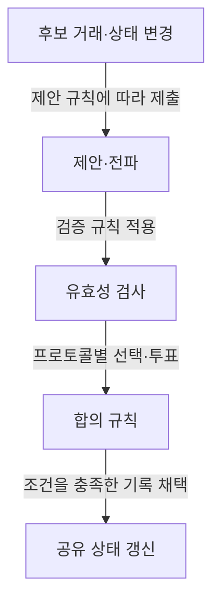

## 지식 로드맵 내 현재 위치
IT 분산시스템 → 복제 상태 합의 → 블록체인·분산원장 합의 알고리즘

## 30초 인출
- **본질:** 합의 알고리즘은 분산 노드가 정해진 장애·신뢰 가정 아래 공유할 결정이나 기록 순서를 일치시키는 절차다.
- **메커니즘:** 제안·검증·투표 또는 경쟁적 증명 등 규칙으로 상태를 정하고, 프로토콜별 확정 기준을 적용한다.
- **추가 단서:** 작업 증명·지분 증명·PBFT의 보안 가정과 완결 방식은 서로 다르다.

핵심 용어

- **비잔틴 결함 허용(BFT):** 일부 노드가 임의로 오작동하거나 악의적으로 행동해도 정해진 조건에서 합의를 유지하는 성질이다.
- **완결성(Finality):** 결정된 기록이 되돌려지지 않는다는 보장으로, 확률적·프로토콜상 명시적 방식 등 구현별 차이가 있다.
- **위임 지분 증명(DPoS):** 참여자가 대표 검증자를 선출하거나 위임해 블록 생성·검증에 참여시키는 방식이다.

---

## 1교시 예상문제 (10점)
> 블록체인 합의 알고리즘의 개념과 PoW·PoS·DPoS·PBFT의 특징을 비교하시오. (제122회 1교시 기출 주제)

---

## 1교시 10점 답안
### 1. 정의·목적
정의: 합의 알고리즘은 분산 참여자가 공유 상태에 대한 결정을 일치시키는 프로토콜이다.
목적: 중앙 단일 결정자 없이도 유효한 기록과 상태를 유지한다.

### 2. 주요 유형 비교
| 유형 | 참여·선정 방식 | 대표적 확정·비용 특성 |
|---|---|---|
| PoW | 계산 작업을 수행한 채굴자가 블록 제안 경쟁 | 누적 작업량 기반, 확률적 확정; 연산 자원 필요 |
| PoS | 지분을 예치한 검증자가 제안·투표 | 보안·확정 규칙은 프로토콜별 상이; 지분 담보 |
| DPoS | 참여자가 대표 검증자를 선출·위임 | 제한된 대표 집단이 처리; 대표성·집중도 고려 |
| PBFT | 알려진 복제 노드의 다단계 메시지·투표 | 고전형은 정족수 기반 확정; 통신량과 구성원 규모 고려 |

**제언:** 처리량뿐 아니라 장애 가정·참여 구조·확정 조건을 함께 비교해 선택한다.

---

## 2~4교시 예상문제 (25점)
> 블록체인 합의 알고리즘의 목적과 PoW·PoS·DPoS·PBFT의 동작 원리·특성을 비교하고, 적용 시 고려사항을 설명하시오. (예상)

---

## 2~4교시 25점 답안
## Ⅰ. 개요와 합의 대상
합의 알고리즘은 분산 노드가 공유하는 결정·기록을 어떤 순서와 조건으로 채택할지 정한다. 블록체인에서는 거래 유효성 검증과 원장 상태의 갱신이 주요 대상이며, 장애 가정과 참여자 신뢰 모델에 따라 프로토콜이 달라진다.

| 설계 항목 | 확인 질문 |
|---|---|
| 참여자 | 누구나 참여하는가, 허가된 검증자만 참여하는가? |
| 장애 모델 | 충돌·중단만 고려하는가, 악의적 행위도 고려하는가? |
| 확정 기준 | 확률적으로 안전해지는가, 투표 정족수로 명시 확정하는가? |

## Ⅱ. 일반적 상태 결정 흐름

그림은 공통 개념의 요약이며 PoW·PoS·PBFT의 세부 동작이나 완결 조건을 동일하게 묘사하지 않는다.

## Ⅲ. 주요 유형 비교
| 유형 | 참여·선정 방식 | 대표적 확정·비용 특성 |
|---|---|---|
| PoW | 계산 작업을 수행한 채굴자가 블록 제안 경쟁 | 누적 작업량 기반, 확률적 확정; 연산 자원 필요 |
| PoS | 지분을 예치한 검증자가 제안·투표 | 보안·확정 규칙은 프로토콜별 상이; 지분 담보 |
| DPoS | 참여자가 대표 검증자를 선출·위임 | 제한된 대표 집단이 처리; 대표성·집중도 고려 |
| PBFT | 알려진 복제 노드의 다단계 메시지·투표 | 고전형은 정족수 기반 확정; 통신량과 구성원 규모 고려 |

PoW·PoS의 구체적 완결 조건은 체인 프로토콜에 따라 다르다. 고전 PBFT는 `n ≥ 3f+1`인 복제 노드 구성으로 최대 `f`개 비잔틴 노드를 허용하는 모델을 사용한다. 이는 모든 BFT 프로토콜에 그대로 적용되는 보편적 수식은 아니다.

## Ⅳ. 기술사적 제언
| 문제 | 해결 방안 |
|---|---|
| 성능 수치만으로 합의 방식을 고르면 장애·공격 상황의 안전성과 확정 지연을 놓칠 수 있음 | 위협모델·참여 정책·확정 목표를 먼저 정하고, 장애 주입 시험으로 안전성·가용성·처리량을 함께 검증한다. |

## 출제 이력과 검증 출처
- 원노트에 기록된 기출: 제122회 1교시, 블록체인 합의 알고리즘의 개념과 PoW·PoS·DPoS·PBFT 비교.
- Nakamoto, [Bitcoin: A Peer-to-Peer Electronic Cash System](https://bitcoin.org/bitcoin-paper).
- Ethereum.org, [Proof-of-stake](https://ethereum.org/developers/docs/consensus-mechanisms/pos/) — 이더리움 PoS의 프로토콜별 예시.
- Castro & Liskov, [Practical Byzantine Fault Tolerance](https://www.usenix.org/conference/osdi-99/presentation/practical-byzantine-fault-tolerance), OSDI 1999.

## 연결 토픽
- 분산 실행 개념: [Web 3.0](./083_web3.md)
