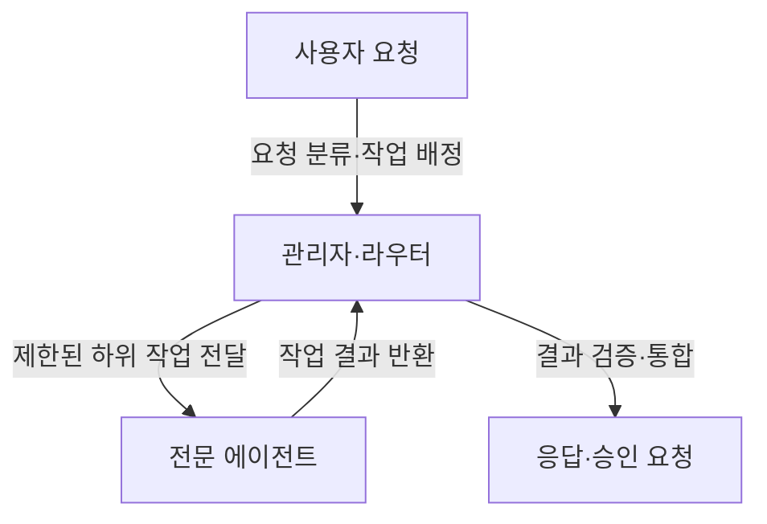

## 지식 로드맵 내 현재 위치
IT 인공지능 → 에이전트 시스템 → 다중 에이전트 협력·흐름 제어

## 30초 인출
- **본질:** 에이전트 오케스트레이션은 여러 에이전트의 작업과 제어권 이동을 관리하는 방식이다.
- **메커니즘:** 요청을 분할·라우팅하고 결과를 검토·통합하며, 종료 조건과 오류 처리를 둔다.
- **추가 단서:** 제어는 코드가 맡거나 모델 판단에 맡길 수 있으며, 두 방식을 조합할 수도 있다.

핵심 용어

- **관리자형(Agents as Tools):** 관리자 에이전트가 전문 에이전트의 결과를 도구 응답처럼 받아 최종 대화를 통제하는 구조다.
- **핸드오프(Handoff):** 한 에이전트가 작업 제어권을 전문 에이전트에게 넘기는 방식이다.
- **Human-in-the-Loop (HITL):** 사람의 승인·검토가 필요한 단계에서 작업을 멈추고 사람의 판단을 받는 절차다.

---

## 1교시 예상문제 (10점)
> AI 에이전트 오케스트레이션의 개념과 주요 구조, 신뢰성 확보 방안을 설명하시오. (예상)

---

## 1교시 10점 답안
### 1. 정의·목적
정의: 에이전트 오케스트레이션은 여러 에이전트의 실행 순서와 제어권을 관리하는 방식이다.
목적: 복합 요청을 적절한 작업자에게 배정하고 결과를 통합한다.

### 2. 기본 협업 흐름

### 3. 대표 패턴
| 패턴 | 제어 방식 |
|---|---|
| 순차 파이프라인 | 정해진 단계대로 결과 전달 |
| 관리자형 | 중앙 관리자가 하위 작업을 배정·통합 |
| 핸드오프·라우팅형 | 분류 결과에 따라 전문 에이전트로 제어권 이전 |

**제언:** 외부 영향이 큰 작업에는 사람의 승인과 도구별 권한 검사를 둔다.

---

## 2~4교시 예상문제 (25점)
> 복합 업무를 처리하는 AI 에이전트 오케스트레이션의 구성·패턴과 신뢰성 확보 방안을 설명하시오. (예상)

---

## 2~4교시 25점 답안
## Ⅰ. 개요와 오케스트레이션 패턴
오케스트레이션은 어떤 에이전트가 언제 실행되고, 결과·제어권이 어디로 이동하는지 정한다. 다중 에이전트는 복합 작업의 분할에 유용할 수 있지만 호출·검증 비용과 오류 경로도 늘린다.

| 패턴 | 동작 | 적합한 상황 |
|---|---|---|
| 순차 | 고정된 단계가 차례로 실행 | 단계와 선후관계가 명확 |
| 관리자형 | 관리자가 전문 에이전트를 호출하고 응답을 통합 | 최종 응답을 한 주체가 소유해야 할 때 |
| 핸드오프 | 분류 에이전트가 전문 에이전트로 제어권을 넘김 | 전문 주체가 이후 상호작용을 맡을 때 |
| 병렬 실행 | 독립 작업을 동시에 수행 | 결과 간 의존성이 낮고 지연을 줄일 때 |

## Ⅱ. 작업 흐름과 결과 검증

의존 작업은 선행 결과가 나온 뒤 실행하고, 독립 작업만 병렬화한다. 무조건 DAG로 모델링해야 하는 것은 아니며, 조건부 반복은 재시도 횟수와 종료 조건을 둬 통제한다.

## Ⅲ. 신뢰성·운영 통제
| 위험 | 통제 |
|---|---|
| 에이전트 간 반복 호출·비용 증가 | 호출 상한, 시간제한, 중복 요청 차단, 종료 조건 |
| 결과 형식 불일치·근거 오류 | 구조화된 입력·출력, 검증 규칙, 필요 시 독립 평가 |
| 민감 작업의 무승인 실행 | 최소 권한 도구, 금액·영향 기준의 사람 승인 |
| 상태·실행 경로 추적 불가 | 실행 이력·도구 호출·결과 버전 기록, 재현 가능한 평가 |

## Ⅳ. 기술사적 제언
| 문제 | 해결 방안 |
|---|---|
| 모델의 자율 분기와 외부 도구 실행이 결합되면 비용·오류·부작용 범위를 예측하기 어려움 | 위험도별 실행 권한과 호출 한도를 적용하고, 도구 전후 검증·실행 추적·중단 경로를 통합 시험한다. |

## 출제 이력과 검증 출처
- 현재 확인된 기출 없음. 문항은 에이전트 오케스트레이션 패턴과 통제 요건을 바탕으로 한 예상문제.
- OpenAI Agents SDK, [Agent orchestration](https://openai.github.io/openai-agents-python/multi_agent/) — 관리자형·핸드오프와 코드 기반 흐름의 구현 예.

## 연결 토픽
- 프로젝트 지침: [AAIF·AGENTS.md](./087_aaif_agents_md.md)
