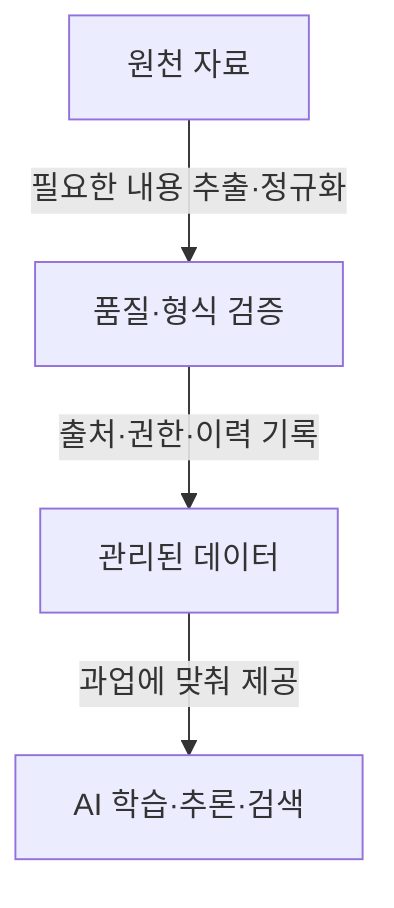

## 지식 로드맵 내 현재 위치
IT 데이터 관리 → AI 활용 데이터 준비 → 품질·권한·계보를 갖춘 AI-ready data

## 30초 인출
- **본질:** AI-ready data는 정해진 AI 과업에 맞게 품질·구조·권한을 확인해 사용할 수 있도록 준비한 데이터다.
- **메커니즘:** 원천 자료를 추출·정제하고, 품질·출처·이용 조건을 기록해 필요한 모델이나 서비스에 제공한다.
- **추가 단서:** 임베딩·청킹은 검색 과업에 쓰일 수 있지만 모든 AI 데이터의 필수 가공은 아니다.

핵심 용어

- **데이터 계보(Data Lineage):** 데이터의 출처와 처리·변환 이력을 추적하는 정보다.
- **데이터 품질(Data Quality):** 데이터가 정확성·완전성·최신성 등 의도한 사용에 적합한 정도다.
- **접근 메타데이터:** 자료의 소유자·분류·이용 권한 등 접근 판단에 필요한 정보를 설명한다.

---

## 1교시 예상문제 (10점)
> 생성형 AI 활용을 위한 AI-ready data의 개념과 준비 절차, 핵심 관리 항목을 설명하시오. (예상)

---

## 1교시 10점 답안
### 1. 정의·목적
정의: AI-ready data는 특정 AI 과업에 사용할 수 있도록 품질·구조·이용 조건을 확인한 데이터다.
목적: 데이터 오류·권한 위반을 줄이고 AI 결과를 검증할 기반을 마련한다.

### 2. 준비 흐름

### 3. 준비 기준
| 기준 | 확인 사항 |
|---|---|
| 품질·구조 | 정확성, 완전성, 단위·레이아웃 보존 |
| 권리·보안 | 이용 목적, 접근권한, 민감정보 처리 |
| 추적성 | 원천·변환·버전과 갱신 시점 |

**제언:** 모델의 사용 목적과 위험에 맞춰 품질·권한 기준을 데이터 처리 절차에 반영한다.

---

## 2~4교시 예상문제 (25점)
> 기업의 AI 활용을 위한 데이터 준비 요건과 처리 파이프라인, 품질·권한·계보 관리 방안을 설명하시오. (예상)

---

## 2~4교시 25점 답안
## Ⅰ. 개요와 적합성
AI-ready data는 보편적인 파일 형식이나 특정 제품을 뜻하지 않는다. 목표 과업·모델·법적 이용 조건에 맞춰 데이터의 적합성을 확인하고 필요한 준비를 마친 상태를 가리킨다.

| 준비 기준 | 확인 사항 |
|---|---|
| 품질·구조 | 정확성, 완전성, 단위·레이아웃 보존 |
| 권리·보안 | 이용 목적, 접근권한, 민감정보 처리 |
| 추적성 | 원천·변환·버전과 갱신 시점 |

## Ⅱ. 처리 파이프라인

추출·정규화 방법은 자료 형식과 과업에 맞춘다. 청킹·임베딩은 검색 기반 활용에서 필요할 수 있으나, 구조화 데이터·모델 학습 등 모든 경로에 적용되는 필수 단계는 아니다.

## Ⅲ. 데이터 거버넌스와 검증
| 관리 영역 | 통제·검증 |
|---|---|
| 품질 | 출처별 검증 규칙, 오류·중복·최신성 점검 |
| 개인정보·기밀 | 최소 수집, 목적 제한, 필요 시 마스킹·비식별화 |
| 권한 | 문서·레코드별 접근 정책을 제공 계층에서 실제 강제 |
| 변경·계보 | 변환 버전, 승인, 갱신·삭제 전파 기록 |

개인정보 처리는 목적·법적 근거에 따라 결정한다. 비식별화했다고 재식별 위험이나 이용 제한이 사라지는 것은 아니다.

## Ⅳ. 기술사적 제언
| 문제 | 해결 방안 |
|---|---|
| 조직의 모든 원천 자료를 한 번에 AI용으로 전환하면 정제 비용과 검토 우선순위가 불분명해짐 | 먼저 대표 AI 과업을 정하고, 그 과업의 최소 자료 집합을 품질·권한 기준에 맞춰 준비한 뒤 활용을 넓힌다. |

## 출제 이력과 검증 출처
- 현재 확인된 기출 없음. 문항은 데이터 품질·권한·계보를 포함한 AI 데이터 준비 범위의 예상문제.
- NIST, [AI Risk Management Framework](https://www.nist.gov/itl/ai-risk-management-framework) — AI 시스템의 목적·맥락·위험을 관리하는 자발적 프레임워크. 2026년 현재 개정 중.
- NIST, [Research Data Framework](https://nvlpubs.nist.gov/nistpubs/SpecialPublications/1500-18/NIST.SP.1500-18r2.html) — 데이터 품질의 사용 적합성·출처 관련 정의.

## 연결 토픽
- 데이터 검색 활용: [검색 증강 생성(RAG)](./005_rag.md)
- 임베딩 표현: [임베딩](./085_embedding.md)
