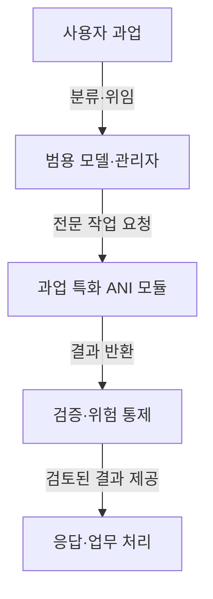

## 지식 로드맵 내 현재 위치
IT 인공지능 → AI 역량 범주 → 과업 특화 인공지능(ANI)과 범용 AI 구상(AGI)

## 30초 인출
- **본질:** ANI는 정해진 과업이나 범위에 맞춰 설계된 인공지능을 가리키는 용어다.
- **메커니즘:** 과업에 특화된 모델·규칙·도구를 필요한 기능에 적용하고 결과를 검증한다.
- **추가 단서:** ANI는 높은 정확성·안전성이나 낮은 비용을 자동 보장하지 않으며, AGI도 합의된 단일 실현 기준이 없다.

핵심 용어

- **좁은 인공지능(Artificial Narrow Intelligence, ANI):** 제한된 과업·영역을 수행하도록 설계한 AI를 설명하는 범주 용어다.
- **범용 인공지능(Artificial General Intelligence, AGI):** 다양한 영역에서 폭넓게 학습·추론하는 능력을 갖춘 AI를 가리키는 개념이며, 보편적으로 합의된 실현 기준은 없다.
- **복합 AI 시스템(Compound AI System):** 모델·검색·도구·검증기 등 여러 구성요소를 결합해 하나의 문제를 푸는 시스템이다.

---

## 1교시 예상문제 (10점)
> AGI를 지향하는 시스템에서 ANI가 필요한 이유와 특화 AI의 활용상 유의점을 설명하시오. (예상)

---

## 1교시 10점 답안
### 1. 정의·목적
정의: ANI는 특정 과업이나 제한된 영역을 수행하도록 설계된 인공지능이다.
목적: 범용 모델만으로 처리하기 어려운 전문 기능을 목적에 맞게 제공한다.

### 2. 범용 모델과 특화 모듈의 결합

이는 가능한 복합 AI 설계 예이며, ANI가 범용 AI의 필수 구성요소라는 뜻은 아니다.

### 3. 기대와 유의점
| 기대 | 유의점 |
|---|---|
| 전문 과업에 맞춘 기능·평가 가능 | 범위 밖 입력과 환경 변화에 취약할 수 있음 |
| 작은 구성요소를 교체·시험 가능 | 특화 모델도 편향·오류·보안 위험을 가짐 |

**제언:** 특화 모델의 적용 범위와 실패 시 사람에게 넘기는 조건을 정한다.

---

## 2~4교시 예상문제 (25점)
> AGI 관점에서 ANI의 필요성을 설명하고, 범용 모델과 과업 특화 AI의 역할 분담 및 신뢰성 확보 방안을 제시하시오. (제135회 1교시 13번 기출 주제)

---

## 2~4교시 25점 답안
## Ⅰ. 개요와 ANI의 필요성
ANI는 제한된 과업을 수행하도록 설계한 AI를 일컫는 범주다. 다양한 과업을 다루려는 범용 모델이 발전해도, 비용·지연·도메인 검증 요구에 따라 특화 구성요소를 사용하는 편이 적절할 수 있다. 이는 특정 구성 방식에 대한 설계 선택이지, AGI가 실현되거나 ANI가 언제나 더 안전하다는 주장이 아니다.

| 필요 관점 | ANI 활용 이유 |
|---|---|
| 전문성 | 특정 입력·출력과 평가 기준에 맞춰 설계·검증 |
| 효율 | 작업에 필요한 크기·연산량으로 구성 가능 |
| 통제 | 기능·데이터·권한 경계를 작은 단위로 설정 가능 |

## Ⅱ. 복합 시스템에서의 역할 분담

범용 모델이 과업을 해석·라우팅하고 특화 구성요소가 제한된 기능을 수행하는 예다. 특정 ANI 호출이 항상 더 정확하거나 안전한지는 실제 자료와 평가로 확인해야 한다.

## Ⅲ. 적용 범위와 위험 관리
| 특성 | 기대 효과 | 관리할 위험 |
|---|---|---|
| 과업 범위 제한 | 시험·교체 범위를 좁힐 수 있음 | 범위 밖 입력에 대한 오판 |
| 전문 데이터·모델 | 특정 지표에 맞춘 성능 최적화 | 자료 편향·분포 변화 |
| 모듈화 | 권한·연산 자원을 기능별 관리 | 모듈 간 오류 전파·통합 실패 |

## Ⅳ. 기술사적 제언
| 문제 | 해결 방안 |
|---|---|
| 모든 세부 과업에 특화 모듈을 두면 유지 비용과 라우팅 복잡도가 커질 수 있음 | 요청량과 전문성 요구가 높은 과업부터 모듈화하고, 모듈 추가 전 범용 모델 기준선과 운영 비용을 비교한다. |

## 출제 이력과 검증 출처
- 원노트에 기록된 기출: 제135회 1교시 13번, “AGI(Artificial General Intelligence) 측면에서 ANI(Artificial Narrow Intelligence)의 필요성”.
- NIST, [AI Risk Management Framework](https://www.nist.gov/itl/ai-risk-management-framework) — AI 시스템의 목적·맥락·위험에 따른 관리 원칙. 프레임워크는 자발적 사용을 위한 것이며, ANI·AGI 분류 표준은 아니다.

## 연결 토픽
- 작업 분배: [AI 에이전트 오케스트레이션](./088_ai_agent_orchestration.md)
- 기반 모델 표현: [생성형 AI](./009_generative_ai.md)
