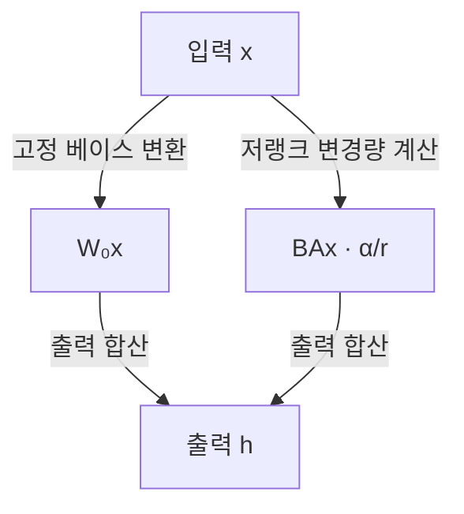

## 지식 로드맵 내 현재 위치
IT 인공지능 → 거대 언어모델 적응 → 파라미터 효율적 미세조정(PEFT) → LoRA·QLoRA

## 30초 인출
- **본질:** PEFT는 전체 모델을 갱신하지 않고 일부 매개변수만 학습해 사전학습 모델을 과업에 맞추는 방법군이다.
- **메커니즘:** LoRA는 베이스 가중치를 고정하고 저랭크 행렬로 표현한 가중치 변경량을 학습한다.
- **추가 단서:** QLoRA는 양자화된 베이스 모델 위에서 LoRA 어댑터를 학습해 메모리를 더 줄인다.

핵심 용어

- **파라미터 효율 미세조정(PEFT):** 사전학습 모델의 일부 매개변수만 조정해 과업에 적응시키는 방법군이다.
- **LoRA(Low-Rank Adaptation):** 고정된 가중치에 저랭크 행렬 곱으로 표현한 학습 가능한 변경량을 더하는 방법이다.
- **랭크(Rank, r):** LoRA 변경 행렬의 중간 차원이며, 파라미터 수와 표현 용량에 영향을 준다.
- **QLoRA:** 양자화된 베이스 모델을 고정한 채 LoRA 어댑터를 학습하는 방법이다.

---

## 1교시 예상문제 (10점)
> PEFT의 개념과 LoRA의 행렬 구조·학습 방식, QLoRA의 차이를 설명하시오. (예상)

---

## 1교시 10점 답안
### 1. 정의·목적
정의: PEFT는 사전학습 모델의 일부 매개변수만 학습해 새 과업에 적응시키는 방법군이다.
목적: 전체 미세조정보다 학습 가능한 매개변수와 저장 부담을 줄인다.

### 2. LoRA 구조
베이스 가중치 `W₀`는 고정하고 저랭크 변경량 `ΔW = (α/r)BA`만 학습한다. `W₀∈R^(d_out×d_in)`, `A∈R^(r×d_in)`, `B∈R^(d_out×r)`이다.

### 3. LoRA·QLoRA 차이
| 방식 | 베이스 가중치 | 학습하는 매개변수 |
|---|---|---|
| LoRA | 보통 원래 정밀도에서 고정 | 저랭크 어댑터 |
| QLoRA | 양자화해 고정 | 저랭크 어댑터 |

**제언:** 과업 품질과 메모리 요구를 함께 측정해 랭크·양자화 설정을 선택한다.

---

## 2~4교시 예상문제 (25점)
> PEFT의 목적과 LoRA의 저랭크 행렬 학습 원리, QLoRA의 양자화 기반 메모리 절감 구조 및 적용 시 고려사항을 설명하시오. (예상)

---

## 2~4교시 25점 답안
## Ⅰ. 개요와 PEFT
전체 미세조정은 모델의 모든 가중치를 갱신하지만 PEFT는 변경 대상 매개변수 수를 줄이는 여러 방법을 포괄한다. LoRA는 그중 가중치 변경량을 저랭크 구조로 학습하는 기법이다.

| 방법 | 학습 대상 | 특징 |
|---|---|---|
| 전체 미세조정 | 베이스 모델 전체 가중치 | 표현 유연성이 크지만 저장·최적화 자원 부담 증가 |
| PEFT | 일부 매개변수 또는 추가 모듈 | 학습·저장 부담을 줄일 수 있으나 과업별 품질 검증 필요 |

## Ⅱ. LoRA 행렬 구조

`h = W₀x + (α/r)BAx`이며, `A∈R^(r×d_in)`, `B∈R^(d_out×r)`, `W₀∈R^(d_out×d_in)`이다. 학습 중 베이스 가중치는 고정하고 A·B를 갱신한다. 저랭크 구조의 추가 매개변수 수는 `r(d_in+d_out)`로, 전체 행렬의 `d_in d_out`보다 작게 설정할 수 있다.

## Ⅲ. LoRA와 QLoRA
| 구분 | LoRA | QLoRA |
|---|---|---|
| 베이스 가중치 | 동결, 보통 기존 정밀도로 유지 | 동결한 베이스를 저비트로 양자화 |
| 학습 변수 | LoRA 어댑터 | LoRA 어댑터 |
| 메모리 절감 요인 | 전체 가중치 기울기·옵티마이저 상태를 피함 | 양자화된 베이스와 메모리 절약 기법 추가 |
| 주의점 | 랭크·적용 계층이 성능에 영향 | 양자화 오차·하드웨어·학습 구현 검증 |

QLoRA 논문은 NF4, 이중 양자화, 페이지드 옵티마이저를 제안하고 65B 모델을 단일 48GB GPU에서 미세조정한 실험을 보고했다. 이는 특정 연구 설정의 결과이지 모든 모델·환경의 하드웨어 요구량 보장은 아니다. 지원되는 선형 계층에서는 학습 후 어댑터를 베이스 가중치에 병합해 별도 추론 경로를 없앨 수 있으나, 양자화·다중 어댑터 구성은 별도 고려가 필요하다.

## Ⅳ. 기술사적 제언
| 문제 | 해결 방안 |
|---|---|
| 여러 업무가 하나의 어댑터 설정을 공유하면 과업별 용량 요구와 배포 단위가 맞지 않을 수 있음 | 업무별 검증 결과에 따라 랭크·적용 계층을 정하고, 베이스 모델과 어댑터 버전을 함께 관리해 독립 배포한다. |

## 출제 이력과 검증 출처
- 현재 확인된 기출 없음. 문항은 PEFT·LoRA·QLoRA의 구조와 적용 범위를 바탕으로 한 예상문제.
- Hu et al., [LoRA: Low-Rank Adaptation of Large Language Models](https://arxiv.org/abs/2106.09685), 2021.
- Dettmers et al., [QLoRA: Efficient Finetuning of Quantized LLMs](https://arxiv.org/abs/2305.14314), 2023.

## 연결 토픽
- 선호 정렬: [DPO](./092_dpo.md)
- 임베딩·표현: [임베딩](./085_embedding.md)
