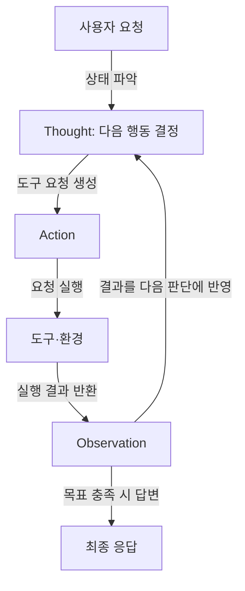

## 지식 로드맵 내 현재 위치
IT 인공지능 → LLM 에이전트 → 추론과 도구 사용 결합 → ReAct

## 30초 인출
- **본질:** ReAct는 언어 모델의 추론과 외부 행동을 번갈아 수행해 문제를 해결하는 패턴이다.
- **메커니즘:** 모델이 생각·행동을 생성하고, 도구가 실행한 결과를 관측해 다음 추론에 반영한다.
- **한계:** 도구 결과가 틀리거나 루프가 길어질 수 있으므로 실행 권한·횟수·시간을 통제한다.

핵심 용어

- **Thought:** 현재 상태를 해석하고 다음 단계를 정하는 모델의 추론 내용이다.
- **Action:** 도구 호출처럼 외부 환경에 요청하는 행동이다.
- **Observation:** 외부 도구나 환경이 Action에 돌려준 결과다.
- **ReAct:** 추론과 행동을 교차해 계획을 갱신하는 접근법이다.

---

## 1교시 예상문제 (10점)
> ReAct(Reasoning and Acting) 패턴의 개념과 Thought-Action-Observation 동작 과정을 설명하고 Chain-of-Thought와 비교하시오. (예상)

---

## 1교시 10점 답안
### 1. 정의·목적
정의: ReAct는 언어 모델이 추론과 외부 행동을 교차하며 문제를 푸는 패턴이다.
목적: 도구 결과를 다음 판단에 반영해 외부 정보와 작업을 활용한다.

### 2. 동작 과정

### 3. CoT와 차이
| 관점 | CoT | ReAct |
|---|---|---|
| 과정 | 추론 단계를 이어 답을 생성 | 추론과 외부 행동·관측을 반복 |
| 외부 데이터 | 기본적으로 직접 얻지 않음 | 도구를 통해 얻을 수 있음 |
| 고려점 | 모델 지식과 추론에 의존 | 도구 오류·지연·권한 위험을 추가 관리 |

**제언:** 허용된 도구와 실행 한도를 정하고 관측 결과의 출처를 확인한다.

---

## 2~4교시 예상문제 (25점)
> ReAct 패턴의 구조와 동작 원리를 설명하고, CoT 및 단순 도구 호출과의 차이와 에이전트 운영 시 통제 방안을 제시하시오. (예상)

---

## 2~4교시 25점 답안
## Ⅰ. 개념과 구성
ReAct는 언어 모델의 추론과 외부 행동을 번갈아 수행하는 문제 해결 패턴이다. Thought는 계획·해석, Action은 도구 호출, Observation은 실행 결과의 반환을 담당한다.

| 구성 | 역할 |
|---|---|
| 언어 모델 | 다음 생각이나 도구 행동을 생성 |
| 도구 실행기 | 요청을 검증하고 허용된 도구를 실행 |
| 외부 도구 | 검색·계산·업무 시스템 결과 반환 |

## Ⅱ. 실행 메커니즘
각 관측 결과는 다음 판단의 입력이 되며, 목표를 달성하거나 중단 조건을 만나면 응답을 마친다.

## Ⅲ. 기존 방식과 비교
| 방식 | 모델 과정 | 외부 환경과의 관계 | 특징·제약 |
|---|---|---|---|
| CoT | 중간 추론 후 답변 | 외부 실행은 기본 과정에 없음 | 다단계 추론을 표현 |
| 단순 도구 호출 | 사전 정한 호출 뒤 결과 사용 | 제한된 호출 흐름 | 동적 계획 수정이 제한될 수 있음 |
| ReAct | 추론·행동·관측을 교차 | 관측으로 다음 행동을 갱신 | 유연하지만 실행 경계가 필요 |

이 패턴은 외부 근거를 활용할 기회를 제공하지만 오류 없는 답변을 보장하지 않는다. 도구 출력은 신뢰도와 출처를 확인해야 한다.

## Ⅳ. 기술사적 제언
| 문제 | 해결 방안 |
|---|---|
| 도구 오용, 반복 호출 또는 민감 작업의 무단 실행 | 도구 목록·인자 스키마·사용자 권한을 검증하고, 반복·시간·비용 한도와 작업별 승인 절차를 둔다. |

## 출제 이력과 검증 출처
- 현재 확인한 기출 없음. 본 문항은 ReAct의 핵심 개념을 묻는 예상문제.
- Yao et al., [ReAct: Synergizing Reasoning and Acting in Language Models](https://arxiv.org/abs/2210.03629), ICLR 2023.
