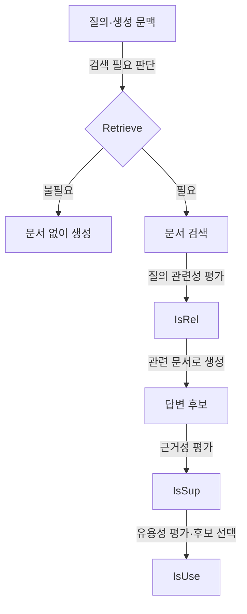

## 지식 로드맵 내 현재 위치
IT 인공지능 → 검색 증강 생성(RAG) → 검색·생성 결과의 모델 내 반성 → Self-RAG

## 30초 인출
- **본질:** Self-RAG는 검색 필요성과 검색·생성 결과를 반성 토큰으로 판단하도록 학습한 RAG 방식이다.
- **메커니즘:** 검색 여부를 정하고, 검색 문서의 관련성·생성 문장의 근거성·응답의 유용성을 평가한다.
- **특징:** 반성 결과는 후보 생성과 선택에 활용되며, 모든 질의에서 검색을 강제하지 않는다.

핵심 용어

- **Self-RAG:** 검색·생성·비평을 모델의 반성 토큰으로 연결하는 학습 기반 RAG 프레임워크다.
- **[Retrieve]:** 검색 수행 여부나 이어지는 검색 동작을 표시한다.
- **[IsRel]:** 검색 문서가 질문과 관련 있는지 평가한다.
- **[IsSup] / [IsUse]:** 생성 문장의 근거성 및 응답의 유용성을 평가한다.

---

## 1교시 예상문제 (10점)
> Self-RAG의 개념과 반성 토큰의 역할 및 검색·생성 과정을 설명하시오. (예상)

---

## 1교시 10점 답안
### 1. 정의·목적
정의: Self-RAG는 검색·생성 결과를 반성 토큰으로 평가하는 검색 증강 생성 방식이다.
목적: 질의에 필요한 검색을 선택하고, 근거성과 유용성을 고려해 답변을 생성한다.

### 2. 반성 토큰 기반 과정

### 3. 적용 시 고려
반성 토큰은 평가 기준이 잘못되면 오판할 수 있다. 검색 품질과 근거성 판단을 별도 검증 데이터와 사람 검토로 확인한다.

**제언:** 업무에 맞는 근거성 기준을 정하고 반성 판단과 최종 답변을 함께 평가한다.

---

## 2~4교시 예상문제 (25점)
> Self-RAG의 필요성과 반성 토큰을 이용한 검색·생성·비평 원리를 설명하고, 기존 RAG와 비교하여 적용 및 평가 시 고려사항을 제시하시오. (예상)

---

## 2~4교시 25점 답안
## Ⅰ. 기존 RAG와 Self-RAG
기존 고정형 RAG는 정해진 방식으로 문서를 검색해 답변 생성에 제공한다. Self-RAG는 모델이 검색 필요성을 판단하고, 문서와 답변을 반성 토큰으로 평가하도록 학습한다.

| 구분 | 고정형 RAG | Self-RAG |
|---|---|---|
| 검색 결정 | 구성된 검색 절차에 따름 | 모델이 검색 필요 판단을 생성 |
| 결과 평가 | 별도 검색기·후처리에 의존 가능 | 반성 토큰으로 문서·생성 평가 |
| 핵심 고려 | 검색 품질과 문맥 구성 | 학습·토큰 해석 및 평가 품질 |

## Ⅱ. 반성 토큰의 동작

논문은 검색 여부, 문서 관련성, 생성 내용의 근거성, 응답 유용성을 반성 토큰으로 표현한다. 검색 문서나 생성 문장이 부적절할 수 있어 이런 평가는 사실 검증을 대신하지 않는다.

## Ⅲ. 장점과 적용상 한계
| 관점 | 적용 의미 | 확인할 한계 |
|---|---|---|
| 검색 선택 | 불필요한 검색을 줄일 가능성 | 검색 필요 판단의 오류 |
| 문서 관련성 | 관련 근거 중심으로 생성 후보 평가 | 검색기와 평가 토큰의 편향 |
| 근거성·유용성 | 후보 답변의 선택 기준 제공 | 토큰 점수가 실제 정답성을 보증하지 않음 |
| 모델 구성 | 학습된 반성 토큰을 생성 과정에 활용 | 전용 학습·추론 구현과 도메인 평가 필요 |

## Ⅳ. 기술사적 제언
| 문제 | 해결 방안 |
|---|---|
| 정적 RAG로 충분한 질의에도 자기반성 경로를 적용하면 추론 비용만 늘 수 있음 | 질의별 검색 필요성과 품질 이득이 확인되는 업무를 골라 Self-RAG 경로를 제한 적용하고 기본 RAG와 비교한다. |

## 출제 이력과 검증 출처
- 현재 확인한 기출 없음. Self-RAG의 검색·반성 구조를 묻는 예상문제.
- Asai et al., [Self-RAG: Learning to Retrieve, Generate, and Critique through Self-Reflection](https://arxiv.org/abs/2310.11511), ICLR 2024.
- 관련 비교: [CRAG](./091_crag.md).
