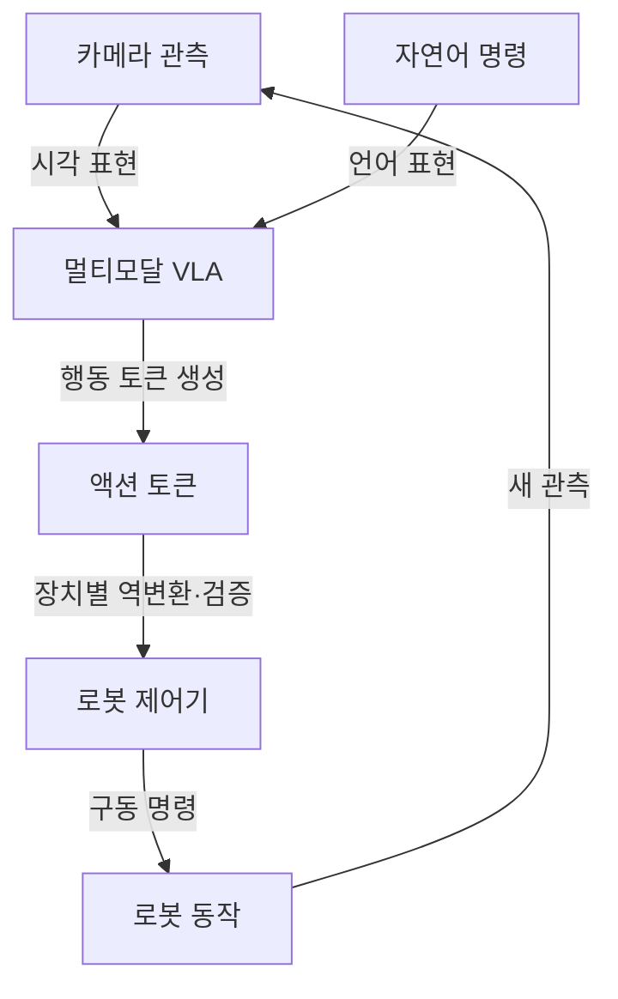

## 지식 로드맵 내 현재 위치
IT 인공지능 → 멀티모달 파운데이션 모델 → 물리 환경의 인식·언어·행동 통합 → VLA

## 30초 인출
- **본질:** VLA는 시각·언어 입력에 조건화해 로봇 행동을 출력하는 비전-언어-행동 모델이다.
- **메커니즘:** 관측과 명령을 함께 처리하고, 로봇 동작을 토큰 등 모델 출력으로 표현해 제어에 연결한다.
- **운영:** 행동 출력을 실제 로봇에 적용하기 전 장치별 변환·한계·안전 검증이 필요하다.

핵심 용어

- **VLA:** 비전·언어 입력을 로봇 행동과 연결하도록 학습한 모델 계열이다.
- **액션 토큰:** 연속 동작 값을 양자화하거나 구조화해 모델이 출력할 수 있는 토큰 표현이다.
- **RT-2:** 웹 규모 비전-언어 데이터와 로봇 궤적 데이터를 함께 활용해 로봇 제어로 지식 전이를 연구한 VLA 모델이다.
- **임바디드 AI:** 센서·구동기를 통해 물리 환경과 상호작용하는 인공지능이다.

---

## 1교시 예상문제 (10점)
> VLA(Vision-Language-Action) 모델의 개념과 액션 토큰화의 역할, 적용 시 고려사항을 설명하시오. (예상)

---

## 1교시 10점 답안
### 1. 정의·목적
정의: VLA는 시각·언어 입력을 로봇 행동 출력에 연결하는 모델 계열이다.
목적: 지시와 환경 관측을 함께 사용해 로봇의 행동 계획·제어를 지원한다.

### 2. 입력에서 행동까지

### 3. 토큰화와 안전
RT-2는 로봇 동작 값을 토큰으로 표현해 VLM이 행동 출력을 학습하도록 했다. 토큰화 방식과 동작 범위는 로봇·과업에 따라 정해야 하며, 모델 출력만으로 안전이 보장되지는 않는다.

**제언:** 장치 한계와 안전 조건을 별도 제어 계층에서 검증한 뒤 행동을 실행한다.

---

## 2~4교시 예상문제 (25점)
> VLA 모델의 개념과 입력·출력 구조, RT-2의 액션 토큰화 및 웹·로봇 데이터 활용을 설명하고 실제 로봇 적용 시 고려사항을 제시하시오. (예상)

---

## 2~4교시 25점 답안
## Ⅰ. 개념과 기존 구성 비교
VLA는 시각 관측과 언어 지시를 받아 로봇 행동을 출력하는 모델 계열이다. 영상 설명을 생성하는 VLM에서 물리 행동 출력으로 확장한 구성이며, 출력의 해석과 실행은 로봇 인터페이스가 담당한다.

| 구성 | 입력·출력의 중심 |
|---|---|
| VLM | 영상·언어 입력 → 텍스트 응답 |
| VLA | 영상·언어 입력 → 로봇 행동 표현 |
| 전통적 분리형 제어 | 인식·계획·제어 모듈을 별도 구성·연결 |

## Ⅱ. 모델 동작 구조

VLA가 행동 토큰을 출력해도 토큰 정의, 좌표계, 구동 한계는 로봇 플랫폼에 맞춰 해석해야 한다. 관측과 실행 결과를 다시 입력하면 폐루프 동작이 가능하다.

## Ⅲ. RT-2 액션 토큰화와 데이터 활용
RT-2는 연속 로봇 동작의 여러 차원을 구간화해 정수 토큰으로 표현하고, 이를 언어 모델 출력으로 학습했다. 논문 설정에서는 각 동작 차원을 256개 구간으로 양자화했으며, 이 수는 모든 VLA의 공통 규격이 아니다.

| RT-2 구성 | 역할 |
|---|---|
| 웹 규모 비전·언어 데이터 | 사전학습 VLM의 시각·언어 표현 기반 |
| 로봇 궤적 데이터 | 행동 토큰과 관측·지시의 대응 학습 |
| 토큰화된 동작 출력 | 언어 모델의 출력 형식으로 로봇 행동 표현 |

논문은 웹 지식의 로봇 제어 전이를 연구했다. 성능은 모델·데이터·로봇 플랫폼·평가 과업에 따라 달라지며, 특정 결과를 범용 조작 능력으로 확대 해석하지 않는다.

## Ⅳ. 기술사적 제언
| 문제 | 해결 방안 |
|---|---|
| 모델 출력 지연·오류나 환경 변화가 실제 충돌·오동작으로 이어질 수 있음 | 출력 범위·좌표·속도를 검증하고, 독립 안전 센서와 정지 인터록을 두며, 시뮬레이션·제한 구역 시험 후 단계적으로 배치한다. |

## 출제 이력과 검증 출처
- 현재 확인한 기출 없음. VLA의 입력·행동 구조와 적용 고려사항을 묻는 예상문제.
- Brohan et al., [RT-2: Vision-Language-Action Models Transfer Web Knowledge to Robotic Control](https://arxiv.org/abs/2307.15818), CoRL 2023.
- [Google DeepMind: RT-2](https://deepmind.google/blog/rt-2-new-model-translates-vision-and-language-into-action/).
