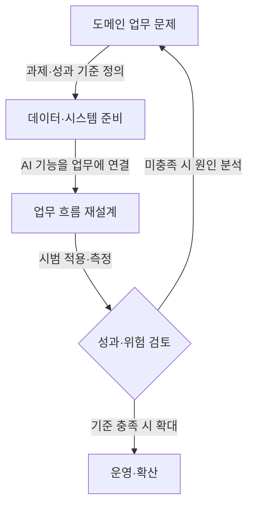

## 지식 로드맵 내 현재 위치
IT 경영 → 디지털 전환(DX) → 인공지능 전환(AX) → 도메인 업무 재설계

## 30초 인출
- **본질:** AX는 AI를 기존 업무에 추가하는 데 그치지 않고, AI를 활용해 업무와 운영 방식을 바꾸는 전환이다.
- **메커니즘:** 도메인 과제를 고르고, 데이터·시스템·사람·AI를 연결해 업무 흐름을 재설계하고 성과를 검증한다.
- **구분:** “AX 2.0”과 “X+AI”는 맥락에 따라 쓰이는 전략 표현이며, 공인된 단일 단계 표준은 아니다.

핵심 용어

- **AX(AI Transformation):** AI를 활용해 조직의 업무나 운영 방식을 변화시키는 활동이다.
- **X+AI:** 산업·업무 영역(X)의 지식과 데이터에 AI를 결합한다는 전략 표현이다.
- **업무 재설계:** AI 도입을 계기로 역할·절차·시스템 연계를 다시 정하는 일이다.
- **PoC:** 제한된 범위에서 기술·업무 가설을 검증하는 시범 적용이다.

---

## 1교시 예상문제 (10점)
> X+AI와 AX의 의미를 설명하고, 단순 AI 도구 도입과 업무 전환의 차이 및 추진 시 고려사항을 서술하시오. (예상)

---

## 1교시 10점 답안
### 1. 정의·목적
정의: AX는 AI를 활용해 조직의 업무와 운영 방식을 바꾸는 전환이다.
목적: 도메인 문제를 해결하고 업무 성과를 개선하도록 AI와 업무 절차를 함께 설계한다.

### 2. 도구 도입에서 업무 전환까지

### 3. 추진 기준
“AX 2.0”은 문맥에 따라 성숙 단계나 전략을 뜻할 수 있어 보편적 표준 단계로 단정하지 않는다. 과제별 성과, 데이터 준비도, 위험과 사람의 역할을 구체화한다.

**제언:** 기술 시연보다 업무 지표와 책임 주체를 먼저 정해 작은 범위에서 검증한다.

---

## 2~4교시 예상문제 (25점)
> 기업의 X+AI·AX 추진 배경과 업무 재설계 원리를 설명하고, 데이터·시스템·조직을 연계한 추진 방안과 성과·위험 관리 방안을 제시하시오. (예상)

---

## 2~4교시 25점 답안
## Ⅰ. 개념과 추진 배경
AX는 AI 기능을 기존 절차에 덧붙이는 수준을 넘어 업무 방식과 운영 모델을 바꾸는 활동이다. 다만 “AX 2.0”은 통용되는 하나의 표준 단계 명칭이 아니므로 조직이 정의한 목표와 범위를 명시해야 한다.

| 접근 | 변화의 초점 |
|---|---|
| 디지털화·DX | 정보와 절차의 디지털 처리 |
| AI 도구 활용 | 기존 업무 중 일부 작업 보조·자동화 |
| 업무 중심 AX | AI 활용을 전제로 역할·절차·시스템을 재검토 |

## Ⅱ. 추진 구조와 절차

| 단계 | 주요 작업 |
|---|---|
| 문제 선정 | 업무 병목·오류·비용과 해결 목표를 정의 |
| 기반 정비 | 데이터 권리·품질·접근, 시스템 연결을 확인 |
| 업무 설계 | AI 역할, 사람의 승인·예외 처리, 기존 절차 변경을 합의 |
| 검증·운영 | 제한된 시범에서 성과·위험을 측정하고 모니터링 |

## Ⅲ. 성과와 위험 관리
| 관리 대상 | 확인 내용 |
|---|---|
| 업무 성과 | 기준선과 비교 가능한 시간·품질·비용 지표 |
| 데이터·시스템 | 사용 권한, 최신성, 품질, 연계 장애 |
| 사람·책임 | 최종 결정권, 검토·이의 제기, 오류 대응 절차 |
| AI 위험 | 정확성, 보안, 개인정보, 편향, 기록·감사 가능성 |

PoC 성능만으로 본사업 가치를 확정하지 않는다. 실제 사용자·데이터·업무 흐름에서 검증하고, 개선 비용과 운영 비용도 포함해 판단한다.

## Ⅳ. 기술사적 제언
| 문제 | 해결 방안 |
|---|---|
| 시범 성능이 실제 업무성과로 이어지지 않거나 위험 책임이 불분명함 | 현업 책임자와 기준선을 정하고, 권한·검토·예외 절차를 설계한 뒤 제한된 범위로 운영 검증 후 확대한다. |

## 출제 이력과 검증 출처
- 현재 확인한 기출 없음. AX·X+AI의 업무 적용과 추진 방안을 묻는 예상문제.
- “AX 2.0”은 단일 공인 표준 용어로 확인되지 않아 이 답안에서 성숙 단계 구분으로 단정하지 않았다.
