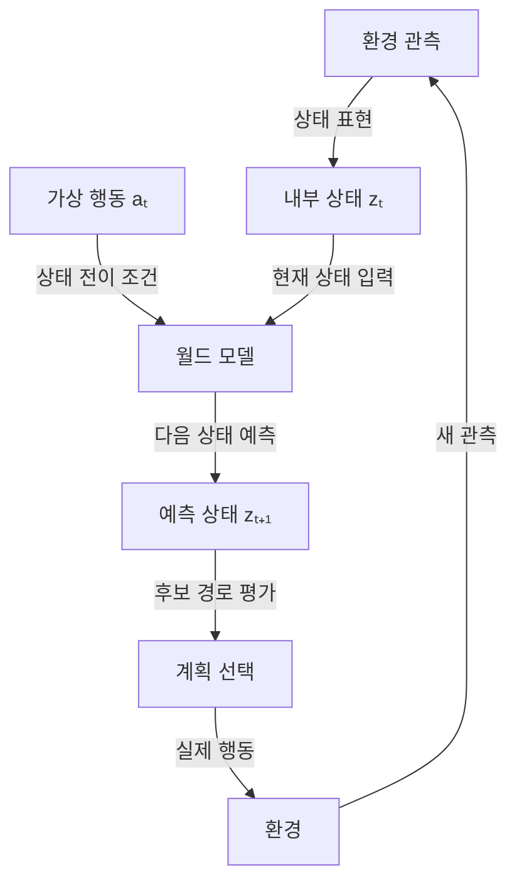

## 지식 로드맵 내 현재 위치
IT 인공지능 → 에이전트·강화학습 → 환경의 상태·동역학 모델링 → 월드 모델

## 30초 인출
- **본질:** 월드 모델은 환경의 상태 변화와 행동 결과를 예측해 계획·학습에 쓰는 모델이다.
- **메커니즘:** 관측을 내부 상태로 표현하고, 행동에 따른 다음 상태나 관측을 추정한다.
- **한계:** 예측은 실제 세계를 완전히 재현하지 않으며, 오차와 불확실성이 누적될 수 있다.

핵심 용어

- **월드 모델:** 에이전트가 환경 상태와 변화를 예측하는 데 사용하는 학습된 모델이다.
- **잠재 상태:** 원시 관측을 요약해 동역학 예측에 쓰는 내부 표현이다.
- **롤아웃:** 모델이 예측한 상태 전이를 여러 단계 연결해 미래 경로를 추정하는 과정이다.
- **JEPA:** 원본 입력을 그대로 재구성하는 대신 표현 공간에서 목표 표현을 예측하도록 학습하는 구조 계열이다.

---

## 1교시 예상문제 (10점)
> 월드 모델의 개념과 행동 조건부 상태 예측 원리를 설명하고, 계획·학습에서의 활용과 한계를 서술하시오. (예상)

---

## 1교시 10점 답안
### 1. 정의·목적
정의: 월드 모델은 환경 상태의 변화와 행동 결과를 예측하는 모델이다.
목적: 실제 시행 전에 미래 경로를 평가해 에이전트의 계획·학습을 돕는다.

### 2. 상태 예측과 계획

### 3. 활용·한계
| 활용 | 고려사항 |
|---|---|
| 시뮬레이션 내 정책 학습·계획 | 예측 오차와 분포 변화 |
| 다음 상태·관측 예측 | 물리 법칙을 완벽히 보장하지 않음 |

**제언:** 실제 환경과의 차이를 측정하고 불확실성이 큰 상황에는 안전한 대체 동작을 둔다.

---

## 2~4교시 예상문제 (25점)
> 월드 모델의 상태 표현과 행동 조건부 예측 원리를 설명하고, 모델 기반 계획·학습에서의 활용 및 물리 시뮬레이터·생성형 비디오 모델과의 차이, 적용상 한계를 제시하시오. (예상)

---

## 2~4교시 25점 답안
## Ⅰ. 개념과 모델 유형
월드 모델은 환경의 상태와 동역학을 학습해 행동 후 결과를 예측하는 모델이다. 상태는 관측 데이터 또는 잠재 표현으로 나타낼 수 있으며, 구현 목적에 따라 생성·예측 방식이 다르다.

| 접근 | 세계 변화 표현 |
|---|---|
| 물리 시뮬레이터 | 사람이 구현한 규칙·수치모델 |
| 생성형 비디오 모델 | 조건에 맞는 영상 프레임 생성 |
| 월드 모델 | 상태와 행동의 전이를 계획·학습에 활용 |

각 유형의 경계는 겹칠 수 있으며, 영상 생성만으로 행동 결과를 신뢰성 있게 예측한다고 단정할 수 없다.

## Ⅱ. 행동 조건부 상태 예측

행동 조건부 전이의 한 표현은 `zₜ₊₁ ~ P(zₜ₊₁ | zₜ, aₜ)`이다. 모델이 잠재 공간을 쓰더라도 예측의 정확도와 장기 일관성은 학습 데이터·구조·과업에 좌우된다.

## Ⅲ. 활용 및 적용 과제
| 활용 | 기대 역할 | 검증할 위험 |
|---|---|---|
| 모델 기반 강화학습 | 내부 롤아웃으로 정책을 평가·학습 | 모델 편향이 정책에 축적 |
| 로봇 계획 | 행동 후보의 결과를 비교 | 현실과 시뮬레이션의 차이 |
| 비디오 기반 물리 추론 | 관측 변화의 표현·예측 | 보지 못한 조건에서 오차 |
| JEPA 계열 예측 | 잠재 표현의 미래 예측 | 표현 예측이 실행 가능한 계획을 보장하지 않음 |

Dreamer 계열은 학습한 모델의 상상된 롤아웃을 정책 학습에 활용한다. JEPA는 표현 공간의 예측 학습 계열이며, 모든 JEPA가 행동 제어 월드 모델인 것은 아니다.

## Ⅳ. 기술사적 제언
| 문제 | 해결 방안 |
|---|---|
| 모델 롤아웃의 오차가 누적되어 실제 실행에서 위험한 계획이 선택될 수 있음 | 예측 불확실성을 평가하고 제한된 범위에서 실제 결과와 대조하며, 안전 제약·독립 제어기·실패 복구를 갖춘 뒤 적용한다. |

## 출제 이력과 검증 출처
- 현재 확인한 기출 없음. 월드 모델의 예측 구조와 활용·한계를 묻는 예상문제.
- Hafner et al., [Mastering Diverse Domains through World Models](https://arxiv.org/abs/2301.04104), DreamerV3의 세계 모델 및 상상 롤아웃 기반 학습.
- [Meta AI: V-JEPA 2](https://ai.meta.com/research/publications/v-jepa-2-self-supervised-video-models-enable-understanding-prediction-and-planning/), 잠재 예측 모델의 물리 추론·로봇 계획 연구 사례.
