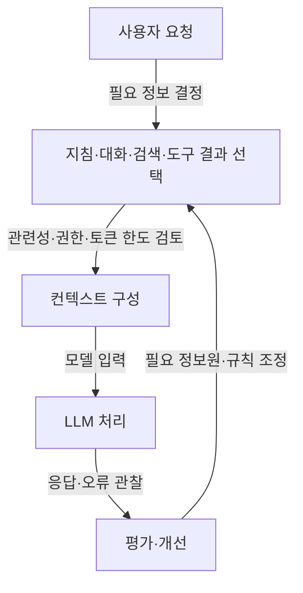

## 지식 로드맵 내 현재 위치
IT 인공지능 → LLM 응용 → 프롬프트·검색·메모리 결합 → 컨텍스트 구성

## 30초 인출
- **본질:** 컨텍스트 엔지니어링은 모델이 과업을 수행하도록 입력 문맥을 선택·구성·갱신하는 설계 활동이다.
- **메커니즘:** 지침·대화·검색 정보·도구 결과를 관련성과 토큰 한도에 맞게 구성한다.
- **원칙:** 긴 문맥이나 특정 위치 배치가 성능을 보장하지 않으므로 대상 모델·과업으로 검증한다.

핵심 용어

- **컨텍스트:** 모델이 요청을 처리할 때 함께 받는 지침·대화·외부 정보 등의 입력이다.
- **컨텍스트 엔지니어링:** 과업에 맞는 컨텍스트를 선택하고 구성·관리하는 접근이다.
- **Lost in the Middle:** 일부 실험에서 긴 입력의 중간에 둔 관련 정보를 모델이 덜 활용하는 현상이다.
- **프롬프트 캐싱:** 재사용 가능한 입력 접두부를 캐시해 후속 처리 효율을 높이는 제공자별 기능이다.

---

## 1교시 예상문제 (10점)
> 컨텍스트 엔지니어링의 개념과 프롬프트 엔지니어링과의 차이를 설명하고, LLM 입력 문맥을 구성할 때의 원칙을 서술하시오. (예상)

---

## 1교시 10점 답안
### 1. 정의·목적
정의: 컨텍스트 엔지니어링은 모델 입력에 포함할 정보를 과업에 맞게 선택·구성하는 활동이다.
목적: 필요한 근거와 지침을 적절한 양으로 제공해 과업 수행을 돕는다.

### 2. 문맥 구성 과정

### 3. 설계 원칙
| 원칙 | 설명 |
|---|---|
| 관련성 | 요청에 필요한 정보만 선별 |
| 신뢰성 | 권한·출처·최신성을 확인 |
| 한도 관리 | 토큰·지연·비용을 측정 |
| 검증 | 정보 위치와 구성을 과업별로 시험 |

**제언:** 문맥 배치와 압축 방식은 대표 질의로 평가하고 성능·비용을 함께 조정한다.

---

## 2~4교시 예상문제 (25점)
> 컨텍스트 엔지니어링의 개념과 구성 요소를 설명하고, 긴 입력에서의 정보 활용 문제 및 프롬프트 캐싱을 포함한 설계·평가 방안을 제시하시오. (예상)

---

## 2~4교시 25점 답안
## Ⅰ. 개념과 범위
컨텍스트 엔지니어링은 모델 입력 문맥을 요청별로 설계·관리하는 접근이다. 프롬프트 문구 작성도 포함될 수 있지만, 검색 자료·대화 상태·도구 응답의 선택과 갱신까지 다룬다. 용어 자체가 단일 표준 방법론을 뜻하지는 않는다.

| 관점 | 프롬프트 작성 중심 | 컨텍스트 구성 중심 |
|---|---|---|
| 주된 대상 | 지침·질문 표현 | 전체 모델 입력과 정보원 |
| 주요 작업 | 문구·예시 조정 | 정보 선택·검색·압축·갱신 |
| 평가 | 응답 품질 | 품질·근거성·지연·비용 |

## Ⅱ. 구성 파이프라인

## Ⅲ. 긴 문맥·캐시 설계와 평가
| 요소 | 설계 기준 | 검증 항목 |
|---|---|---|
| 검색·대화 정보 | 관련도·출처·최신성을 고려해 포함 | 근거 누락·오래된 정보 |
| 문맥 길이 | 과업에 필요한 정보와 모델 한도에 맞춤 | 정확도·지연·비용 |
| 정보 위치 | 순서 효과를 가정하지 않고 과업별 구성 비교 | 관련 정보 위치별 성능 |
| 캐시 접두부 | 제공자 기능과 캐시 조건에 맞춰 반복되는 부분을 구성 | 캐시 적중·지연·비용 |

일부 장문 질의응답 실험에서는 관련 정보가 중간에 있을 때 성능이 저하되는 현상이 관찰됐다. 이 결과가 모든 모델·과업에 같은 배치 규칙을 보장하지는 않는다. 프롬프트 캐싱 또한 제공자별 조건과 효과가 다르다.

## Ⅳ. 기술사적 제언
| 문제 | 해결 방안 |
|---|---|
| 모델 문맥 한도를 늘리는 것이 자료 선별보다 먼저 고려될 수 있음 | 먼저 질의와 직접 관련된 자료만 검색·선별하고, 남은 정보가 한도를 넘을 때 요약·분할·긴 문맥 중 적합한 방식을 비교한다. |

## 출제 이력과 검증 출처
- 현재 확인한 기출 없음. 컨텍스트 구성 원리와 장문 입력 관리 방안을 묻는 예상문제.
- Liu et al., [Lost in the Middle: How Language Models Use Long Contexts](https://arxiv.org/abs/2307.03172), 특정 장문 과업에서 정보 위치가 미치는 영향 연구.
- [Anthropic: Effective context engineering for AI agents](https://www.anthropic.com/engineering/effective-context-engineering-for-ai-agents), 컨텍스트 선택·구성의 실무적 접근.
