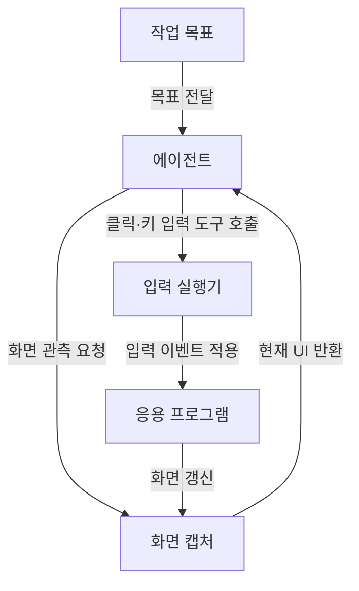

## 지식 로드맵 내 현재 위치
IT 인공지능 → 에이전트 도구 사용 → GUI 기반 컴퓨터 조작 → 컴퓨터 유즈

## 30초 인출
- **본질:** 컴퓨터 유즈 에이전트는 화면 관측과 입력 동작을 사용해 GUI 작업을 수행하는 에이전트다.
- **메커니즘:** 화면을 관측하고 다음 클릭·키 입력을 실행한 뒤, 바뀐 화면에서 결과를 확인한다.
- **위험:** 모델 출력은 실제 동작으로 이어지므로 권한·대상·실행 환경과 사람의 확인을 통제한다.

핵심 용어

- **컴퓨터 유즈:** 모델이 화면을 관측하고 클릭·키 입력 등 도구를 호출해 컴퓨터 작업을 수행하는 방식이다.
- **시각적 접지:** 화면 요소와 작업 지시를 연결해 조작 대상을 찾는 과정이다.
- **간접 프롬프트 인젝션:** 웹페이지·문서 등 에이전트가 읽는 자료에 삽입된 지시가 동작에 영향을 주는 위험이다.
- **샌드박스:** 에이전트가 접근할 수 있는 파일·계정·시스템을 제한한 실행 환경이다.

---

## 1교시 예상문제 (10점)
> 컴퓨터 유즈 에이전트의 개념과 화면 관측·입력 실행 과정을 설명하고, 적용 시 보안 통제 방안을 서술하시오. (예상)

---

## 1교시 10점 답안
### 1. 정의·목적
정의: 컴퓨터 유즈 에이전트는 GUI를 관측하고 입력 도구를 사용해 작업을 수행하는 AI 에이전트다.
목적: API가 없거나 GUI 조작이 필요한 작업을 자동화한다.

### 2. 관측·동작 피드백

### 3. 통제 기준
| 위험 | 통제 |
|---|---|
| 잘못된 클릭·입력 | 제한된 계정·응용 프로그램과 작업 허용목록 |
| 민감·파괴적 동작 | 실행 전 사용자 확인과 취소 경로 |
| 화면 내 악성 지시 | 화면 내용을 비신뢰 데이터로 취급하고 권한을 분리 |

**제언:** 제한된 테스트 환경에서 먼저 검증하고 민감 작업은 사람의 승인을 받는다.

---

## 2~4교시 예상문제 (25점)
> 컴퓨터 유즈 에이전트의 구조와 실행 루프를 설명하고, API 기반 자동화와 비교하여 오류·간접 프롬프트 인젝션 위험을 포함한 운영 통제 방안을 제시하시오. (예상)

---

## 2~4교시 25점 답안
## Ⅰ. 개념과 적용 범위
컴퓨터 유즈는 모델이 GUI 화면을 관측하고 입력 도구를 호출해 컴퓨터 작업을 수행하는 방식이다. API가 없는 환경에 적용할 수 있으나 API·접근성 인터페이스보다 느리거나 취약할 수 있고, 화면만으로 앱 내부 상태를 확정하기 어렵다.

| 방식 | 인터페이스 | 주요 고려사항 |
|---|---|---|
| API 자동화 | 구조화된 요청·응답 | API 가용성·권한·스키마 |
| GUI 자동화 | 화면 관측·입력 동작 | 화면 변화·좌표·실행 결과 확인 |
| 접근성 인터페이스 | UI 요소의 의미·속성 | 앱 지원·권한·요소 검증 |

## Ⅱ. 관측·실행 루프

## Ⅲ. 보안·신뢰성 통제
| 위험 | 운영 통제 |
|---|---|
| 오인식·좌표 오류 | 화면 상태 확인, 안전한 재시도 한도, 작업 결과 검증 |
| 간접 프롬프트 인젝션 | 화면의 콘텐츠와 지시를 구분하고 민감 작업 권한을 별도 통제 |
| 과도한 권한 | 전용 계정, 작업별 최소 권한, 파일·네트워크 접근 제한 |
| 파괴적 작업 | 사전 확인, 감사 기록, 중단·복구 경로 |

프롬프트 인젝션 방어는 모델 지시만으로 보장되지 않는다. 권한 제한과 작업 도구의 검증을 독립적으로 적용한다.

## Ⅳ. 기술사적 제언
| 문제 | 해결 방안 |
|---|---|
| 비신뢰 화면 내용이나 오인식으로 허가되지 않은 입력이 실행될 수 있음 | 격리 계정·환경에서 허용된 작업만 수행하게 하고, 송금·삭제 등 민감 동작은 별도 확인과 사후 감사가 있어야 실행한다. |

## 출제 이력과 검증 출처
- 현재 확인한 기출 없음. GUI 에이전트의 구조·보안 통제를 묻는 예상문제.
- [Anthropic Docs: Mitigate jailbreaks and prompt injections](https://docs.anthropic.com/ko/docs/test-and-evaluate/strengthen-guardrails/mitigate-jailbreaks), 컴퓨터 유즈의 화면 기반 인젝션 고려사항.
- [OWASP Top 10 for LLM Applications: Prompt Injection](https://genai.owasp.org/llmrisk/llm01-prompt-injection/), 신뢰되지 않은 입력의 위험과 완화 한계.
