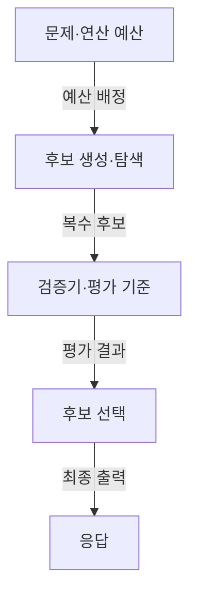

## 지식 로드맵 내 현재 위치
IT 인공지능 → LLM 학습·추론 → 추론 시점 연산 배분 → 테스트 타임 컴퓨트

## 30초 인출
- **본질:** 테스트 타임 컴퓨트는 추론 시점에 추가 연산을 투입해 답변 후보를 만들고 평가하는 접근이다.
- **메커니즘:** 샘플링·탐색·검증에 쓸 연산 예산을 과업에 따라 배분한다.
- **한계:** 연산을 늘려도 성능 향상이 보장되지 않으며 지연·비용이 함께 증가한다.

핵심 용어

- **추론 시점 연산(Test-time Compute):** 모델이 답을 생성할 때 추가로 사용하는 계산량이다.
- **Best-of-N:** 여러 후보를 생성하고 평가 기준에 따라 하나를 선택하는 방법이다.
- **검증기(Verifier):** 답변이나 추론 후보를 평가하는 모델·절차다.
- **과정 보상 모델(PRM):** 풀이의 중간 단계별 품질을 평가하도록 학습된 모델이다.

---

## 1교시 예상문제 (10점)
> 테스트 타임 컴퓨트의 개념과 대표적인 후보 생성·평가 방법, 적용 시 고려사항을 설명하시오. (예상)

---

## 1교시 10점 답안
### 1. 정의·목적
정의: 테스트 타임 컴퓨트는 추론 과정에 추가 연산을 사용해 출력 후보를 개선하려는 접근이다.
목적: 복잡한 과업에 더 많은 후보 탐색·검증을 배정한다.

### 2. 후보 탐색·선택

### 3. 효과와 비용
| 기대 | 비용·제약 |
|---|---|
| 탐색·검증 기회 확대 | 지연·토큰·연산 비용 증가 |
| 일부 난도 높은 문제에서 개선 가능 | 검증기 오류·불필요한 탐색 |

**제언:** 과업별 평가 결과를 기준으로 연산 한도를 정하고 품질과 비용을 함께 측정한다.

---

## 2~4교시 예상문제 (25점)
> 테스트 타임 컴퓨트의 개념과 후보 생성·탐색·검증 방식을 설명하고, 사전학습 연산과 비교하여 성능·비용의 균형을 위한 적용 방안을 제시하시오. (예상)

---

## 2~4교시 25점 답안
## Ⅰ. 개념과 학습 연산의 구분
테스트 타임 컴퓨트는 모델을 학습한 뒤 실제 추론에서 후보 생성·탐색·검증에 추가 계산을 쓰는 접근이다. 사전학습은 모델 파라미터를 학습하는 연산이며, 두 자원은 목적과 사용 시점이 다르다.

| 구분 | 사전학습 연산 | 테스트 타임 컴퓨트 |
|---|---|---|
| 시점 | 모델 학습 시 | 요청을 처리할 때 |
| 연산 목적 | 파라미터·표현 학습 | 해당 문제의 후보 추론·평가 |
| 비용 발생 | 학습 과정 | 질의별 추론 지연·자원 |

## Ⅱ. 후보 생성과 평가 구조

대표 방법은 여러 후보를 생성하는 샘플링, 후보 공간을 탐색하는 방법, 정답·과정 검증기를 이용한 선택 등이 있다. 모든 시스템이 PRM·MCTS 또는 사용자에게 보이지 않는 별도 사고 토큰을 사용하는 것은 아니다.

## Ⅲ. 성능·비용 배분
| 요소 | 이점 | 위험·비용 |
|---|---|---|
| 후보 수 증가 | 대안 탐색 | 비용·지연 증가, 유사 후보 반복 |
| 탐색 깊이 | 복합 경로 검토 | 잘못된 전제의 연장 |
| 검증기 | 후보 비교 기준 제공 | 검증기 편향·오판 |
| 난도별 배분 | 어려운 요청에 연산 집중 가능 | 난도 분류 오류·불균등 서비스 |

연산량과 품질의 관계는 모델·문제 유형·검증기에 따라 달라진다. 더 오래 생성할수록 성능이 항상 선형 상승한다는 법칙으로 설명하지 않는다.

## Ⅳ. 기술사적 제언
| 문제 | 해결 방안 |
|---|---|
| 쉬운 질의에 과잉 연산을 쓰거나 어려운 질의의 탐색 결과를 잘못 검증할 수 있음 | 문제군별 품질·지연·비용 평가를 바탕으로 예산을 제한하고, 검증 실패·시간 초과 시 안전한 대체 응답을 제공한다. |

## 출제 이력과 검증 출처
- 현재 확인한 기출 없음. 추론 시점 탐색·검증과 비용 배분을 묻는 예상문제.
- Snell et al., [Scaling LLM Test-Time Compute Optimally can be More Effective than Scaling Model Parameters](https://arxiv.org/abs/2408.03314), test-time compute의 난도 의존성과 예산 배분 연구.
- Yang et al., [Towards Thinking-Optimal Scaling of Test-Time Compute for LLM Reasoning](https://arxiv.org/abs/2502.18080), 과도한 추론 길이가 일부 과업에서 성능을 낮출 수 있음을 연구.
