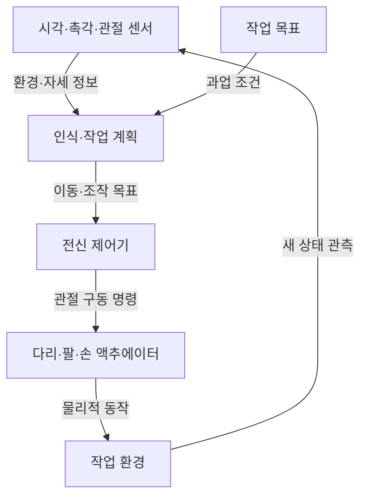

## 지식 로드맵 내 현재 위치
IT 인공지능 → 피지컬 AI → 로봇 이동·조작 → 휴머노이드 로봇

## 30초 인출
- **본질:** 휴머노이드 로봇은 사람과 닮은 신체 형태로 이동·조작 과업을 수행하도록 설계한 로봇이다.
- **메커니즘:** 센서로 환경을 인식하고, 작업 계획과 전신 제어를 통해 다리·팔·손을 구동한다.
- **도입:** 기존 공간·도구의 활용 가능성이 장점이지만 안전·가동률·비용을 현장별로 검증해야 한다.

핵심 용어

- **휴머노이드 로봇:** 사람과 유사한 신체 형상을 갖춰 인간 환경의 작업을 수행하려는 로봇이다.
- **액추에이터:** 전기·유압 등 에너지를 관절의 힘과 움직임으로 바꾸는 구동 장치다.
- **전신 제어:** 이동·자세·팔 조작을 로봇 전체의 상태를 고려해 함께 제어하는 접근이다.
- **피지컬 AI:** 물리 환경을 감지하고 로봇 등 신체를 통해 행동하는 AI를 설명하는 용어다.

---

## 1교시 예상문제 (10점)
> 휴머노이드 로봇의 개념과 인식·계획·제어 구조를 설명하고, 산업 적용 시 고려사항을 서술하시오. (예상)

---

## 1교시 10점 답안
### 1. 정의·목적
정의: 휴머노이드 로봇은 사람과 유사한 형상을 이용해 이동·조작 과업을 수행하도록 설계된 로봇이다.
목적: 사람 중심의 환경에서 다양한 작업을 수행할 가능성을 제공한다.

### 2. 로봇 동작 구조

### 3. 현장 적용 기준
| 장점 가능성 | 검증할 조건 |
|---|---|
| 사람용 통로·도구를 활용할 수 있음 | 크기·하중·작업대와 실제로 호환되는가 |
| 다양한 작업으로 전환할 수 있음 | 과업별 성공률·전환시간·유지 비용은 어떤가 |
| 위험 작업을 대신할 수 있음 | 안전 정지·사람 협업·고장 대응이 검증됐는가 |

**제언:** 인간 환경 호환성만 가정하지 말고 특정 작업의 안전·성능을 실증한다.

---

## 2~4교시 예상문제 (25점)
> 피지컬 AI 관점에서 휴머노이드 로봇의 개념과 인식·계획·전신 제어 구조를 설명하고, 산업 도입 시 효과·공급망·안전 과제를 포함한 추진 방안을 제시하시오. (예상)

---

## 2~4교시 25점 답안
## Ⅰ. 개념과 적용 배경
휴머노이드 로봇은 사람과 유사한 신체 형태로 사람 중심 환경의 이동·조작을 수행하려는 로봇이다. 기존 도구·공간을 활용할 가능성은 있으나, 모든 현장을 개조 없이 자동화할 수 있다는 뜻은 아니다.

| 구성 형태 | 주된 환경 적합성 |
|---|---|
| 바퀴형 이동 로봇 | 평탄한 바닥의 이동·운반 |
| 고정형 산업 로봇 | 반복적이고 구조화된 작업 |
| 휴머노이드 | 사람용 공간에서의 이동·양팔 작업을 목표로 함 |

## Ⅱ. 인식·계획·전신 제어

| 기능 | 역할 |
|---|---|
| 인식 | 시각·촉각·관절 상태로 주변과 로봇 상태 파악 |
| 계획 | 목표를 이동·조작 과업으로 분해 |
| 전신 제어 | 균형과 팔·다리 동작을 조정 |
| 안전 제어 | 제한 조건 위반 시 감속·정지·복구 |

## Ⅲ. 산업화 과제와 추진 관점
| 과제 | 검토 기준 |
|---|---|
| 작업 성능 | 사이클 시간, 성공률, 예외 작업 |
| 하드웨어 | 정밀 구동부·센서·배터리의 신뢰성과 정비성 |
| 안전·사람 협업 | 작업자 동선, 접촉 위험, 정지·회복 절차 |
| 공급망·비용 | 부품 조달, 서비스 체계, 전체 운용 비용 |
| 실증 데이터 | 실제 작업 조건과 로봇 행동의 대표성 |

휴머노이드 폼팩터만으로 범용성과 경제성을 보장하지 않는다. 고정 반복 과업에서는 전용 장비가 더 적합할 수 있다. 국내 정책 자료에서도 피지컬 AI와 제조·물류·건설용 휴머노이드 개발을 지원하고 있으나, 개별 사업 목표와 예산은 해당 연도 공식 공고를 확인해야 한다.

## Ⅳ. 기술사적 제언
| 문제 | 해결 방안 |
|---|---|
| 휴머노이드 형태 자체가 도입 우선순위를 결정하는 기준으로 쓰일 수 있음 | 이동·양팔 조작이 함께 필요한 작업인지 먼저 확인하고, 그 조건이 없는 공정은 전용 로봇·고정 자동화와 비교해 선택한다. |

## 출제 이력과 검증 출처
- 현재 확인한 기출 없음. 휴머노이드 구조와 산업 적용 과제를 묻는 예상문제.
- [산업통상자원부: 2026년 예산 편성 참고자료](https://motie.go.kr/kor/article/ATCL3f49a5a8c/170868/view), 피지컬 AI 및 제조·물류·건설 현장용 휴머노이드 개발 지원 방향.
- [과학기술정보통신부: 2024년 기술영향평가 결과](https://www.msit.go.kr/bbs/view.do%3Bjsessionid%3DhKFHhEpoSNvJBMYYMVoaPkXjXdW7vm_sFUx5BP_J.AP_msit_1?bbsSeqNo=96&mId=123&mPid=122&nttSeqNo=3180384&sCode=user), 휴머노이드 활용의 안전·소통·프라이버시 고려사항.
