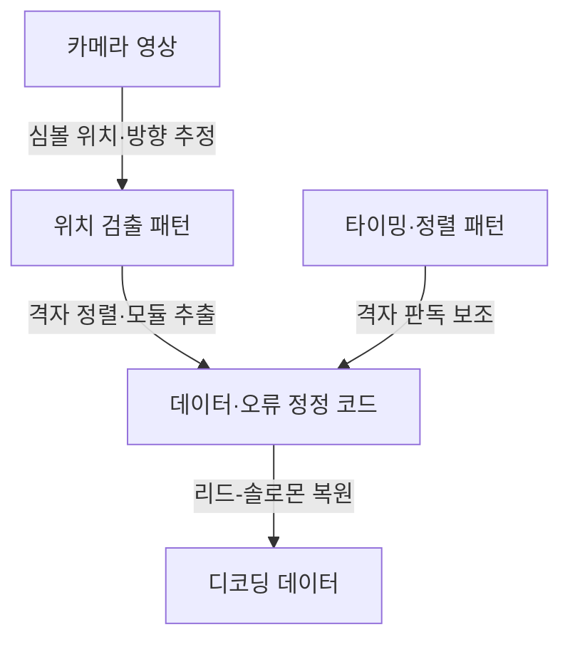

## 지식 로드맵 내 현재 위치
IT 데이터 표현 → 자동인식·바코드 → 2차원 매트릭스 심볼 → QR 코드

## 30초 인출
- **본질:** QR 코드는 데이터를 2차원 모듈 격자에 인코딩하는 매트릭스 바코드다.
- **메커니즘:** 위치 검출·타이밍 패턴으로 심볼을 찾고 정렬한 뒤, 데이터를 읽고 오류 정정을 수행한다.
- **한계:** 오류 정정은 손상 범위와 배치에 따라 달라지며, QR의 시각적 구조는 URL의 안전성을 보증하지 않는다.

핵심 용어

- **모듈:** QR 심볼을 이루는 흑백의 작은 격자 셀이다.
- **위치 검출 패턴:** 세 모서리의 정해진 패턴으로 심볼 위치와 방향 추정에 쓰인다.
- **리드-솔로몬 부호:** 손상·오염으로 읽히지 않는 일부 코드워드를 복원하는 오류 정정 방식이다.
- **큐싱(Quishing):** QR코드를 이용해 사용자를 사기성 URL로 유도하는 피싱 수법이다.

---

## 1교시 예상문제 (10점)
> QR코드의 내부 패턴과 데이터 복원 원리를 설명하고, QR 이용 시 보안 유의사항을 서술하시오. (제120회 1교시)

---

## 1교시 10점 답안
### 1. 정의·목적
정의: QR 코드는 데이터를 2차원 격자 모듈로 표현하는 매트릭스 바코드다.
목적: 다양한 데이터 유형을 저장하고 카메라로 읽어 디지털 정보에 빠르게 접근한다.

### 2. 검출·복원 구조

### 3. 데이터·보안
| 기능 | 설명 |
|---|---|
| 오류 정정 | 일부 코드워드 오류·손상 복원, 수준별 용량 절충 |
| 사용자 안전 | 스캔 후 목적지 URL·앱 권한을 확인 |

복원 비율은 코드워드 기준이며, 실제 손상된 면적의 같은 비율을 항상 복구한다는 뜻은 아니다.

**제언:** QR 스캔 뒤 이동할 URL을 확인하고 민감한 작업은 신뢰된 앱에서만 진행한다.

---

## 2~4교시 예상문제 (25점)
> QR코드의 데이터 표현과 위치·정렬 패턴, 리드-솔로몬 오류 정정 원리를 설명하고, 1차원 바코드와 비교하여 활용 및 큐싱 대응 방안을 제시하시오. (제120회 1교시를 확장한 예상문제)

---

## 2~4교시 25점 답안
## Ⅰ. 개념과 1차원 바코드 비교
QR 코드는 가로·세로 모듈 격자에 데이터를 담는 2차원 바코드다. 저장 가능한 양은 심볼 버전, 문자 모드, 오류 정정 수준에 따라 달라진다.

| 항목 | 1차원 바코드 | QR 코드 |
|---|---|---|
| 표현 | 한 방향의 막대·간격 | 2차원 모듈 격자 |
| 판독 | 방향·폭 정보 중심 | 카메라 영상에서 패턴·격자 복원 |
| 복원 | 심볼·시스템에 따라 다름 | 리드-솔로몬 오류 정정 제공 |

## Ⅱ. 심볼 구조와 판독

세 개 위치 검출 패턴의 흑백 폭 비율은 판독기가 패턴을 식별하는 데 쓰인다. 타이밍·정렬·포맷 정보와 데이터 영역을 구분해 읽는다.

## Ⅲ. 인코딩·오류 정정·활용
| 요소 | 기능 | 유의점 |
|---|---|---|
| 데이터 모드·버전 | 저장 유형과 심볼 크기 결정 | 데이터량이 커지면 코드가 복잡·밀집 |
| 오류 정정 수준 | 리드-솔로몬 중복 부호로 일부 오류 복원 | 복원 강도와 저장 용량 간 절충 |
| 판독 환경 | 방향을 바꾸어도 패턴을 찾아 디코딩 | 조명·반사·인쇄 품질·카메라에 영향 |

ISO/IEC 18004가 QR 심볼의 형식과 오류 정정 규칙을 규정한다. 제조사 안내의 L/M/Q/H 복원율은 코드워드 비율의 근사치이며, 손상 위치에 따라 실제 복구 가능성은 달라진다.

## Ⅳ. 기술사적 제언
| 문제 | 해결 방안 |
|---|---|
| 정상 인쇄물처럼 보이는 악성 QR이 이용자를 사기성 URL로 연결할 수 있음 | 스캔 뒤 도메인·인증서·요청 권한을 확인하고, 결제·로그인 등 민감 동작은 공식 앱이나 별도 인증 절차에서 확인한다. |

## 출제 이력과 검증 출처
- 제120회 1교시: QR 코드 관련 문항으로 기록된 주제.
- [ISO/IEC 18004:2024](https://www.iso.org/standard/83389.html), QR 코드 심볼·인코딩·오류 정정 규격.
- [DENSO WAVE: QR Code standardization](https://www.qrcode.com/en/about/standards.html), 데이터 용량 및 오류 정정 수준 개요.
- [DENSO WAVE: Error correction feature](https://www.qrcode.com/en/about/error_correction.html), 리드-솔로몬 복원과 코드워드 비율 설명.
