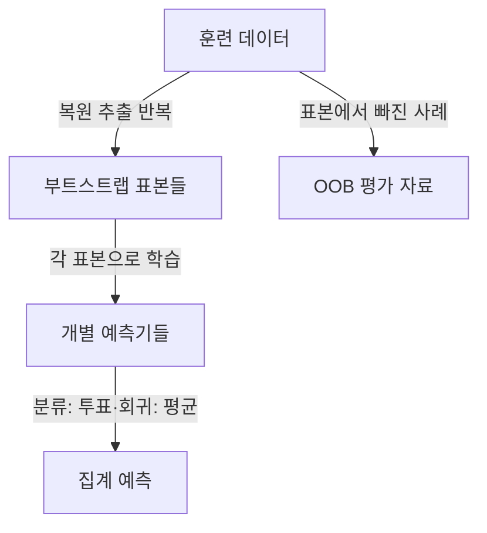

## 지식 로드맵 내 현재 위치
IT 인공지능 → 앙상블 학습 → 부트스트랩 표본·예측 집계 → 배깅

## 30초 인출
- **본질:** 배깅은 부트스트랩 표본으로 여러 예측기를 학습해 예측을 집계하는 앙상블 방법이다.
- **메커니즘:** 복원 추출 표본마다 모델을 학습하고, 분류는 투표·회귀는 평균으로 결합한다.
- **효과 조건:** 모델 간 예측이 완전히 같지 않을 때 집계가 분산을 줄일 수 있다.

핵심 용어

- **부트스트랩 표본:** 원본 데이터에서 복원 추출해 만든 학습 표본이다.
- **배깅:** bootstrap aggregating의 약어로, 여러 표본에서 학습한 예측을 결합한다.
- **OOB(Out-of-Bag):** 특정 부트스트랩 표본에서 선택되지 않은 학습 사례다.
- **랜덤 포레스트:** 배깅에 각 노드의 무작위 특성 선택 등을 결합한 트리 앙상블이다.

---

## 1교시 예상문제 (10점)
> 배깅의 부트스트랩 추출과 예측 집계 원리를 설명하고 OOB 데이터 및 부스팅과의 차이를 서술하시오. (제126회 1교시)

---

## 1교시 10점 답안
### 1. 정의·목적
정의: 배깅은 복원 추출한 표본별로 모델을 학습하고 결과를 집계하는 앙상블 방법이다.
목적: 표본 변화에 민감한 예측기의 변동을 집계로 줄인다.

### 2. 학습·집계 구조

### 3. OOB와 부스팅
| 관점 | 배깅 | 부스팅 |
|---|---|---|
| 학습 관계 | 각 표본의 모델을 독립 학습 | 앞선 단계 결과를 반영하며 순차 학습 |
| 주요 집계 | 평균·투표 | 단계별 가중 결합 |
| OOB | 각 모델에서 제외된 사례를 평가에 활용 가능 | 일반적 구성요소가 아님 |

**제언:** OOB를 내부 점검에 활용하되 최종 일반화는 독립 검증 자료로 확인한다.

---

## 2~4교시 예상문제 (25점)
> 배깅의 부트스트랩 학습과 집계 원리를 설명하고 분산 감소 조건, OOB 평가, 랜덤 포레스트 및 부스팅과의 차이를 제시하시오. (제126회 1교시를 확장한 예상문제)

---

## 2~4교시 25점 답안
## Ⅰ. 개념과 활용 배경
배깅은 학습 자료를 복원 추출해 여러 버전을 만들고, 각 버전으로 학습한 예측기를 집계하는 방법이다. 특히 학습자료 변화에 민감한 예측기에서 변동을 줄이는 데 유용할 수 있다.

| 구성 | 역할 |
|---|---|
| 부트스트랩 표본 | 데이터 표본 변화 구성 |
| 개별 예측기 | 표본별 예측 학습 |
| 집계기 | 분류 투표·회귀 평균 등으로 결합 |

## Ⅱ. 학습·집계 구조

복원 추출 표본마다 원본과 같은 크기로 뽑으면 각 관측값이 한 표본에 포함되지 않을 확률은 `(1−1/N)^N`이며, 큰 `N`에서 약 36.8%다. 이 비율은 표본 크기와 절차에 따른 근사치다.

## Ⅲ. 분산 감소와 기법 비교
동일 분산 `σ²`, 개별 예측 간 상관계수 `ρ`인 `B`개 예측을 평균한다고 단순화하면:

`Var(평균) = σ²[ρ + (1−ρ)/B]`

상관이 낮을수록 집계 효과가 커지며, 모델 수를 늘려도 상관 성분은 남는다.

| 기법 | 표본·학습 방식 | 핵심 차이 |
|---|---|---|
| 배깅 | 복원 추출, 독립 학습 | 예측 변동 완화 |
| 랜덤 포레스트 | 부트스트랩 + 노드별 특성 무작위 선택 | 트리 상관을 더 낮추는 데 기여 |
| 부스팅 | 앞선 단계의 오차·잔차에 반응 | 순차 학습으로 단계별 보정 |

OOB 점수는 모델별 미포함 표본의 예측으로 내부 성능을 추정하지만, 데이터 누수·반복 튜닝을 거친 뒤 독립 테스트를 대체한다고 볼 수 없다.

## Ⅳ. 기술사적 제언
| 문제 | 해결 방안 |
|---|---|
| 모델 간 상관이 높거나 OOB 결과만 반복 최적화하면 실제 성능 향상이 제한될 수 있음 | 데이터 분할을 고정하고 OOB·검증 세트·최종 테스트를 구분하며, 랜덤 특성 선택 등 다양성 조정의 효과를 평가한다. |

## 출제 이력과 검증 출처
- 제126회 1교시: 배깅 관련 문항으로 기록. 제105회 앙상블 기법 문항에서도 배깅·부스팅을 다룸.
- Breiman, [Bagging Predictors](https://doi.org/10.1007/BF00058655), 배깅 원 논문.
