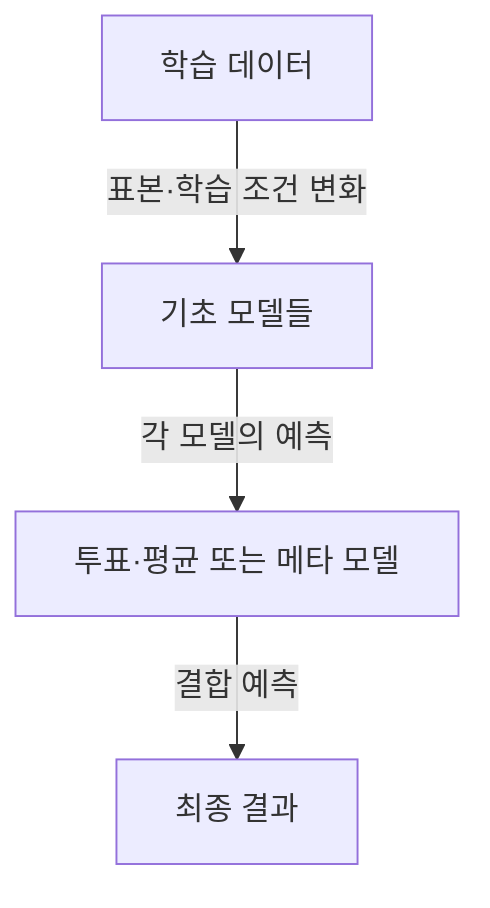
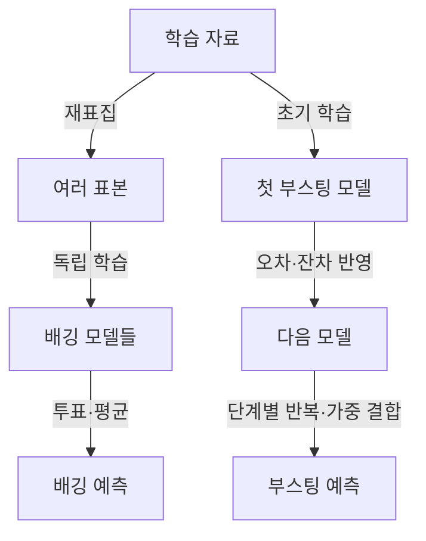
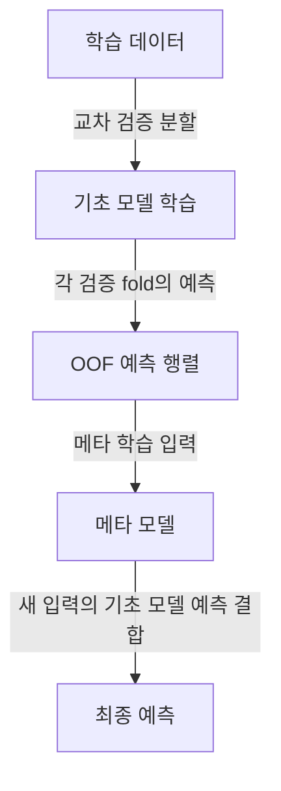

## 30초 인출

앙상블 학습은 여러 예측기를 결합해 단일 모델의 오차를 보완하는 학습 방법이다. 모델의 오차가 서로 다를수록 결합의 이점이 커질 수 있다.

핵심 용어

- **배깅(Bagging)**: 부트스트랩 표본으로 여러 모델을 독립적으로 학습해 예측을 결합한다.
- **부스팅(Boosting)**: 앞선 모델의 오차를 다음 모델이 보완하도록 순차적으로 학습한다.
- **스태킹(Stacking)**: 여러 기초 모델의 예측을 메타 모델의 입력으로 사용해 결합 규칙을 학습한다.
- **다양성(Diversity)**: 모델 간 오차가 서로 다른 정도로, 앙상블의 보완 가능성과 관계된다.

---

## 1교시 예상문제 (10점)

> 앙상블학습(Ensemble Learning)의 개념, 필요성, 주요 기법(투표, 배깅, 부스팅, 스태킹)의 특징과 장단점을 설명하시오. (제120회 1교시)

---

## 1교시 10점 답안

### 1. 정의·목적

앙상블 학습은 여러 모델의 예측을 결합해 일반화 성능을 높이려는 방법이다. 성능 개선은 모델의 수만으로 보장되지 않으며, 각 모델의 예측 품질과 오차 간 상관에 좌우된다.

### 2. 대표 기법

| 기법 | 학습 방식 | 결합 방식 |
|---|---|---|
| 배깅 | 표본을 달리해 병렬 학습 | 투표·평균 |
| 부스팅 | 앞선 오차를 반영해 순차 학습 | 가중 결합 |
| 스태킹 | 서로 다른 기초 모델 학습 | 별도 메타 모델이 예측 결합 |

**제언:** 검증 데이터로 결합 성능과 오류 상관을 함께 확인한다.

---

## 2~4교시 예상문제 (25점)

> 앙상블 학습의 원리와 필요성을 설명하고, 배깅·부스팅·스태킹의 구조 및 적용상 유의점을 비교하시오. (제120회 1교시의 주제를 확장한 예상문제)

---

## 2~4교시 25점 답안

### Ⅰ. 개념과 성립 조건

앙상블은 여러 학습기의 예측을 결합해 단일 학습기의 한계를 보완한다. 오류가 강하게 같은 방향으로 발생하면 결합 효과가 작으므로, 정확도뿐 아니라 오류의 상관과 데이터 분할의 타당성을 검토한다.

| 검토 요소 | 의미 |
|---|---|
| 개별 예측력 | 각 모델이 유용한 신호를 학습했는가 |
| 오류 다양성 | 모델이 같은 사례에서 같은 방식으로 실패하지 않는가 |
| 결합 규칙 | 투표·평균·학습된 결합 중 문제에 맞는가 |

### Ⅱ. 배깅과 부스팅

배깅은 재표집한 데이터로 모델을 병렬 학습하고 결과를 결합한다. 부스팅은 앞선 단계의 손실이나 잔차를 반영해 다음 모델을 순차적으로 학습한다.

| 비교 | 배깅 | 부스팅 |
|---|---|---|
| 학습 관계 | 병렬·독립적 학습이 가능 | 이전 단계에 의존하는 순차 학습 |
| 대표 예 | 랜덤 포리스트 | AdaBoost, Gradient Boosting 계열 |
| 유의점 | 표본·모델 간 다양성 확인 | 과적합, 이상치 민감도와 학습률 점검 |

### Ⅲ. 투표와 스태킹

투표는 정해진 규칙으로 예측을 합치고, 스태킹은 검증 가능한 예측 자료로 메타 모델을 학습한다. 스태킹의 메타 학습에는 학습 자료에 대한 자기 예측이 아니라 교차 검증의 Out-of-Fold 예측을 사용해 정보 누출을 막는다.

| 방식 | 결합 근거 | 주의점 |
|---|---|---|
| 하드 투표 | 클래스 표의 다수결 | 클래스별 비용·불균형 반영 필요 |
| 소프트 투표 | 확률의 평균 또는 가중 평균 | 확률 보정과 가중치 검증 필요 |
| 스태킹 | 메타 모델이 학습한 결합 | OOF 생성과 평가 데이터 분리 필요 |

### Ⅳ. 적용과 기술적 제언

| 문제 | 해결 방안 |
|---|---|
| 여러 결합 기법 중 선택 기준이 없어 복잡한 앙상블부터 도입할 수 있음 | 검증 자료에서 단순 투표·배깅을 기준으로 삼고, 스태킹은 메타 모델의 추가 이득이 비용을 정당화할 때 선택한다. |

## 출제 이력과 검증 출처

- 제120회 정보관리기술사 1교시 주제: 앙상블 학습의 개념, 필요성, 투표·배깅·부스팅·스태킹의 특징.
- Breiman, “Bagging Predictors,” *Machine Learning*, 1996, DOI: [10.1007/BF00058655](https://doi.org/10.1007/BF00058655).
- Wolpert, “Stacked generalization,” *Neural Networks*, 1992, DOI: [10.1016/S0893-6080(05)80023-1](https://doi.org/10.1016/S0893-6080(05)80023-1).
