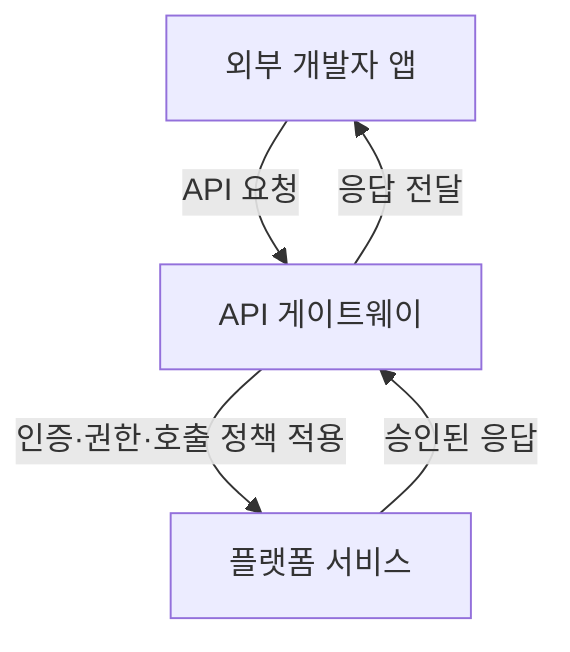
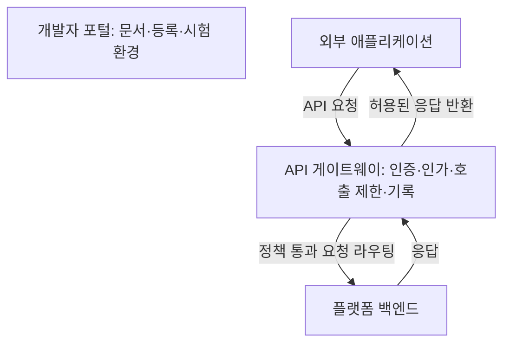

## 30초 인출

오픈 플랫폼은 외부 참여자가 정해진 인터페이스와 규칙을 통해 핵심 서비스를 이용하거나 확장할 수 있도록 개방한 플랫폼이다. 개방 범위는 API 접근·권한·운영정책으로 통제한다.

핵심 용어

- **API**: 시스템 기능이나 데이터를 정해진 요청·응답 규칙으로 이용하게 하는 인터페이스다.
- **API 게이트웨이**: 외부 API 요청의 인증·인가·제한·라우팅 등을 적용하는 진입 계층이다.
- **개발자 포털**: API 문서, 등록 절차, 시험 도구와 변경 공지를 제공하는 접점이다.
- **양면 네트워크 효과**: 한쪽 참여자의 증가가 다른 쪽 참여자의 효용을 높일 수 있는 현상이다.

---

## 1교시 예상문제 (10점)

> 오픈 플랫폼(Open Platform)의 개념, 필요성, 핵심 아키텍처 및 플랫폼 개방에 따른 거버넌스·보안 고려사항을 설명하시오. (제125회 1교시)

---

## 1교시 10점 답안

### 1. 정의·목적

오픈 플랫폼은 내부 기능을 API 등으로 외부에 제공해 제3자와 서비스·연계를 만들도록 하는 운영 방식이다. 공개 범위, 이용 조건, 책임을 명확히 해야 개방과 통제를 함께 운영할 수 있다.

### 2. 개방의 관리

| 영역 | 관리 기준 |
|---|---|
| 접근 | 등록, 인증, 최소 권한과 동의 범위 |
| 운영 | 호출 한도, 장애 격리, 로그와 모니터링 |
| 변화 | 버전 정책, 하위 호환성, 종료 사전 공지 |

**제언:** 업무별 공개 범위와 권한을 정하고 이용 내역을 지속 점검한다.

---

## 2~4교시 예상문제 (25점)

> 오픈 플랫폼의 개념과 추진 필요성을 설명하고, API 중심 아키텍처와 개방에 따른 보안·거버넌스 대책을 제시하시오. (제125회 1교시 주제를 확장한 예상문제)

---

## 2~4교시 25점 답안

### Ⅰ. 개념과 추진 목적

오픈 플랫폼은 외부 참여자가 정해진 인터페이스와 이용 규칙에 따라 핵심 역량을 활용하게 하는 플랫폼이다. 개방은 소스코드 공개와 같은 뜻이 아니며, API 제공 범위와 계약·정책을 통해 통제된다.

| 참여자 | 플랫폼과의 관계 |
|---|---|
| 플랫폼 운영자 | 핵심 서비스·데이터와 이용 정책을 관리 |
| 외부 개발자·사업자 | 허용된 API로 기능을 연계하거나 서비스 개발 |
| 최종 이용자 | 연계된 서비스와 기능을 이용 |

### Ⅱ. API 연계 구조

개발자 포털은 연계에 필요한 문서·등록·시험 정보를 제공한다. 실제 요청은 게이트웨이에서 정책을 거쳐 백엔드로 전달된다.

| 구성요소 | 책임 |
|---|---|
| 개발자 포털 | 명세, 신청·키 발급, 변경 공지 제공 |
| 게이트웨이 | 인증·인가, 호출 제한, 라우팅·관측 적용 |
| 백엔드 | 권한 범위 내 업무 처리와 응답 생성 |

### Ⅲ. 거버넌스와 보안

| 위험 | 통제 |
|---|---|
| 과도한 데이터 접근 | 업무 목적·동의에 맞는 최소 범위와 권한 분리 |
| 키 유출·오용 | 비밀정보 보호, 키 회전, 호출 감시와 폐기 절차 |
| 폭주·오용 트래픽 | 호출 한도, 이상 탐지, 서비스별 격리 |
| API 변경으로 연계 중단 | 버전 관리, 하위 호환성 검토, 종료 전 공지 |
| 외부 사업자 사고 | 책임·신고·감사·재위탁 조건을 계약에 명시 |

### Ⅳ. 기술적 제언

| 문제 | 해결 방안 |
|---|---|
| API 개방이 데이터·기능의 무제한 공유로 오해됨 | 자산별 공개 등급, 목적, 이용 주체와 권한 범위를 명시 |
| 외부 연계 확대에 따라 통제 지점이 분산됨 | 게이트웨이와 사업자 관리 절차에서 공통 보안 정책 적용 |
| 연계자가 변경 내용을 늦게 알아 장애 발생 | 명세·버전·종료 일정을 포털에서 관리하고 사전 통지 |

## 출제 이력과 검증 출처

- 제125회 정보관리기술사 1교시 주제: 오픈 플랫폼의 개념, 필요성, 아키텍처 및 거버넌스·보안 고려사항.
- OpenAPI Specification: [공식 명세](https://spec.openapis.org/oas/latest.html).
- IETF RFC 6749, OAuth 2.0 Authorization Framework: [RFC 6749](https://www.rfc-editor.org/rfc/rfc6749).
