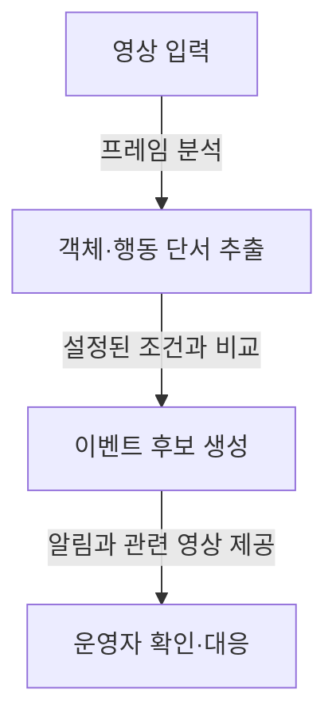
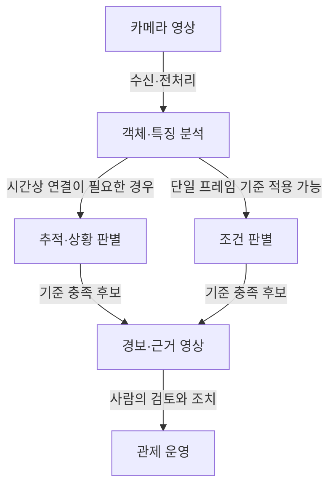

## 30초 인출

지능형 CCTV는 영상에서 객체나 상황을 분석해 운영자에게 이벤트와 확인 정보를 제공하는 영상감시 시스템이다. 분석 모델과 처리 위치는 목적·환경에 따라 달라지며, 자동 탐지는 사람의 확인과 대응을 돕는다.

핵심 용어

- **객체 탐지(Object Detection)**: 영상 프레임에서 객체의 종류와 위치를 추정한다.
- **다중 객체 추적(MOT)**: 연속 프레임의 객체를 연결해 이동 궤적을 추정한다.
- **이벤트 분석**: 탐지·추적 정보나 영상 특징을 이용해 설정된 상황을 판별한다.
- **프라이버시 마스킹**: 영상에서 지정된 영역을 가리거나 흐리게 처리하는 기술적 보호조치다.

---

## 1교시 예상문제 (10점)

> 지능형 CCTV의 개념, 주요 탐지 기능(침입, 배회, 쓰러짐 등), 영상 분석 프로세스 및 프라이버시 보호 방안을 설명하시오. (제121회 1교시)

---

## 1교시 10점 답안

### 1. 정의·목적

지능형 CCTV는 영상 분석으로 사건 후보를 찾아 운영자에게 알리는 시스템이다. 탐지 결과는 오탐·미탐이 있을 수 있으므로 현장 확인과 적절한 대응 절차가 필요하다.

### 2. 보호 원칙

| 항목 | 운영 고려 |
|---|---|
| 설치·이용 | 설치 목적과 법적 근거, 안내와 접근 통제 확인 |
| 보관·제공 | 보관 기간과 열람·제공 권한을 제한 |
| 영상 분석 | 마스킹 등은 보조 조치이며 적법한 설치·운영을 대체하지 않음 |

**제언:** 경보를 사람의 확인 절차와 연결하고 영상 접근·보관을 함께 통제한다.

---

## 2~4교시 예상문제 (25점)

> 지능형 CCTV의 개념과 영상 분석 구성·처리 절차를 설명하고, 성능 검증 및 개인정보 보호를 포함한 운영 대책을 제시하시오. (제121회 1교시 주제를 확장한 예상문제)

---

## 2~4교시 25점 답안

### Ⅰ. 개념과 적용 범위

지능형 CCTV는 영상에서 관심 객체·상황을 분석해 운영자가 확인할 이벤트 후보를 제공한다. 모든 시스템이 동일한 모델이나 처리 구조를 쓰지는 않으며, 탐지 결과가 자동으로 사실을 확정하는 것도 아니다.

| 전통적 영상관제 | 지능형 분석 지원 |
|---|---|
| 사람이 화면을 관찰하고 상황을 찾음 | 시스템이 설정된 조건의 후보를 찾아 검토를 지원 |
| 관제 화면·저장·검색이 중심 | 분석 결과·경보와 관제 기능을 함께 사용 |

### Ⅱ. 분석 절차와 구성

일반적인 처리 흐름은 입력 영상에서 특징을 추출하고, 설정된 기준에 맞는 후보를 만들어 관제 절차로 전달하는 구조다. 실제 시스템은 객체 추적, 행동 인식, 엣지·서버 처리 여부를 목적에 따라 선택한다.

| 구성 | 역할 |
|---|---|
| 영상 수집·전처리 | 스트림 수신, 품질·관심 영역 처리 |
| 분석 모듈 | 객체·행동 등 목적에 맞는 특징 분석 |
| 이벤트·관제 연계 | 기준에 맞는 후보와 확인 자료 전달 |

### Ⅲ. 성능과 운영 검증

모델 성능은 대상 이벤트, 카메라 환경, 데이터와 평가 기준에 따라 달라진다. 따라서 단일 정확도 수치를 모든 환경의 보장으로 해석하지 않고, 현장 조건에서 오탐·미탐과 처리 지연을 점검한다.

| 평가 항목 | 확인 내용 |
|---|---|
| 탐지 품질 | 이벤트별 정밀도·재현율 또는 합의된 평가 지표 |
| 환경 변화 | 조명·가림·각도·혼잡도에 따른 성능 변화 |
| 운영 영향 | 경보량, 처리 지연, 통신·저장 부하 |
| 사람의 대응 | 경보 확인·오탐 처리·사후 조치 절차 |

### Ⅳ. 기술적 제언: 개인정보 보호와 운영 검증

| 문제 | 해결 방안 |
|---|---|
| 목적 외 촬영·이용 또는 과도한 보관 | 목적·설치 근거·안내·보관 기간·접근 권한을 사전에 정하고 점검 |
| 얼굴·차량번호 등 식별정보 노출 | 업무 목적과 법적 요건에 맞는 마스킹·접근 제한을 적용하고 예외 접근을 기록 |
| 경보를 확정 사실처럼 취급 | 운영자 확인, 오탐 정정, 이의·사후 검토 절차를 마련 |
| 인증·성능 수치를 현재 상태와 혼동 | 시험기관의 최신 공지와 해당 제품·시나리오의 결과를 별도로 확인 |

## 출제 이력과 검증 출처

- 제121회 정보관리기술사 1교시 주제: 지능형 CCTV의 개념, 탐지 기능, 영상 분석 절차와 프라이버시 보호.
- KISA, 지능형 CCTV 시험 관련 공지(2026-06-02): [시험 재개 및 결과보고서 발급 안내](https://www.kisa.kr/401/form?postSeq=3677). 공지에 따르면 2026-06-02 시험을 재개했으며 인증서가 아닌 결과보고서를 발급한다. 2026년 9월 예정 차세대 체계의 실제 시행 여부는 이 검토에서 공식 확인하지 못했다.
- 개인정보보호위원회, 고정형 영상정보처리기기 설치·운영 안내서 개정 자료: [공식 안내](https://pipc.go.kr/np/cop/bbs/selectBoardArticle.do?bbsId=BS074&mCode=C020010000&nttId=9866).
