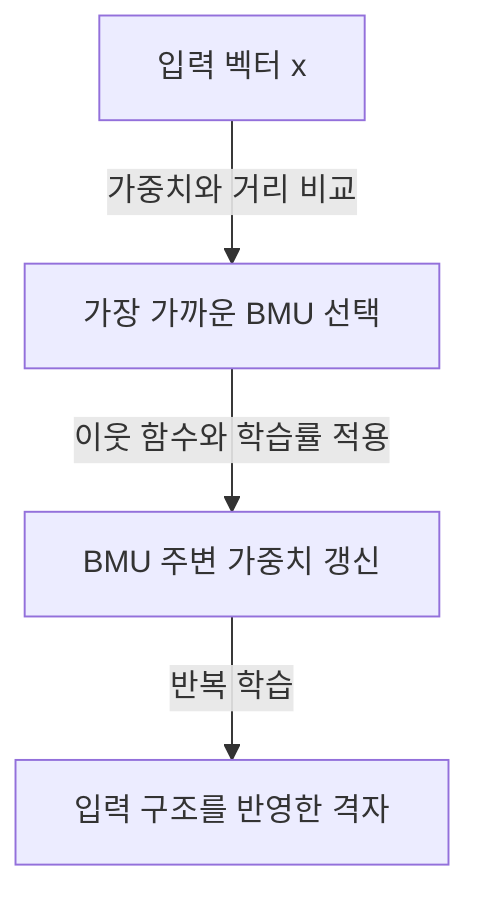
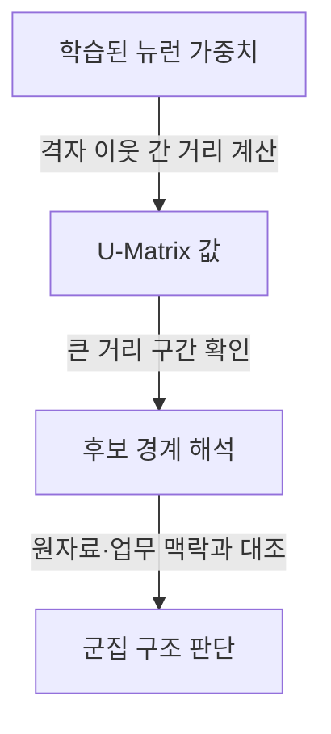

## 30초 인출

자기조직화지도(SOM)는 입력 벡터와 가까운 대표 벡터를 격자에 배치해 비지도 데이터 구조를 시각화하는 경쟁학습 방법이다. 승자 뉴런과 그 이웃의 가중치를 입력에 맞춰 갱신하며, 위상 보존은 근사적 목표이지 보장이 아니다.

<details>
<summary>핵심 용어</summary>

- **BMU(Best Matching Unit)**: 입력과 대표 가중치 벡터의 거리가 가장 작은 뉴런이다.
- **이웃 함수(Neighborhood Function)**: BMU 주변 뉴런이 학습에 참여하는 정도를 정한다.
- **위상 보존(Topology Preservation)**: 입력 공간의 근접 관계가 지도에서도 대체로 유지되도록 학습하는 성질이다.
- **U-Matrix**: 격자 이웃 뉴런의 가중치 간 거리를 나타내 경계 구조를 살펴보는 시각화다.
</details>

---

## 1교시 예상문제 (10점)

> 자기조직화지도(SOM)의 개념과 학습 원리를 설명하고, BMU와 이웃 갱신의 역할을 제시하시오. (예상)

---

## 1교시 10점 답안

### 1. 정의·목적

SOM은 고차원 입력을 저차원 격자의 대표 벡터에 대응시켜 데이터의 구조를 탐색하는 비지도 경쟁학습이다.



### 2. 핵심 동작

| 단계 | 의미 |
|---|---|
| 경쟁 | 입력과 각 뉴런 가중치의 거리를 비교 |
| 승자 선택 | 최소 거리 뉴런을 BMU로 지정 |
| 협력적 갱신 | BMU와 이웃 가중치를 입력 방향으로 조정 |

**제언:** 입력 특성을 적절히 스케일링하고 결과 지도를 검증한다.

---

## 2~4교시 예상문제 (25점)

> 군집 분석 기법인 SOM의 개념과 학습 절차를 설명하고, 위상 보존의 의미와 결과 해석 시 유의점을 기술하시오. (제134회 4교시 6번 주제를 바탕으로 정리)

---

## 2~4교시 25점 답안

### Ⅰ. 개념과 구성

SOM은 입력 공간의 대표 벡터를 격자 뉴런에 학습해 데이터의 유사 구조를 저차원에서 살펴보게 하는 비지도 학습법이다. 각 뉴런은 입력과 같은 차원의 가중치 벡터를 가진다.

| 구성 | 설명 |
|---|---|
| 입력 벡터 | 학습 자료의 한 관측값 |
| 격자 뉴런 | 가중치 벡터와 지도상 위치를 보유 |
| 거리 척도 | BMU를 비교·선택하는 기준 |
| 이웃 함수 | BMU 주변 가중치 갱신 범위와 정도 |

### Ⅱ. 학습 메커니즘

각 입력에서 BMU를 찾고, BMU 및 주변 뉴런의 가중치를 입력 쪽으로 이동시킨다. 학습률과 이웃 반경은 보통 학습 중 조정하며, 구체적 스케줄은 구현에 따라 다르다.

```mermaid
flowchart TD
    A[입력 x와 격자 가중치 wᵢ] -->|거리 d(x,wᵢ) 계산| B[최소 거리 뉴런 c 선택]
    B -->|이웃 반경 내 뉴런 결정| C[학습률·이웃 함수 적용]
    C -->|wᵢ ← wᵢ + α h꜀ᵢ (x − wᵢ)| D[가중치 갱신]
    D -->|다음 입력으로 반복| A
```

가중치 갱신은 다음과 같이 쓸 수 있다.

\[
w_i(t+1)=w_i(t)+\alpha(t)h_{ci}(t)\bigl(x-w_i(t)\bigr)
\]

여기서 \(c\)는 BMU, \(\alpha\)는 학습률, \(h_{ci}\)는 BMU와 뉴런 \(i\)의 격자상 거리에 따른 이웃 함수다.

### Ⅲ. 위상·결과 해석

SOM은 가까운 입력이 지도에서 가깝게 놓이도록 학습하지만 이를 항상 보장하지는 않는다. U-Matrix는 인접 뉴런 가중치 간 거리를 표시해 큰 차이가 나타나는 경계를 살펴보는 데 쓰며, 독립적인 군집 정답으로 해석해서는 안 된다.



| 진단 | 확인 목적 |
|---|---|
| 양자화 오차 | 입력이 BMU에 얼마나 잘 대표되는지 점검 |
| 위상 오차 | 입력 이웃 관계가 지도에서 얼마나 어긋나는지 점검 |
| U-Matrix | 이웃 가중치 차이의 공간 분포를 관찰 |

### Ⅳ. 기술적 제언

| 문제 | 해결 방안 |
|---|---|
| 변수 척도 차이가 거리 계산을 지배 | 업무 의미에 맞춰 정규화·표준화를 검토 |
| 격자 크기·초기화에 따라 지도가 달라짐 | 여러 설정으로 반복 학습하고 오차·안정성을 비교 |
| 지도상의 경계를 확정 군집으로 오해 | 원자료와 도메인 지식을 대조하고 필요하면 별도 군집 검증 수행 |

## 출제 이력과 검증 출처

- 제134회 정보관리기술사 4교시 6번: “군집분석기법인 SOM(Self Organizing Map)에 대하여 설명하시오.”
- Kohonen, “Self-organized formation of topologically correct feature maps,” *Biological Cybernetics*, 1982, DOI: [10.1007/BF00337288](https://doi.org/10.1007/BF00337288).
