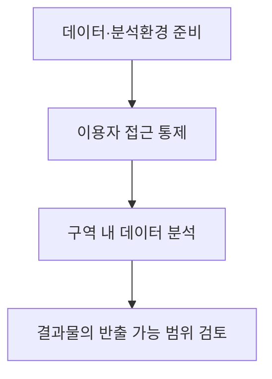

## 30초 인출

- 본질: **데이터안심구역**은 공개하기 어려운 데이터를 보안대책이 갖춰진 환경에서 안전하게 분석·활용하도록 지정한 구역이다.
- 메커니즘: 관리기관이 분석 환경과 보안대책을 마련하고, 이용자가 통제된 환경에서 데이터를 분석한다.

핵심 용어

- **데이터안심구역**: 데이터산업법 제11조에 따라 안전한 데이터 분석·활용을 위해 지정·운영하는 구역이다.
- **미개방데이터**: 공개되지 않았지만 안심구역에서의 분석·활용을 위해 지원할 수 있는 데이터다.
- **기술적·물리적·관리적 보안대책**: 불법 접근과 데이터의 변경·훼손·유출·파괴를 막기 위해 갖춰야 하는 보호조치다.
- **개인정보 안심구역**: 개인정보보호위원회가 지정한 안전한 환경에서 가명정보를 보다 유연하게 처리하도록 지원하는 제도다.

---
## 1교시 예상문제 (10점)
> 데이터안심구역과 개인정보 안심구역의 목적과 활용 대상을 비교하시오. (예상)

---
## 1교시 10점 답안

### 1. 정의·목적

- 정의: **데이터안심구역**은 데이터를 안전하게 분석·활용할 수 있도록 지정한 구역이다.
- 목적: 공개하기 어려운 데이터의 활용과 보호를 함께 지원한다.

### 2. 두 제도의 구분

| 구분 | 데이터안심구역 | 개인정보 안심구역 |
|---|---|---|
| 근거·지정 | 데이터산업법 제11조, 과기정통부장관·관계 중앙행정기관장 | 개인정보위의 안심구역 제도 |
| 활용 초점 | 미개방데이터 등을 안전한 환경에서 분석·활용 | 안전한 환경에서 가명정보의 유연한 처리 |
| 공통점 | 보안대책을 갖춘 분석 환경 | 보안·개인정보 보호조치를 갖춘 분석 환경 |

### 3. 제언

대상 데이터와 적용 제도를 먼저 구분하고, 분석 과정의 접근·반출 통제를 운영 기준으로 정한다.

---
## 2~4교시 예상문제 (25점)
> 데이터안심구역의 정의와 기능, 지정기준 및 운영상 고려사항을 설명하시오. (예상)

---
## 2~4교시 25점 답안

## Ⅰ. 데이터안심구역의 개요

| 구분 | 핵심 |
|---|---|
| 정의 | 누구든지 데이터를 안전하게 분석·활용할 수 있도록 지정·운영하는 구역 |
| 목적 | 미개방데이터의 활용을 지원하면서 불법 접근·유출 등을 예방 |

데이터산업법 제11조는 미개방데이터와 분석 시스템·도구 등의 지원, 기술적·물리적·관리적 보안대책을 규정한다.

## Ⅱ. 주요 기능과 이용 흐름

| 기능 | 수행 내용 |
|---|---|
| 데이터 지원 | 미개방데이터의 안전한 활용 지원 |
| 분석 환경 제공 | 분석 시스템·도구를 통제된 구역에서 제공 |
| 보안 운영 | 접근·변경·유출 위험에 대한 보호조치 적용 |

반출 여부와 심사 절차는 해당 구역의 운영 기준과 데이터의 적용 법령에 맞춰 확인한다. 모든 결과물이 자동으로 반출되거나 반대로 통계만 허용된다고 단정하지 않는다.

## Ⅲ. 지정기준과 운영 책임

| 기준 | 법령상 확인 사항 |
|---|---|
| 지정 주체·대상 | 과기정통부장관 또는 관계 중앙행정기관장이 신청을 받아 시설을 지정; 클라우드 기반 가상 공간도 포함 가능 |
| 보안대책 | 기술적·물리적·관리적 대책을 갖출 것 |
| 분석 장비 | 데이터 분석·활용에 필요한 장비 등을 갖출 것 |
| 신청 서류 | 관리계획과 지정기준 충족 증빙 제출 |
| 지정 후 관리 | 관리기관은 관리 실적·현황을 매년 지정권자에게 알림 |

시설 형태만 보고 지정 여부를 판단하지 않는다. 보안대책과 실제 분석 환경을 함께 확인한다.

## Ⅳ. 인접 제도와의 구분

| 비교 기준 | 데이터안심구역 | 개인정보 안심구역 |
|---|---|---|
| 제도 중심 | 데이터의 안전한 분석·활용 | 가명정보의 안전하고 유연한 처리 |
| 주요 데이터 | 미개방데이터 지원 가능 | 가명정보 활용 중심 |
| 공통 운영 요구 | 안전한 분석 환경·접근 통제 | 안전한 분석 환경·접근 통제 |

데이터안심구역에 개인정보가 포함된다면 해당 개인정보 처리 규율도 별도로 확인해야 한다.

## Ⅴ. 제언

| 운영 문제 | 해결 방향 |
|---|---|
| 안전한 분석 환경을 마련해도 이용 절차와 결과물 검토가 불명확하면 활용이 지연됨 | 데이터 유형별 접근 권한과 반출 검토 기준을 운영계획에 명시하고 처리 이력을 남김 |

## 출제 이력과 검증 출처

- 기존 노트의 출제 이력: 제133회 2교시 6번 데이터안심구역의 정의·기능·지정요건, 제136회 1교시 10번 개인정보 안심구역과의 비교.
- [데이터산업법 제11조 — 국가법령정보센터](https://law.go.kr/lsLinkCommonInfo.do?chrClsCd=010202&lsJoLnkSeq=1025556481)
- [데이터산업법 시행령 제12조 — 한국법제연구원 법령정보](https://elaw.klri.re.kr/kor_service/lawViewMultiContent.do?hseq=68814)
- [개인정보 안심구역 설명 — 개인정보보호위원회](https://www.pipc.go.kr/np/cop/bbs/selectBoardArticle.do?bbsId=BS074&mCode=C020010000&nttId=10303)
