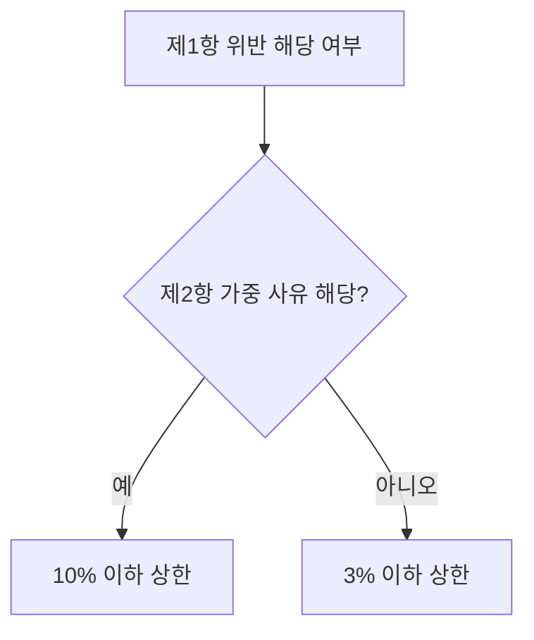
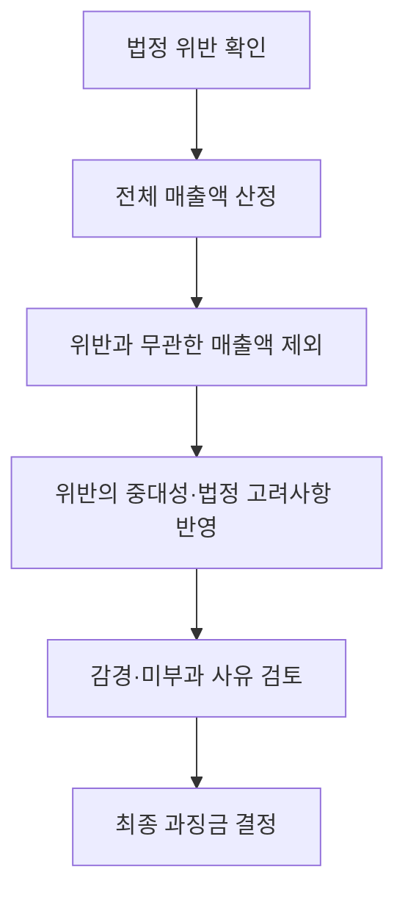

## 지식 로드맵 내 현재 위치

개인정보 보호 → 법 위반 제재 → 개인정보 보호법 2026년 개정 과징금

## 30초 인출

- 본질: 2026년 개정은 반복·중대 위반에 더 무거운 과징금을 부과해 개인정보 보호 의무의 이행을 강화한다.
- 메커니즘: 일반 상한은 전체 매출액의 3%이며, 법정 가중 요건에 해당하면 10%까지 가능하다. 산정 시 위반과 무관한 매출을 제외하고, 법정 고려사항과 감경 요건을 적용한다.

핵심 용어

- **과징금**: 법 위반에 대해 행정기관이 부과하는 금전 제재.
- **전체 매출액**: 개인정보 보호법 제64조의2의 과징금 산정 기준이 되는 개인정보처리자의 매출액.
- **가중 과징금**: 3년 내 고의·중과실 재위반, 1천만 명 이상 피해를 낳은 고의·중과실 위반, 시정명령 불이행 후 유출등 발생 등 법정 사유에서 10% 상한을 적용할 수 있는 과징금.
- **위반과 무관한 매출액**: 과징금 기준 매출액을 계산할 때 전체 매출액에서 제외하는 매출액.

---

## 1교시 예상문제 (10점)

> 개인정보 보호법 2026년 개정에 따른 과징금의 일반·가중 상한과 산정 시 고려사항을 설명하시오. (예상)

---

## 1교시 10점 답안

### 1. 정의·목적

- 정의: 개인정보 보호법상 과징금은 법정 위반행위에 대해 개인정보보호위원회가 부과하는 금전 제재다.
- 목적: 위반으로 얻는 이익을 억제하고 개인정보 보호 의무의 실효성을 높인다.

### 2. 상한과 산정

| 구분 | 요건·상한 |
|---|---|
| 일반 과징금 | 법 제64조의2 제1항 각 호에 해당하면 전체 매출액의 3% 이하. 매출액이 없거나 산정하기 곤란한 경우 대통령령에 따라 20억 원 이하 |
| 가중 과징금 | 고의·중과실 재위반 등 제2항 요건이면 전체 매출액의 10% 이하. 매출액이 없거나 산정하기 곤란한 경우 대통령령에 따라 50억 원 이하 |
| 산정 기준 | 전체 매출액에서 위반행위와 관련 없는 매출액을 제외한 금액을 기준으로 함 |
| 고려사항 | 위반 내용·기간·횟수, 이익, 안전조치 노력, 피해 규모, 회복·확산 방지 및 보호 노력 등을 고려 |

제언: 위반 유형별 적용 요건과 산정 자료를 정기적으로 점검해 과징금 산정 근거를 추적 가능하게 관리한다.

---

## 2~4교시 예상문제 (25점)

> 개인정보 보호법 2026년 개정에 따른 과징금 부과체계를 설명하고, 반복·중대 위반을 예방하기 위한 개인정보처리자의 관리·기술적 대응방안을 제시하시오. (예상)

---

## 2~4교시 25점 답안

## Ⅰ. 개요

개정법은 일반 과징금 상한을 유지하면서 반복·중대 위반에 대한 가중 상한과 감경 규정을 신설·정비했다. 법률 제21445호는 2026년 9월 11일 시행되었다.

| 제재 목적 | 주요 수단 |
|---|---|
| 위반 억제와 피해 예방 | 일반 3% 상한, 법정 가중 사유에 10% 상한, 산정 시 비례성·보호 노력 고려 |

## Ⅱ. 과징금 부과 대상과 상한

| 구분 | 법정 기준 |
|---|---|
| 일반 부과 | 제64조의2 제1항 각 호의 위반행위에 전체 매출액 3% 이하 |
| 매출액 산정 곤란 | 대통령령이 정한 경우 20억 원 이하 |
| 가중 부과 | 제1항에도 불구하고 제2항의 법정 가중 요건이면 전체 매출액 10% 이하 |
| 가중 시 매출액 산정 곤란 | 대통령령이 정한 경우 50억 원 이하 |

## Ⅲ. 가중 요건과 적용 범위

가중 상한은 모든 위반에 자동 적용되지 않는다. 법은 다음 경우를 별도 요건으로 둔다.

| 법정 가중 사유 | 적용 조건 |
|---|---|
| 3년 이내 재위반 | 과징금 부과처분을 받은 날부터 3년 내 제1항 각 호 위반을 다시 하고, 고의 또는 중대한 과실이 있을 것 |
| 대규모 피해 | 고의 또는 중대한 과실의 제1항 위반으로 정보주체 피해 규모가 1천만 명 이상일 것 |
| 시정명령 불이행 후 유출등 | 제64조제1항 시정조치명령에 따르지 않아 제1항제9호의 유출등 위반이 발생할 것 |

## Ⅳ. 산정·조정 절차

법은 매출액 산정자료 제출을 정당한 사유 없이 거부하거나 거짓 자료를 내는 경우 전체 매출액을 기준으로 산정할 수 있도록 한다. 부과액은 위반 내용·기간·횟수, 취득 이익, 안전조치, 피해 규모와 회복 조치, 보호 인증·자율 활동, 조사 협조 등을 고려해 비례성을 확보해야 한다.

## Ⅴ. 감경·미부과 검토

| 구분 | 기준 |
|---|---|
| 감경 | 개인정보 보호를 위해 예산·인력·설비·장치 등을 투자하고 운영하는 등 대통령령상 사유가 있으면 감경. 단, 고의·중과실 위반은 이 감경 규정에서 제외 |
| 미부과 가능 | 객관적 납부능력 부재, 위법성 착오에 정당한 사유, 경미한 위반·소액 과징금, 피해가 없거나 경미한 법정 사유 등 |
| 산정 원칙 | 위반에 상응하는 비례성과 침해 예방 효과를 함께 고려 |

## Ⅵ. 예방을 위한 관리·기술 대응

| 위험 | 대응 |
|---|---|
| 같은 위반이 재발 | 위반 유형·시정 기한·책임자·재발방지 결과를 연결한 시정조치 관리대장 운영 |
| 접근·처리 통제가 형식화 | 개인정보 처리 흐름과 권한을 정기 점검하고 접근기록·변경기록을 보존 |
| 사고 범위 확인 지연 | 로그·백업·자산 목록을 연계해 영향받은 정보주체와 처리시스템을 신속히 식별 |
| 보호 투자·조치 입증 곤란 | 위험평가, 예산·인력 배치, 암호화·접근통제 적용과 개선 결과를 증적화 |

## Ⅶ. 기술사적 제언

| 문제 | 해결 방안 |
|---|---|
| 법정 의무 이행과 실제 시스템 통제가 분리되어 반복 위반·피해 범위를 제때 확인하기 어려움 | 개인정보 처리 흐름, 권한·로그, 시정조치, 보호 투자 기록을 자산 단위로 연결해 정기 점검하고, 미해결 고위험 항목은 경영진의 개선 결정까지 추적한다. |

## 출제 이력과 검증 출처

- 기존 노트에 확인된 기출 문항은 없어 예상문제로 구성함.
- [국가법령정보센터, 개인정보 보호법 제64조의2(2026-09-11 시행)](https://law.go.kr/LSW/lsLinkCommonInfo.do?ancYnChk=&chrClsCd=010202&lsJoLnkSeq=1020398647)
- [국가법령정보센터, 개인정보 보호법 일부개정 법률 제21445호 개정이유 및 주요내용](https://www.law.go.kr/LSW/lsRvsRsnListP.do?chrClsCd=010202&lsId=011357&lsRvsGubun=all)
