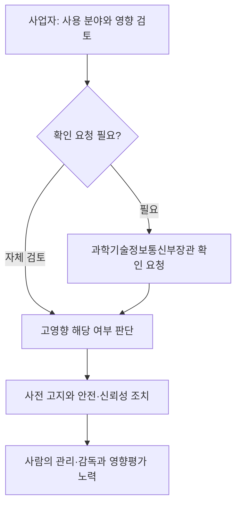
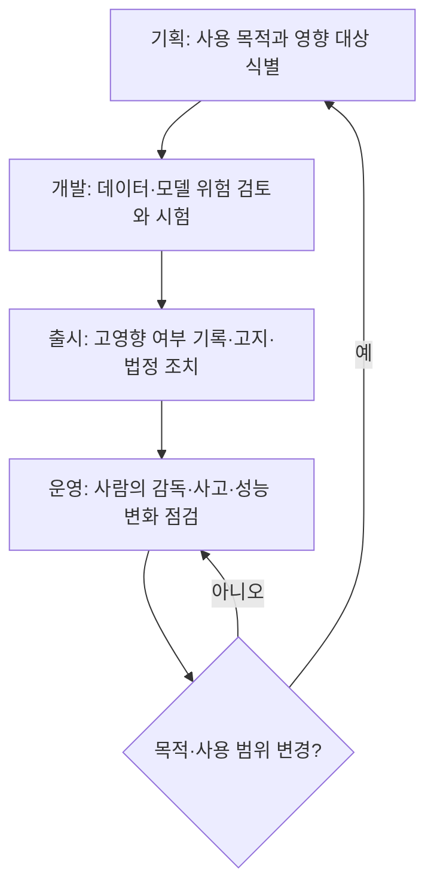

## 지식 로드맵 내 현재 위치

인공지능 정책·법제 → 신뢰·안전 규율 → 고영향 인공지능

## 30초 인출

- 본질: 고영향 인공지능은 사람의 생명·신체 안전이나 기본권에 중대한 영향을 미칠 수 있어 법률상 별도 책무가 적용되는 인공지능이다.
- 메커니즘: 사업자가 사용 분야와 영향을 바탕으로 해당 여부를 검토하고, 해당 시스템을 제공할 때 투명성·안전성·신뢰성 조치와 사람의 관리·감독을 마련한다.

<details><summary>핵심 용어</summary>

- **고영향 인공지능**: 사람의 생명·신체 안전 또는 기본권에 중대한 영향을 미치거나 위험을 초래할 우려가 있는 인공지능.
- **인공지능사업자**: 인공지능 개발·이용 또는 제품·서비스 제공과 관련해 법률상 의무를 지는 사업자.
- **영향평가**: 고영향 인공지능 제품·서비스가 사람의 기본권에 미치는 영향을 사전에 평가하는 절차.
- **사람의 관리·감독**: AI의 작동과 결과를 사람의 통제 아래 두고, 필요한 감독·대응이 가능하도록 하는 조치.
</details>

---

## 1교시 예상문제 (10점)

> 인공지능기본법상 고영향 인공지능의 개념, 확인 절차 및 사업자 책무를 설명하시오. (예상)

---

## 1교시 10점 답안

### 1. 정의·목적

- 정의: 고영향 인공지능은 사람의 생명·신체 안전 또는 기본권에 중대한 영향을 미치거나 위험을 초래할 우려가 있는 인공지능이다.
- 목적: 중대한 영향을 주는 인공지능의 위험을 관리하고 안전하고 신뢰할 수 있는 이용을 확보한다.

### 2. 확인과 책무



사업자는 고영향 해당 여부를 사전에 검토하고, 필요하면 과학기술정보통신부장관에게 확인을 요청할 수 있다. 해당 인공지능 또는 제품·서비스에는 법률과 시행령에서 정한 안전·신뢰성 조치 및 이용자 사전 고지 의무가 적용된다.

제언: 제품 기획 단계에서 사용 분야와 영향도를 기록하고 법정 확인·조치 결과를 출시 승인에 연결한다.

---

## 2~4교시 예상문제 (25점)

> 인공지능기본법상 고영향 인공지능의 판단·확인 절차와 사업자의 주요 의무를 설명하고, 이를 제품 생명주기에 반영하는 방안을 제시하시오. (예상)

---

## 2~4교시 25점 답안

## Ⅰ. 개요

고영향 인공지능 규율은 중대한 안전·기본권 영향을 고려해 사업자의 사전 검토와 안전·신뢰성 책무를 정한 법적 체계다. 인공지능기본법은 2026년 1월 22일 시행되었으며, 최신 개정법은 2026년 7월 21일 시행본이다.

| 핵심 판단 | 후속 대응 |
|---|---|
| 사람의 생명·신체 안전 또는 기본권에 중대한 영향·위험 우려 | 해당 여부 확인, 법정 안전·신뢰성 조치와 투명성 의무 이행 |

## Ⅱ. 해당 여부 검토와 확인

```text
제품·서비스의 의도된 사용과 실제 사용 확인
                 ↓
법률상 고영향 판단 기준 및 적용 분야 대조
                 ↓
사업자가 사전 검토·근거 기록
                 ↓ 필요한 경우
과학기술정보통신부장관에게 확인 요청
                 ↓
전문위원회 자문을 거쳐 확인 가능
```

고영향 여부는 명칭만으로 정하지 않고 법률의 정의와 열거된 영역 및 시행령상 기준을 제품의 기능·사용 맥락에 대조해 검토한다. 사업자는 스스로 사전 검토하고, 불명확하면 법 제33조에 따라 확인을 요청할 수 있다.

## Ⅲ. 주요 적용 영역

| 영역 예시 | 판단 시 살필 영향 |
|---|---|
| 의료·보건, 에너지·교통 등 안전 관련 | 생명·신체 안전에 대한 영향 |
| 채용·대출·교육·복지 등 기회 배분 | 권리·기회에 대한 중대한 영향 |
| 공공서비스·자격 판정 등 | 기본권 행사와 서비스 접근에 대한 영향 |

분야에 속한다는 사실만으로 모든 AI가 자동 지정되는 것으로 단정하지 않는다. 개별 기능, 이용 목적, 영향을 함께 대조해야 한다.

## Ⅳ. 사업자의 주요 책무

| 책무 | 핵심 내용 |
|---|---|
| 투명성 | 고영향 AI 기반 제품·서비스라는 사실을 이용자에게 사전 고지 |
| 위험 관리 | 위험 식별·평가·완화와 안전성·신뢰성 확보 조치 수행 |
| 사람의 관리·감독 | 사람이 결과와 운영을 감독하고 필요한 대응을 할 수 있도록 체계 마련 |
| 기록·설명 지원 | 법령에 따른 관련 문서·기록을 관리하고 이용자 권리행사에 필요한 설명 지원 |
| 영향평가 | 제품·서비스 제공 전 기본권 영향평가를 수행하도록 노력하며 취약계층 특성을 반영 |

## Ⅴ. 제품 생명주기 관리



## Ⅵ. 구현상 위험과 대응

| 위험 | 대응 |
|---|---|
| 목적 외 사용으로 영향 수준이 달라짐 | 허용 사용·금지 사용을 문서화하고 사용환경 변화를 감시 |
| 사람의 감독이 승인 절차로만 남음 | 감독자의 권한·정보·중단 절차를 정하고 표본 검토와 이의제기 경로 운영 |
| 모델·데이터 변경 후 위험이 커짐 | 변경관리와 재시험 기준을 정하고 운영 중 성능·피해 신호를 점검 |
| 법정 설명에 필요한 근거가 불충분 | 데이터·모델 버전, 판단기록, 사람의 개입과 조치 내역을 연결해 보존 |

## Ⅶ. 기술사적 제언

| 문제 | 해결 방안 |
|---|---|
| 법무 검토, 개발 통제, 운영 감독이 서로 분리되어 실제 사용 변화와 위험 증가를 놓칠 수 있음 | 제품별 사용 목적·영향 판단을 자산대장에 등록하고, 모델·데이터 변경과 운영 지표가 재검토를 촉발하도록 생명주기 통제를 연결한다. |

## 출제 이력과 검증 출처

- 기존 노트는 제140회 3교시 6번을 기출로 기록했으나 공식 원문을 별도로 대조하지 못해 출제 문구는 재인용하지 않음. 본 답안용 문항은 예상문제임.
- [국가법령정보센터, 인공지능기본법 제33조(고영향 인공지능의 확인)](https://law.go.kr/LSW/lsLinkCommonInfo.do?chrClsCd=010202&lsJoLnkSeq=1031810895)
- [국가법령정보센터, 인공지능기본법 제34조(사업자의 책무)](https://law.go.kr/LSW/lsLinkCommonInfo.do?chrClsCd=010202&lsJoLnkSeq=1031810839)
- [국가법령정보센터, 인공지능기본법 제35조(고영향 인공지능 영향평가)](https://www.law.go.kr/LSW/lsSideInfoP.do?docCls=jo&joBrNo=00&joNo=0035&lsiSeq=282791&urlMode=lsScJoRltInfoR)
- [국가법령정보센터, 인공지능기본법 제31조(투명성 확보 의무)](https://law.go.kr/LSW/lsLinkCommonInfo.do?chrClsCd=010202&lsJoLnkSeq=1031810729)
