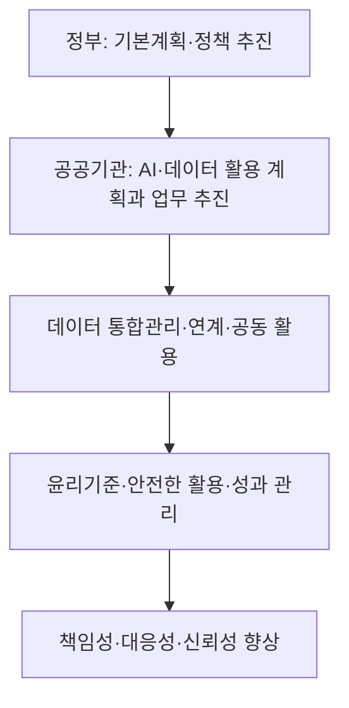
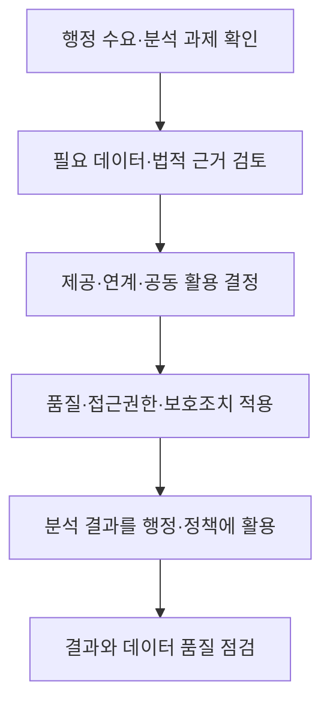

## 지식 로드맵 내 현재 위치

공공 정보화·정책 → 공공 AI·데이터 거버넌스 → 인공지능 및 데이터 기반 행정 활성화에 관한 법률

## 30초 인출

- 본질: 인공지능 및 데이터 기반 행정 활성화에 관한 법률은 공공기관의 데이터·AI 활용과 안전한 활용을 위한 신뢰 기반을 함께 정한 법이다.
- 메커니즘: 공공기관이 데이터와 인공지능 활용을 계획·추진하고, 데이터 통합관리 및 윤리기준·안전 조치로 책임성·대응성·신뢰성을 확보한다.

핵심 용어

- **인공지능 및 데이터 기반 행정**: 공공기관이 행정 업무와 정책 결정에 인공지능과 데이터를 활용하는 행정.
- **데이터 통합관리 플랫폼**: 공공기관의 데이터·활용 정보를 연계해 공동 활용을 지원하는 관리 기반.
- **인공지능 활용 윤리기준**: 행정안전부장관이 공공기관의 안전하고 효율적인 AI 활용을 위해 공정성·투명성·책임성·안전성 등을 반영해 정하는 기준.
- **전문기관**: 행정안전부장관이 관계 부처와 협의해 관련 업무 수행을 위해 지정할 수 있는 기관.

---

## 1교시 예상문제 (10점)

> 인공지능 및 데이터 기반 행정 활성화에 관한 법률의 목적과 주요 추진체계를 설명하시오. (예상)

---

## 1교시 10점 답안

### 1. 정의·목적

- 정의: 이 법은 공공기관의 인공지능·데이터 기반 행정 활성화와 인공지능의 안전한 활용을 위한 신뢰 기반을 정한다.
- 목적: 효율적·객관적·과학적 행정을 통해 공공기관의 책임성·대응성·신뢰성과 국민 삶의 질을 높인다.

### 2. 추진체계

제언: 신규 행정 AI 사업은 데이터 근거, 책임 주체, 위험 통제를 함께 검토해 추진한다.

---

## 2~4교시 예상문제 (25점)

> 인공지능 및 데이터 기반 행정 활성화에 관한 법률의 목적과 추진체계, 데이터 활용 및 신뢰 기반 조성의 주요 내용을 설명하고 공공기관의 이행 방안을 제시하시오. (예상)

---

## 2~4교시 25점 답안

## Ⅰ. 개요

이 법은 데이터기반행정 제도를 AI 활용까지 확장하고, 공공부문의 안전한 AI 사용을 위한 신뢰 기반을 더한 법률이다. 법률 제21392호 개정법은 2026년 8월 28일 시행되었다.

| 법의 목적 | 주요 제도 |
|---|---|
| 효율적·객관적·과학적 행정 및 국민 삶의 질 향상 | 계획·데이터 공동활용·전문기관·윤리기준·활용서비스 관리 |

## Ⅱ. 적용 주체와 추진 기반

| 주체 | 역할 |
|---|---|
| 행정안전부장관 | 기본 정책·데이터 통합관리 플랫폼·윤리기준 등 총괄 |
| 공공기관 | 소관 행정에서 데이터·AI 활용을 추진하고 필요한 관리 수행 |
| 전문기관 | 법정 위탁·지정 업무 및 전문기술 지원 수행 |
| 민간 법인·기관 등 | 법에 따른 데이터 제공·연계·공동활용 참여 가능 |

## Ⅲ. 데이터 기반 행정

데이터 공유는 목적과 법적 근거를 확인한 뒤 제공·연계해야 한다. 개인정보·영업비밀 등 다른 법률상 제한을 무시한 일괄 개방 의무로 해석해서는 안 된다.

## Ⅳ. AI 기반 행정과 활용서비스

| 단계 | 관리 내용 |
|---|---|
| 과제 선정 | 행정상 필요, 대상 국민, 기대 효과와 대체 수단 검토 |
| 도입·개발 | 데이터 적법성·품질, 모델 적합성과 오류 위험 점검 |
| 서비스 제공 | 이용자 고지, 책임자와 이의·오류 대응 경로 마련 |
| 운영·변경 | 성능·영향을 점검하고 데이터·모델·목적 변경 시 재평가 |

## Ⅴ. 신뢰 기반과 윤리기준

행정안전부장관은 공공기관이 AI를 안전하고 효율적으로 도입·활용하도록 공정성·투명성·책임성·안전성 등의 사항과 인공지능기본법상 윤리원칙을 반영한 공공기관 적용 윤리기준을 마련·공표한다.

| 신뢰 요소 | 공공기관의 적용 예 |
|---|---|
| 공정성 | 취약계층·집단별 오류와 불리한 영향을 점검 |
| 투명성 | AI 활용 사실, 주요 한계와 담당 부서를 안내 |
| 책임성 | 결정 권한·검토자·정정 절차를 분명히 지정 |
| 안전성 | 접근 통제, 시험, 사고 대응과 운영 점검 수행 |

## Ⅵ. 현장 이행과 위험 관리

| 위험 | 대응 |
|---|---|
| 데이터 공유 요청이 개인정보·목적 제한과 충돌 | 제공 근거·목적·최소 범위를 먼저 검토하고 안전한 연계 방식 적용 |
| 불완전한 데이터가 행정 판단을 왜곡 | 출처·갱신 시점·결측·품질 기준을 기록하고 결과를 표본 검토 |
| AI 오류가 행정상 불이익으로 이어짐 | 담당 공무원 검토, 당사자 문의·정정 경로와 중단 절차 마련 |
| 모델·데이터가 바뀌어 성능 저하 | 변경 이력과 재시험 기준을 두고 운영 중 결과를 지속 점검 |

## Ⅶ. 기술사적 제언

| 문제 | 해결 방안 |
|---|---|
| 행정서비스에 AI를 도입한 뒤 데이터 근거와 책임·정정 절차를 추적하기 어려움 | 업무별 데이터 출처·법적 근거, 모델 버전, 담당자 검토, 이의 처리와 변경 이력을 하나의 운영대장에 연결하고 정기적으로 표본 감사한다. |

## 출제 이력과 검증 출처

- 기존 노트에는 확인된 기출 문항이 없어 예상문제로 작성함.
- [국가법령정보센터, 인공지능 및 데이터 기반 행정 활성화에 관한 법률(2026-08-28 시행)](https://www.law.go.kr/lsInfoP.do?ancYnChk=0&lsId=013792)
- [국가법령정보센터, 법 제1조 목적 및 개정 법률 제21392호](https://www.law.go.kr/LSW/lsInfoP.do?lsiSeq=283735&viewCls=lsRvsDocInfoR)
- [국가법령정보센터, 법 제31조 인공지능 활용 윤리기준](https://www.law.go.kr/LSW/lsSideInfoP.do?docCls=jo&joBrNo=00&joNo=0031&lsiSeq=283735&urlMode=lsScJoRltInfoR)
- [국가법령정보센터, 법 제21조 전문기관](https://www.law.go.kr/LSW/lsSideInfoP.do?docCls=jo&joBrNo=00&joNo=0021&lsiSeq=283735&urlMode=lsScJoRltInfoR)
