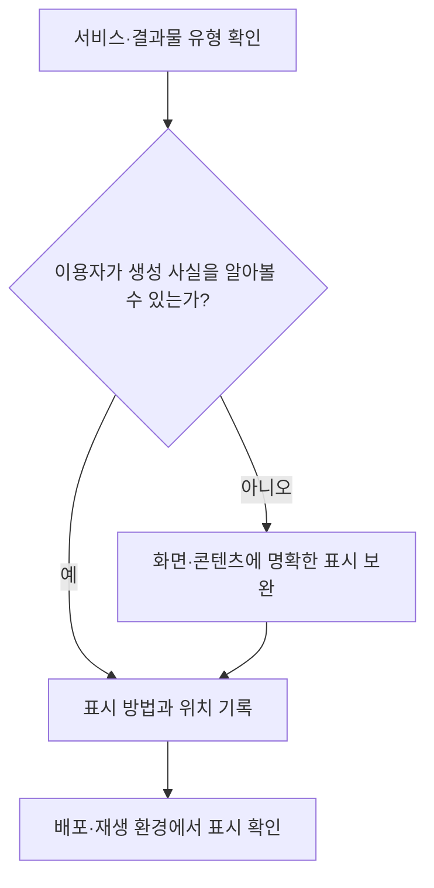
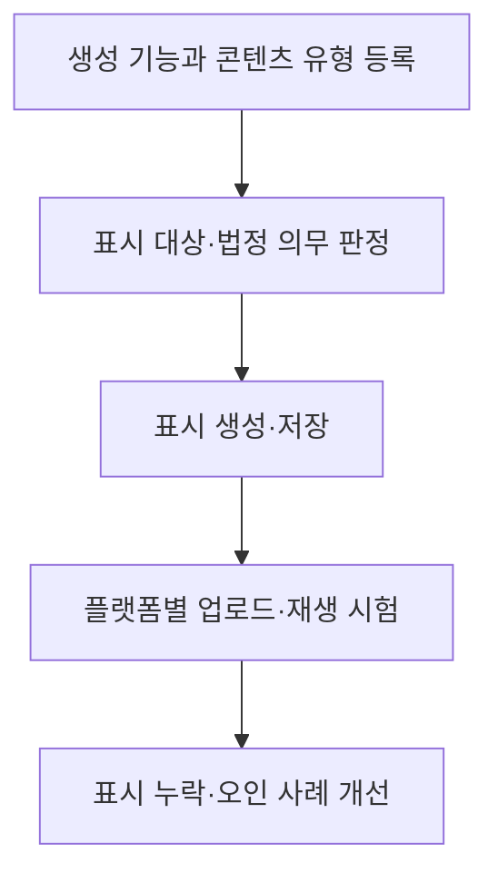

## 지식 로드맵 내 현재 위치

인공지능 정책·법제 → 투명성·이용자 보호 → 생성형 인공지능 표시

## 30초 인출

- 본질: 생성형 인공지능 투명성 의무는 이용자가 AI 기반 제품·서비스와 생성 결과를 알아볼 수 있도록 제공자의 고지·표시를 요구한다.
- 메커니즘: AI 기반 제품·서비스임을 사전에 알리고, 생성형 AI 결과물임을 표시하며, 실제와 구분하기 어려운 음향·이미지·영상은 알아볼 수 있게 고지·표시한다.

핵심 용어

- **투명성 의무**: 인공지능기본법 제31조에 따라 AI 기반 서비스와 생성 결과에 관한 사실을 이용자에게 알리는 의무.
- **가시적 표시**: 결과물이나 이용 화면에서 사람이 알아볼 수 있게 표시하는 방식.
- **비가시적 표시**: 기계적 검증을 위해 콘텐츠에 식별 신호나 출처 정보를 포함하는 기술적 방식.
- **콘텐츠 출처정보**: 콘텐츠의 생성·수정 이력 등을 구조화해 확인하도록 하는 정보. 법정 표시 의무와 구체 기술 표준은 구분해야 한다.

---

## 1교시 예상문제 (10점)

> 인공지능기본법상 생성형 인공지능 투명성 확보 의무와 표시 방식의 고려사항을 설명하시오. (예상)

---

## 1교시 10점 답안

### 1. 정의·목적

- 정의: 생성형 인공지능 투명성 의무는 AI 기반 서비스와 생성 결과임을 이용자에게 알리도록 하는 법적 의무다.
- 목적: 이용자가 결과물의 생성 방식을 알고 적절히 판단하도록 돕는다.

### 2. 법정 고지·표시

| 대상 | 의무 |
|---|---|
| 고영향 AI 또는 생성형 AI 기반 제품·서비스 | 제공 전에 AI 기반으로 운용된다는 사실을 이용자에게 고지 |
| 생성형 AI 또는 이를 이용한 제품·서비스의 결과물 | 생성형 AI로 생성되었다는 사실을 표시 |
| 실제와 구분하기 어려운 가상 음향·이미지·영상 | AI 시스템이 생성했다는 사실을 명확히 인식할 수 있게 고지·표시 |

제언: 콘텐츠 유형과 이용 맥락에 맞는 표시를 설계하고, 생성 여부와 표기 이력을 함께 관리한다.

---

## 2~4교시 예상문제 (25점)

> 인공지능기본법상 생성형 인공지능의 투명성 확보 의무를 구분해 설명하고, 표시의 전달력과 콘텐츠 유통 중 추적성을 높이는 방안을 제시하시오. (예상)

---

## 2~4교시 25점 답안

## Ⅰ. 의무의 목적과 대상별 범위

인공지능기본법 제31조는 AI 기반 서비스의 사전 고지와 생성형 AI 결과물 표시를 정한다. 생성 결과가 실제와 구분하기 어려운 가상 음향·이미지·영상인 경우에는 이용자가 명확히 알아볼 수 있는 방식으로 표시해야 한다.

| 구분 | 법적 요구 |
|---|---|
| AI 기반 서비스 고지 | 고영향 AI 또는 생성형 AI를 이용한 제품·서비스의 제공 전 고지 |
| 결과물 표시 | 생성형 AI로 생성된 결과물임을 표시 |
| 합성 음향·이미지·영상 | 이용자가 생성 사실을 명확히 인식할 수 있게 고지 또는 표시 |
| 예술·창작 표현물 | 전시·향유를 저해하지 않는 방식으로 표시 가능 |

## Ⅲ. 전달 방식

표시 방법은 화면 문구·아이콘·음성 안내 등 이용 맥락에 맞춰 설계할 수 있다. 법은 기술방식 하나를 정해 의무화한 것이 아니므로, 워터마크·메타데이터·출처정보 표준은 법정 고지·표시를 보완하는 수단으로 구분한다.

## Ⅳ. 표시 기술의 보완 관계

| 방식 | 장점 | 한계 |
|---|---|---|
| 화면·콘텐츠의 가시적 표시 | 이용자가 바로 알아보기 쉬움 | 자르기·재촬영·재편집으로 사라질 수 있음 |
| 비가시적 워터마크 | 파일 변형 후에도 검출을 시도할 수 있음 | 변환·압축·공격에 취약할 수 있고 판정 결과가 불확실할 수 있음 |
| 서명된 출처정보 | 생성·수정 이력을 확인하는 데 도움 | 메타데이터가 제거되면 확인이 어려우며 콘텐츠 진실성을 자동 보증하지 않음 |

## Ⅴ. 운영·검증 절차

## Ⅵ. 적용상 문제와 대응

| 문제 | 대응 |
|---|---|
| 이용자가 표시를 놓치거나 오해 | 결과물 가까이에 명확하고 일관된 표시를 제공하고 사용성 시험 |
| 플랫폼 변환으로 표시·출처정보가 사라짐 | 업로드·변환 단계에서 표시 보존 여부를 시험하고, 가능한 경우 출처정보를 함께 전달 |
| 워터마크 탐지 결과를 진위 보증으로 오인 | 탐지 결과의 신뢰도와 한계를 설명하고 사람의 확인 절차를 둠 |
| 예술·창작 이용을 불필요하게 방해 | 법령상 허용되는 표시 방식과 이용 맥락을 확인해 표현을 해치지 않게 배치 |

## Ⅶ. 기술사적 제언

| 문제 | 해결 방안 |
|---|---|
| 서비스 고지, 결과물 표시, 유통 후 검증이 서로 분리되어 이용자에게 정보가 전달되지 않을 수 있음 | 생성 시점에 콘텐츠 유형별 표시 정책을 적용하고, 게시·변환 경로에서 표시의 가독성과 출처정보 보존 여부를 시험해 실패 사례를 개선한다. |

## 출제 이력과 검증 출처

- 기존 노트에 확인된 기출 문항은 없어 예상문제로 작성함.
- [국가법령정보센터, 인공지능기본법 제31조(2026-07-21 시행)](https://law.go.kr/LSW/lsLinkCommonInfo.do?chrClsCd=010202&lsJoLnkSeq=1031810729)
- [국가법령정보센터, 인공지능기본법 시행령 제23조(투명성 확보 의무)](https://www.law.go.kr/LSW/lsLinkCommonInfo.do?chrClsCd=010202&lspttninfSeq=198075)
